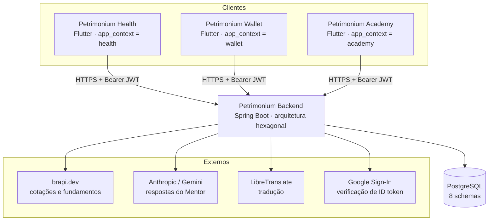
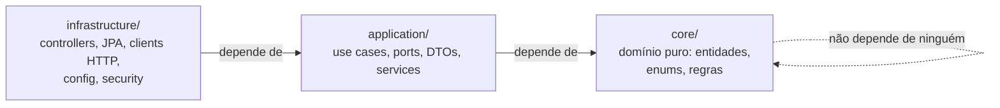
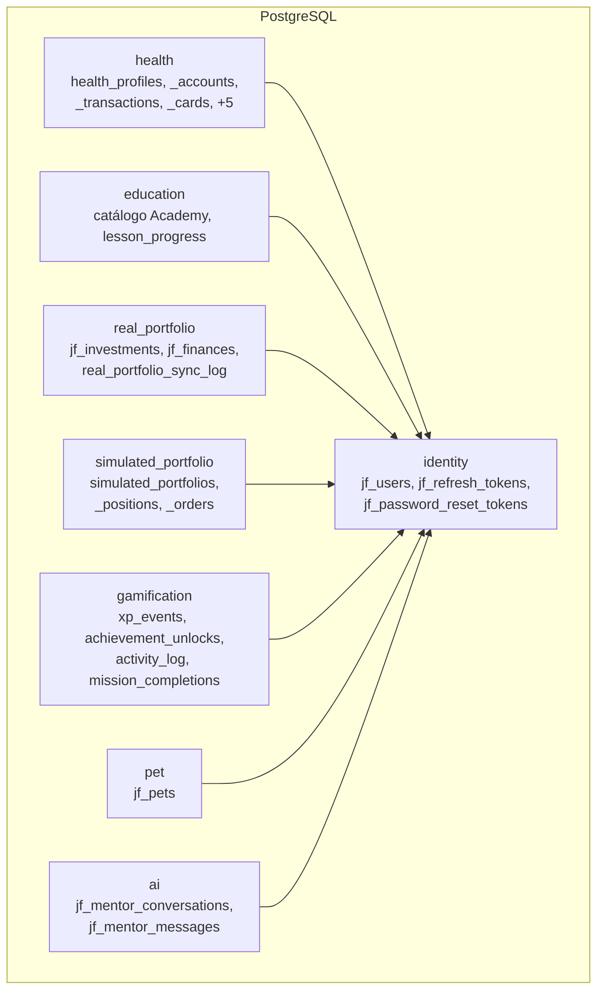

# 00 — Visão geral do sistema

> Estado verificado em 2026-09-04, lendo o código. Números conferidos:
> Wallet 253 arquivos Dart · Academy 327 · Health 31 · Backend 592 arquivos Java,
> 15 controllers, 84 arquivos de use case, 30 migrations (V1…V30).

## 1. O que é o Petrimonium

Um ecossistema de **quatro repositórios** e **três produtos**:

- **Petrimonium Health** — app Flutter de saúde financeira: fluxo de caixa
  **real** (contas, receitas, despesas, cartões, projeção do mês).
- **Petrimonium Wallet** — app Flutter de carteira de investimentos **reais**.
- **Petrimonium Academy** — app Flutter de educação financeira com carteira
  **simulada**.
- **Petrimonium Backend** — Spring Boot, servindo os três.

Os três apps são clientes do **mesmo backend, no mesmo banco**. Não há três
backends nem três bases. A separação entre os produtos — e entre "dinheiro
real" e "dinheiro fictício" — é feita **em tempo de execução**, por uma única
peça: a claim `app_context` no JWT (fatia 01).

Isso é a decisão estrutural mais importante do sistema inteiro. Se você só
entender uma coisa deste Atlas, entenda essa.

**Por que existem três produtos e não um app com três abas**, e o que
exatamente é compartilhado entre eles: [`../INTEGRATION.md`](../INTEGRATION.md)
— o contrato canônico de integração. Este documento aqui descreve a
*máquina*; aquele descreve o *acordo* entre os produtos.

## 2. Diagrama de contexto

Os apps **nunca** falam com serviços externos diretamente (exceto o SDK nativo
do Google Sign-In, que devolve um ID token para o backend validar). Todo o
resto passa pelo backend, que age como BFF.

## 3. As três camadas do backend

O backend é hexagonal. A regra de dependência aponta sempre para dentro:

| Pacote | Contém | Regra |
|---|---|---|
| `core/` | `User`, `RefreshToken`, `AppContextEnum`, `SecurityUtils` | Java puro. Sem Spring, sem JPA, sem HTTP. |
| `application/` | 78 use cases + **ports** (interfaces) | Define o que precisa do mundo externo, nunca *como*. |
| `infrastructure/` | Controllers, adapters JPA, clients HTTP, `SecurityConfig` | Implementa os ports. É a única camada que conhece framework. |
| `presentation/` | DTOs de request/response HTTP | Fronteira do contrato público. |

**Por que isso importa na prática:** um use case como `LoginUseCaseImpl` não
sabe que existe JWT, nem Postgres. Ele conhece `TokenProvider` e
`UserRepository` — interfaces. Trocar JWT por outra coisa é trocar uma
implementação em `infrastructure/`, sem tocar em regra de negócio. Quando você
revisar um PR, **um `import org.springframework` dentro de `core/` ou
`application/` é um erro**, independentemente do que o código faz.

### 3.1 A exceção: o contexto `health` não usa JPA

Todos os contextos persistem por JPA — menos um. O `health` usa
`JdbcHealthStore` (`infrastructure/repository/health/JdbcHealthStore.java`,
532 linhas de `JdbcTemplate`) implementando o port `HealthStore`, e resolve o
schema por um prefixo em tempo de execução (`"health."` no perfil `prod`,
string vazia fora dele) em vez da `DevSchemalessNamingStrategy` que atende as
34 entidades JPA.

**A consequência que você precisa saber antes de mexer:** a rede de segurança
descrita na §6 — `ddl-auto=validate`, que derruba a aplicação no boot se um
`@Column` novo não tiver migration — **não cobre as tabelas do Health**. Lá,
uma coluna que existe no SQL do store e não existe na migration só falha na
primeira chamada que a tocar, em runtime. Ver `../INTEGRATION.md` §8.

## 4. Os três apps Flutter

Todos seguem a mesma arquitetura: `lib/features/<módulo>/` com
`presentation/` (telas e widgets), `data/` (datasources, repositories, models)
e às vezes `domain/`. Dependências são resolvidas por um `DI` estático em
`lib/core/di/dependency_injection.dart` — não é `get_it`, é uma classe com
campos estáticos, alguns não-`final` para que testes possam substituí-los.

| Módulo | Wallet | Academy | Health | Observação |
|---|---|---|---|---|
| `auth` | 19 arq. | 16 arq. | 1 arq. | Mesma identidade; difere no `appContext` |
| `academy` | 9 arq. | 73 arq. | — | No Wallet sobrou só a ponte educacional em asset-details |
| `simulated_wallet` | — | 13 arq. | — | Só Academy |
| `portfolio` | 52 arq. | 31 arq. | — | No Academy só resta a camada de dados |
| `investment` | 15 arq. | 4 arq. | — | Real: Wallet |
| `health` | — | — | 7 arq. | Núcleo do Health: modelos, repositório e controller |
| `accounts` / `transactions` / `summary` | — | — | 5 arq. | Contas, lançamentos e projeção mensal |
| `pet` | 36 arq. | 41 arq. | (em `health`/`profile`) | Companheiro compartilhado |
| `mentor` | 14 arq. | 14 arq. | 1 arq. | Mesma UI; no Health a rota ainda 403 (ver `../INTEGRATION.md` §8.1) |
| `onboarding` | 14 arq. | 24 arq. | 2 arq. | Fluxos deliberadamente distintos |
| `asset_details` | 25 arq. | 25 arq. | — | Idêntico entre Wallet e Academy |
| `home` / `dashboard` / `game` / `profile` / `settings` | — | — | — | Shells e telas de apoio |

**Atenção — a maior fonte de confusão do projeto:** Wallet e Academy nasceram
como clones do mesmo código (`Invest-Game-V2`). Arquivos com o mesmo caminho
nos dois repositórios **podem ter divergido**. Nunca presuma que
`Wallet/lib/features/mentor/...` e `Academy/lib/features/mentor/...` são iguais —
compare antes de editar.

O Health não veio desse clone: nasceu depois, sozinho, com 31 arquivos, um
único controller de estado (`HealthController` + `HealthScope`) e um shell de
4 abas (`home`, `transactions`, `accounts`, `mentor`). Ele **não** herda a DI
estática nem o `ApiClient` dos outros dois — tem os seus próprios em
`lib/core/`. Corrigir um bug de rede no Wallet não corrige o mesmo bug lá.

## 5. Inventário de endpoints e quem pode chamá-los

Regras retiradas de `infrastructure/config/SecurityConfig.java`. Esta tabela é
o contrato de isolamento entre os dois produtos.

| Rota | Exigência | Controller |
|---|---|---|
| `/auth/**` | **Pública** | `AuthController` |
| `/actuator/health**` | **Pública** | — |
| `/api/investments/**` | `APP_CONTEXT_WALLET` | `InvestmentController` |
| `/api/v1/achievements/**` | `APP_CONTEXT_WALLET` | `AchievementController` |
| `/api/v1/academy/**` | `APP_CONTEXT_ACADEMY` | `AcademyCatalogController` |
| `/api/v1/learning/**` | `APP_CONTEXT_ACADEMY` | `LearningController` |
| `/api/v1/lab/**` | `APP_CONTEXT_ACADEMY` | `LabController` |
| `/api/v1/simulated-portfolios/**` | `APP_CONTEXT_ACADEMY` | `SimulatedPortfolioController` |
| `/api/v1/missions/**` | `APP_CONTEXT_ACADEMY` | `MissionController` |
| `/api/v1/health/**` | `APP_CONTEXT_HEALTH` | `HealthController` |
| `/api/mentor/**` | `WALLET` **ou** `ACADEMY` (precisa de um) | `MentorController` |
| `/api/pets/**` | Só autenticado — **compartilhado** | `PetController` |
| `/api/v1/gamification/**` | Só autenticado — **compartilhado** | `GamificationController` |
| `/api/onboarding/**` | Só autenticado — **compartilhado** | `OnboardingController` |
| `/api/settings/**` | Só autenticado — **compartilhado** | `SettingsController` |
| `/api/users/**` | Só autenticado — **compartilhado** | `UserController` |

Quatro categorias, e cada uma existe por um motivo:

- **Exclusivo do Wallet** — envolve patrimônio real. Uma sessão Academy nunca
  pode alcançar. Conquistas entram aqui porque `AchievementCatalog` avalia
  patrimônio (`portfolio_10k` etc.).
- **Exclusivo do Academy** — conteúdo pedagógico e dinheiro fictício.
- **Exclusivo do Health** — fluxo de caixa real: contas, salário, despesas,
  faturas. Nem Academy nem Wallet alcançam, e a razão do Wallet não alcançar
  não é sigilo e sim escopo: ele responde "como está meu patrimônio", não "o
  que sai da minha conta em 12 de março". O `HealthService` ainda deriva o
  dono do subject do JWT em toda chamada — a rota é o portão externo, não a
  única defesa.
- **Compartilhado por decisão explícita** — o Pet é **um só companheiro** para
  a mesma pessoa nos dois apps, por design. O XP que alimenta o nível dele só
  pode ser ganho em rotas Academy-only, então um usuário Wallet ver XP ganho no
  Academy é intencional, **não é vazamento**.

  > **Correção ao comentário do `SecurityConfig`:** aquele comentário justifica
  > a segurança pelo allow-list de `XpEventType`. A conclusão está certa, o
  > raciocínio está incompleto — `XpEventType` governa só `xp_events`, que é
  > **uma das três** fontes somadas por `TotalXpCalculator`. As outras duas
  > (conquistas e missões) não passam pelo enum. Ver [fatia 04](fatias/04-gamificacao-xp-streak.md)
  > §4.1–4.3 para onde a garantia é estrutural e onde ela é só um literal `0`.

O Mentor é o caso especial: é compartilhado mas **sensível ao contexto** — o
prompt do sistema muda conforme o app. Por isso ele exige *um* contexto
resolvível em vez de aceitar qualquer sessão autenticada.

> **Lacuna viva:** o app Health chama `/api/mentor/suggestions` e
> `/api/mentor/chat` na sua aba Mentor, e a linha acima diz por que toda
> sessão Health leva 403 ali. Abrir o gate sozinho seria pior que o 403 —
> sem `buildForHealth`, o use case cai no caminho "seguro para Wallet" e
> serviria dado de patrimônio real numa conversa de fluxo de caixa. Detalhe e
> ordem do conserto em [`../INTEGRATION.md`](../INTEGRATION.md) §8.1.

## 6. O banco: 8 schemas, e a pegadinha do ambiente

Todas as FKs apontam para `identity.jf_users` e **cruzam schema** — isso é
permitido e continua válido, já que `ALTER TABLE ... SET SCHEMA` no Postgres é
operação só de catálogo (nenhuma linha é reescrita).

**A pegadinha que você precisa saber de cor:** existem **três** conjuntos de
migrations, e o ambiente decide quais rodam.

| Diretório | `dev` | `prod` | Conteúdo |
|---|:---:|:---:|---|
| `db/migration` | ✅ | ✅ | Estrutura real, portátil H2 + Postgres |
| `db/migration-dev` | ✅ | ❌ | Seeds (`V2`, `V3`, `V5`, `V17`) — usuários e carteiras de teste |
| `db/migration-postgres` | ❌ | ✅ | Separação em schemas (`V20`, `V23`, `V26`, `V30`) |

Consequência direta: **os 8 schemas não existem em desenvolvimento.** Local
você roda H2 com tudo em um schema só — e não por descuido: o H2 não consegue
mover uma tabela entre schemas via `ALTER TABLE` (verificado empiricamente,
"Schema name must match"), então a V20 tem de ser exclusiva de Postgres.

**Como o Hibernate concilia os dois mundos:** todas as **34** entidades
declaram o schema explicitamente — `@Table(name = "jf_users", schema = "identity")`
— e o perfil `dev` registra `DevSchemalessNamingStrategy`, que devolve `null`
em `toPhysicalSchemaName` e assim ignora essa declaração. Em produção a
qualificação vale; em dev ela é apagada, e `ddl-auto=validate` concorda com o
que as migrations realmente criaram em cada ambiente.

Por isso o acesso a dados em runtime **não depende de `search_path`**: tudo é
qualificado, e não existe nenhuma consulta nativa no projeto (verificado:
nenhum `nativeQuery = true`). O `search_path` só governa o SQL não qualificado
das próprias migrations, executadas na conexão do Flyway, onde
`spring.flyway.schemas` lista os sete schemas.

Além disso, `spring.jpa.hibernate.ddl-auto=validate` em todo lugar: **o
Flyway é dono do schema, o Hibernate nunca cria nem altera nada**. Ele só
confere se o mapeamento bate. Um `@Column` novo sem migration correspondente
derruba a aplicação no boot — o que é exatamente o comportamento desejado.

## 7. Configuração que muda o comportamento

| Onde | Chave | Efeito |
|---|---|---|
| Flutter (build) | `--dart-define=API_BASE_URL` | Sem isso, um build de release **falha na hora** (`assertConfiguredForRelease`) em vez de apontar para `localhost` |
| Flutter (build) | `--dart-define=GOOGLE_SERVER_CLIENT_ID` | Sem isso, login com Google não funciona |
| Flutter (código) | `ApiConstants.appContext` (Wallet, Academy) · `ApiConfig.appContext` (Health) | `'wallet'`, `'academy'` ou `'health'` — **fixo por app**, não é flag de build |
| Backend | `jwt.secret`, `jwt.expiration` | Assinatura e validade do access token |
| Backend | `app.cors.allowed-origins` | Em branco = nenhum acesso cross-origin (não é wildcard silencioso) |
| Backend | `spring.h2.console.enabled` | Também controla se `X-Frame-Options` é desligado |
| Backend | `app.security.trusted-proxies` | Usado pelo rate limiting para achar o IP real |

## 8. Roteiro de leitura sugerido

Se você vai estudar o sistema do zero, nesta ordem:

1. Esta visão geral (uma vez, inteira).
2. [`../INTEGRATION.md`](../INTEGRATION.md) — o contrato entre os três
   produtos: o que é compartilhado, o que é isolado e por quê. Uma vez,
   inteiro, antes de qualquer fatia.
3. Fatia **01 — Autenticação e `app_context`**. É a fundação; todas as outras
   assumem que você entendeu.
4. Fatia **08 — Flyway e schemas**, porque decide o que você vê localmente.
5. Depois escolha por interesse: uma fatia do Wallet e uma do Academy em
   paralelo ensina mais que quatro do mesmo lado, porque o contraste mostra
   onde está a fronteira.

## 9. O que este Atlas ainda não cobre

Honestidade sobre o próprio documento:

- 15 das 29 fatias ainda não foram escritas — entre elas **todas as quatro do
  Health** (26–29). Até que existam, `Petrimonium-Health/docs/API.md` é a
  referência do contrato HTTP daquele produto, mas ela descreve o contrato, não
  o caminho do dado ponta a ponta.
- Não há descrição de deploy/infra de produção além do que está nos
  `.properties` — não foi auditado aqui.
- O deploy de produção (topologia, proxy reverso, `app.security.trusted-proxies`)
  não foi auditado — só o que está nos `.properties`.
