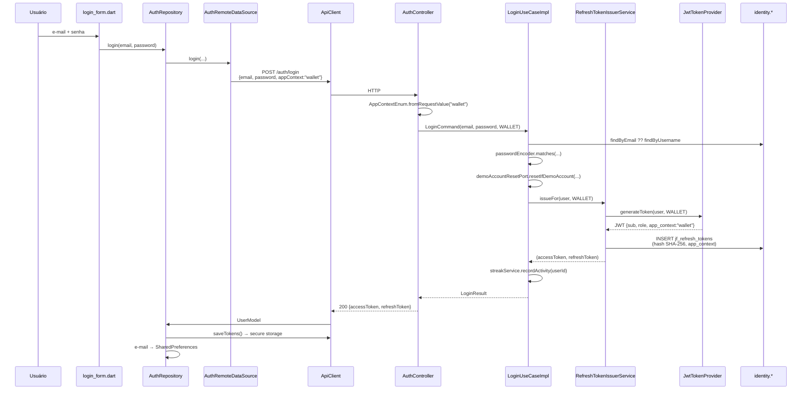
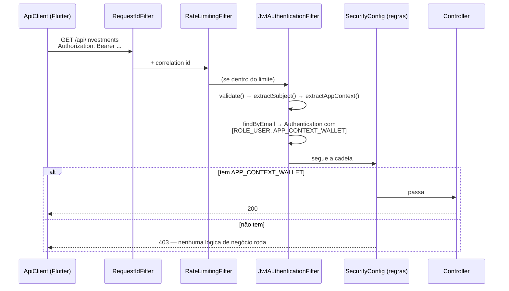
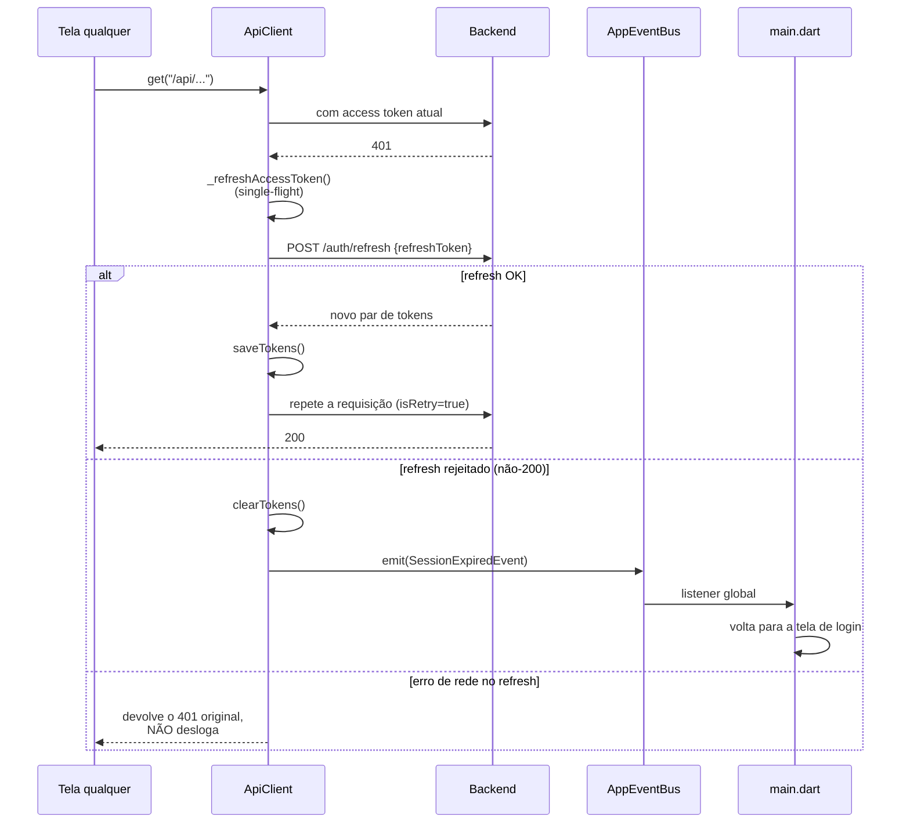

# Fatia 01 — Autenticação e `app_context`

> Verificado em 2026-09-02 lendo o código. Toda linha aqui é rastreável a um arquivo.

Esta é a fatia fundadora. Ela é o que faz *um* backend servir *dois* produtos
sem que um veja os dados do outro.

---

## 1. O que o usuário vê

Ele abre o app, digita e-mail e senha (ou entra com Google), e cai na home.
Enquanto usa, nunca mais pensa em login: se a sessão expira, o app renova
sozinha; se a renovação falha, ele volta para a tela de login com a sessão
limpa.

O que ele **não** vê, e é o ponto central: no mesmo instante do login, o
backend carimba na sessão **qual dos dois apps** fez o pedido. Esse carimbo
acompanha a sessão até o logout, e é ele que decide, em toda requisição
seguinte, se `/api/investments` responde ou devolve 403.

---

## 2. Caminho do dado

### 2.1 Login

### 2.2 Requisição autenticada — onde o `app_context` é cobrado

**A ordem dos filtros é intencional e está explícita no código:**
`RequestIdFilter` → `RateLimitingFilter` → `JwtAuthenticationFilter`.
Toda requisição, inclusive as barradas por rate limit, carrega um id de
correlação nos logs; e uma requisição barrada nunca chega a gastar CPU
parseando JWT.

### 2.3 Renovação silenciosa (401 → refresh → retry)

---

## 3. Arquivos que importam

### Flutter (idêntico nos dois apps, exceto onde indicado)

| Arquivo | Papel |
|---|---|
| `lib/features/auth/presentation/widgets/login_form.dart:47` | Chama `DI.authRepository.login` |
| `lib/features/auth/presentation/widgets/signup_form.dart:108-111` | Registra e **em seguida faz login** — `/auth/register` não devolve token |
| `lib/features/auth/data/repositories/auth_repository.dart` | Orquestra: chama o datasource, guarda tokens, guarda e-mail |
| `lib/features/auth/data/datasources/auth_remote_datasource.dart` | Monta os corpos HTTP; **é aqui que `appContext` entra** |
| `lib/features/auth/data/models/user_model.dart` | Parse da resposta |
| `lib/core/constants/api_constants.dart:42` | `appContext = 'wallet'` — **no Academy, linha 43: `'academy'`** |
| `lib/core/network/api_client.dart` | Tokens, headers, 401/refresh/retry. O coração da fatia no lado do app |
| `lib/core/navigation/start_route_resolver.dart` | Decide a rota inicial ao abrir o app |
| `lib/main.dart:78` | Listener global do `SessionExpiredEvent` |

### Backend

| Arquivo | Papel |
|---|---|
| `core/domain/enums/AppContextEnum.java` | O conceito inteiro em um enum: claim, authority, e os três parsers |
| `core/security/SecurityUtils.java` | Lê de volta o contexto da sessão atual |
| `infrastructure/config/SecurityConfig.java` | **As regras de rota.** O arquivo mais importante do backend |
| `infrastructure/security/jwt/JwtTokenProvider.java` | Assina e lê o JWT |
| `infrastructure/security/jwt/JwtAuthenticationFilter.java` | Transforma o Bearer em `Authentication` com authorities |
| `infrastructure/controller/auth/AuthController.java` | 7 endpoints de `/auth` |
| `application/auth/usecase/LoginUseCaseImpl.java` | Regra do login |
| `application/auth/service/RefreshTokenIssuerService.java` | **Único** ponto de emissão de par de tokens |
| `application/auth/usecase/RefreshTokenUseCaseImpl.java` | Rotação + detecção de roubo |

---

## 4. Regras de negócio (e o porquê de cada uma)

### 4.1 `AppContextEnum` tem três parsers diferentes, de propósito

Esta é a sutileza mais fácil de errar num PR:

| Método | Entrada inválida | Comportamento |
|---|---|---|
| `fromRequestValue` | `"walet"` (typo do cliente) | **Lança exceção** |
| `fromClaimValue` | claim desconhecida num JWT nosso | Devolve `Optional.empty()` |
| `fromAuthority` | authority que não é `APP_CONTEXT_*` | Devolve `Optional.empty()` |

**Por quê:** um typo vindo do cliente deve falhar **alto**, senão o app
silenciosamente ganharia uma sessão sem contexto e todo endpoint gated
passaria a dar 403 de forma inexplicável. Já um token que *nós mesmos*
assinamos e não tem a claim é simplesmente um token antigo, emitido antes da
claim existir — ele continua válido, só não tem escopo de app.

### 4.2 O contexto é fixado no login e **nunca** muda

`RefreshTokenUseCaseImpl` reemite sempre com `stored.appContext()` — o valor
que está na linha do banco, nunca um valor vindo do cliente. Um refresh não
pode transformar uma sessão Academy em sessão Wallet. Por isso a coluna
`app_context` existe em `jf_refresh_tokens` (migration `V21`).

### 4.3 Reuso de refresh token revogado mata todas as sessões

Se um refresh token já revogado é apresentado de novo, `RefreshTokenUseCaseImpl`
loga um warning e chama `revokeAllForUser`. O comentário no código é honesto
sobre o motivo: pode ser um retry duplicado benigno do cliente **ou** alguém
com uma cópia do token. Não dá para distinguir pela requisição, então a
resposta segura é a mesma nos dois casos — derrubar tudo e forçar re-login.

É também por isso que a linha revogada **não é deletada** (`V18` documenta
isso): deletar na rotação jogaria fora exatamente o sinal que detecta o roubo.

### 4.4 Nada de token em claro no banco nem no disco

- Backend: só o **SHA-256** do refresh token é armazenado (`RefreshToken.hash`).
  O valor bruto são 32 bytes de `SecureRandom` em Base64 URL-safe.
- Flutter: os dois tokens vão para `flutter_secure_storage` (keystore/keychain).
  Só o e-mail — não sensível — fica em `SharedPreferences`.

### 4.5 Retry após refresh é seguro em **qualquer** método HTTP

O comentário em `_sendWithAuth` explica algo não óbvio: repetir um `POST` após
renovar o token não corre risco de aplicar a operação duas vezes, porque o
`JwtAuthenticationFilter` roda **antes de qualquer controller**. Um 401 é
prova de que nenhuma lógica de negócio rodou. Não há nada para duplicar.

### 4.6 Falha de rede no refresh **não** desloga

Distinção deliberada em `_performRefresh`: um `catch` de erro de rede devolve
`false` sem limpar tokens. Só um refresh **rejeitado pelo servidor** (não-200,
ou corpo sem os tokens) dispara `SessionExpiredEvent`. Wi-fi ruim não deve
custar a sessão do usuário.

### 4.7 Single-flight no refresh

`_refreshInFlight` garante que N requisições que tomam 401 ao mesmo tempo
compartilhem **um** refresh. Sem isso, N chamadas simultâneas tentariam
rotacionar o mesmo token uma por cima da outra — e, pela regra 4.3, as
perdedoras seriam interpretadas como reuso de token revogado, derrubando
todas as sessões do usuário. Este detalhe de concorrência no cliente protege
uma regra de segurança do servidor.

### 4.8 `/auth/refresh` e `/auth/logout` são públicos de propósito

Ambos estão sob `permitAll()`. Precisa ser assim: renovar (e sair) tem que
funcionar justamente quando o access token **já expirou** — exigir
`Authorization` válido aí seria impossível de satisfazer.

### 4.9 Detalhes menores que confundem na leitura

- `/auth/login` responde apenas `{accessToken, refreshToken}` — **sem e-mail**.
  `UserModel.fromJson` faz `json['email'] ?? ''`, então `email` fica vazio.
  Quem guarda o e-mail é o `AuthRepository`, usando o que o usuário digitou.
- `/auth/register` responde `201` com `{userId, username, email}` e **nenhum
  token** — por isso o `signup_form` chama `register` e depois `login`.
- Login aceita e-mail **ou** username: `findByEmail().or(() -> findByUsername())`.
- `/auth/forgot-password` responde sempre a mesma mensagem, exista a conta ou
  não, para não permitir enumeração de usuários.

---

## 5. Dados persistidos

Schema `identity` (em produção; em dev, sem prefixo — ver visão geral §6).

### `jf_users` (`V1`, + `V16` para Google)

| Coluna | Observação |
|---|---|
| `user_id` | PK |
| `username`, `email` | `email` com constraint de unicidade desde `V7` |
| `password` | Hash. Nulo para contas só-Google |
| `role` | `ADMIN` \| `USER` — **hoje nenhuma rota é admin-only** |
| `investor_profile` | `GUARDIAN` \| `TACTICIAN` \| `ADVENTURER` (fatia 02) |
| `has_answered_onboarding`, `preferred_language`, `is_active` | — |

### `jf_refresh_tokens` (`V18`, + `V21`)

| Coluna | Observação |
|---|---|
| `token_hash` | SHA-256. Índice **único** — toda busca é por aqui |
| `expires_at` | TTL de **30 dias** (`app.refresh-token.expiration-days`) |
| `revoked_at` | Nulo = ativo. Preenchido em rotação/logout/detecção de roubo |
| `replaced_by_token_hash` | Cadeia de rotação — **auditoria apenas, nada consulta** |
| `app_context` | `V21`. Nulo em linhas anteriores à migration |

**Tempos de vida (verificados em `application.properties`):** access token
**1 hora** (`jwt.expiration=3600000`), refresh token **30 dias**
(`app.refresh-token.expiration-days=30`). Em produção o `jwt.expiration` vem
de variável de ambiente e pode divergir desse padrão.

O access token (JWT) **não é persistido** — é stateless e só validado pela
assinatura. Consequência prática: **não existe como revogar um access token
antes de ele expirar.** Um logout revoga o refresh token; o access token
continua válido até `jwt.expiration`. Se isso for inaceitável para algum caso
de uso futuro, é mudança de arquitetura, não ajuste.

---

## 6. Modos de falha

| Situação | O que acontece | Onde |
|---|---|---|
| Senha errada / usuário inexistente | `AuthenticationException` — mesma resposta nos dois casos | `LoginUseCaseImpl` |
| `appContext` com typo | Erro imediato, `"appContext must be 'academy' or 'wallet'"` | `AppContextEnum.fromRequestValue` |
| Token sem `app_context` chamando `/api/investments` | **403** antes do controller | `SecurityConfig` |
| Token sem `app_context` chamando `/api/mentor/chat` | **403** — exige um dos dois | `SecurityConfig` |
| Token sem `app_context` chamando `/api/pets` | **200** — rota compartilhada | `SecurityConfig` |
| JWT inválido/expirado | Filtro não autentica → cai em `anyRequest().authenticated()` → 401 | `JwtAuthenticationFilter` |
| JWT válido de usuário deletado | `findByEmail` vazio → não autentica → 401 | `JwtAuthenticationFilter` |
| Refresh token revogado reapresentado | **Todas** as sessões do usuário revogadas | `RefreshTokenUseCaseImpl` |
| Refresh sem conectividade | 401 original devolvido, sessão **preservada** | `ApiClient._performRefresh` |
| Google Sign-In em Linux/Windows | `UnsupportedError` → "Login com Google não está disponível neste dispositivo." | `AuthRepository.loginWithGoogle` |
| Usuário cancela o Google | Retorna normal, sem login, sem erro | `AuthRepository.loginWithGoogle` |
| Requisição travada | `TimeoutException` após 15s (Mentor tem timeout maior) | `ApiClient._requestTimeout` |
| Release sem `API_BASE_URL` | `StateError` no boot — falha alto em vez de apontar para localhost | `ApiConstants.assertConfiguredForRelease` |

---

## 7. Drills

Responda de cabeça antes de conferir.

<b>Drill 1 —</b> Um usuário Academy chama <code>/api/mentor/chat</code> com um JWT emitido antes da claim <code>app_context</code> existir. O que acontece?

**403.** `SecurityConfig` exige `hasAnyAuthority(WALLET, ACADEMY)` para
`/api/mentor/**`. O filtro não adiciona nenhuma authority `APP_CONTEXT_*`
quando a claim está ausente, então a regra não é satisfeita. O request morre
na cadeia de segurança — `MentorController` nunca é chamado.

**Por que essa rota é assim:** o Mentor monta prompts diferentes por contexto
(carteira real vs. progresso Academy). Servir uma sessão de contexto
desconhecido significaria escolher um prompt no chute — e um dos chutes vaza
dados do outro produto.

<b>Drill 2 —</b> O mesmo token antigo chama <code>/api/pets/my-pet</code>. E agora?

**200.** `/api/pets/**` cai em `anyRequest().authenticated()`. O Pet é
compartilhado por decisão de produto: é um companheiro só, para a pessoa, nos
dois apps.

<b>Drill 3 —</b> Você quer que o Mentor volte a atender sessões sem contexto, com o prompt do Wallet. Quantos lugares precisa mudar?

**Dois, e o segundo é o que se esquece.**

1. `SecurityConfig`: trocar `hasAnyAuthority(...)` por `authenticated()` em
   `/api/mentor/**`.
2. `GetMentorReplyUseCaseImpl`: **já** trata contexto nulo caindo no caminho
   Wallet — a linha decisiva é `boolean isAcademy = appContext ==
   AppContextEnum.ACADEMY`, então qualquer valor que não seja `ACADEMY`
   (inclusive `null`) usa `buildForWallet`. Verificado. Mas isso hoje é
   inalcançável, porque o `SecurityConfig` barra antes; ao abrir a rota, esse
   caminho passa a ser executável e precisa de teste próprio.

E há um terceiro efeito, não óbvio: conversas do Mentor são escopadas por
`app_context` no banco (`V27`). Uma sessão sem contexto passa a ter uma
visibilidade indefinida sobre conversas existentes. **Verifique isso antes de
fazer a mudança.**

<b>Drill 4 —</b> Você adiciona uma coluna nova em <code>jf_users</code>, escreve a migration em <code>db/migration</code>, tudo passa localmente. Que risco continua de pé?

Que ela funcione em H2/dev e falhe em produção — porque em produção a tabela
vive em `identity`, e localmente não existe schema nenhum. `db/migration-postgres`
não roda em dev.

O caso mais perigoso não é a coluna: é qualquer SQL que **referencie tabela por
nome não qualificado** e dependa do `search_path`. Localmente sempre resolve;
em produção depende da configuração do usuário do banco.

**Este ponto não está verificado contra o banco real** — está anotado como
pendência em `00-visao-geral.md` §9. É um bom primeiro exercício de dono do
produto: conectar no Postgres de produção e rodar `SHOW search_path;`.

<b>Drill 5 —</b> Um usuário reclama que foi deslogado do nada, várias vezes no mesmo dia. Qual sua primeira hipótese?

Reuso de refresh token revogado disparando `revokeAllForUser` (regra 4.3).

Como confirmar: procurar nos logs por
`"Rejected reuse of a revoked refresh token for user {id}"` — o warning existe
exatamente para isso.

Causa provável **não** sendo roubo: duas instâncias do app (ou dois
dispositivos) rotacionando tokens em paralelo, ou algum caminho que escapa do
single-flight do `ApiClient`. Vale checar se o usuário está logado em mais de
um lugar antes de tratar como incidente de segurança.

<b>Drill 6 —</b> Por que <code>appContext</code> é <code>const</code> no código em vez de <code>--dart-define</code>?

Porque o binário **é** o produto. Um build do Wallet nunca deve poder virar
Academy por causa de um flag errado na pipeline. O comentário no
`api_constants.dart` diz isso explicitamente: "Fixed per-app value, not a
build flag: this binary is only ever the Wallet client."

Compare com `API_BASE_URL`, que **é** flag: o mesmo produto legitimamente
aponta para ambientes diferentes.

---

## 8. Se você fosse mudar algo aqui

- **Adicionar um terceiro app** → o enum, as regras de rota e a coluna
  `app_context` já suportam. O trabalho real é decidir, endpoint por endpoint,
  em qual das três categorias da §5 da visão geral ele cai.
- **Revogar access tokens** → exige mudança de arquitetura (blacklist ou
  tokens stateful). Hoje é impossível por design.
- **Papéis de admin** → `@EnableMethodSecurity` já está ligado, sem nenhum uso.
  Proteger a primeira rota admin é um `@PreAuthorize` de uma linha.
- **Mexer em `SecurityConfig`** → este é o arquivo onde um erro é mais caro do
  projeto inteiro. Toda mudança aqui merece um teste explícito de que o
  contexto errado toma 403.
