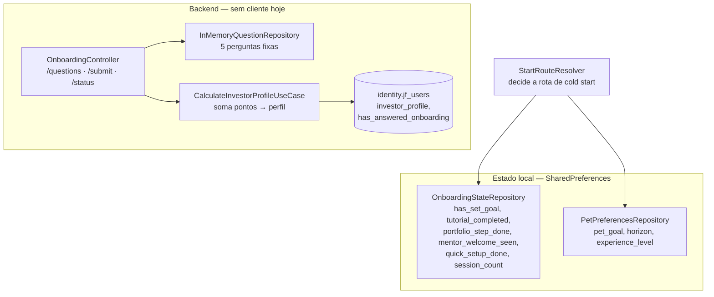

# Fatia 02 — Onboarding e `InvestorProfile`

> Verificado em 2026-09-02 lendo o código. Toda linha aqui é rastreável a um arquivo.

Esta fatia tem uma particularidade que muda como você deve lê-la: **quase tudo
que ela documenta no backend está inalcançável pelos apps hoje.** Os endpoints
existem, funcionam e não têm cliente.

---

## 1. O que o usuário vê

Dois fluxos completamente diferentes, um por produto — e isso é intencional
(Etapa 5 do split).

### Academy — cinco etapas, todas com estado local

`login → meetPet → financialGoal → tutorial → portfolioChoice → home`

Escolher espécie e nome do companheiro, definir meta financeira, tutorial, e
uma escolha sobre carteira que é **deliberadamente opcional**.

### Wallet — duas telas

`login → mentorWelcome → quickSetup → home`

Boas-vindas do Mentor e um setup rápido de mercado/moeda. Sem escolha de pet:
um usuário que chega primeiro pelo Wallet **recebe um pet provisionado
silenciosamente**, chamado `Nino` (`kDefaultWalletPetName`) — um dos nomes que
o Academy sugere na tela de batismo, para não parecer placeholder.

O raciocínio está escrito no `StartRouteResolver`: o pet é um companheiro
cross-app compartilhado (fatia 03), não algo que o Wallet esteja pedindo ao
usuário para configurar.

### O que o usuário **não** vê em nenhum dos dois

O questionário de perfil de investidor. Ver regra 4.1.

---

## 2. Caminho do dado



Repare que as duas metades não se tocam. O roteamento do onboarding é
inteiramente decidido por `SharedPreferences`; o backend de onboarding é
decidido por nada, porque ninguém o chama.

---

## 3. Arquivos que importam

| Arquivo | Papel |
|---|---|
| `core/navigation/start_route_resolver.dart` | **A regra de roteamento.** Diferente em cada app |
| `features/onboarding/data/repositories/onboarding_state_repository.dart` | Todos os flags locais |
| `infrastructure/controller/onboarding/OnboardingController.java` | 3 endpoints, sem cliente |
| `infrastructure/repository/assessment/InMemoryQuestionRepository.java` | As 5 perguntas, **hardcoded em Java** |
| `application/onboarding/usecase/CalculateInvestorProfileUseCaseImpl.java` | A pontuação |
| `application/onboarding/usecase/SubmitAssessmentUseCaseImpl.java` | Idempotente por design |

---

## 4. Regras de negócio (e o porquê de cada uma)

### 4.1 O questionário de perfil está inalcançável nos dois apps

Verificado por rastreamento de referências:

| App | Situação |
|---|---|
| **Wallet** | `DI.onboardingRepository` existe, **nenhum arquivo o chama**. `StartRouteResolver` nunca roteia para um questionário |
| **Academy** | `OnboardingScreen` é referenciada só por `PortfolioNotConnectedCard`, que **não é referenciado por ninguém** (removido da Home na Etapa 7, arquivo não deletado) |

Ou seja: `/api/onboarding/questions` e `/api/onboarding/submit` são endpoints
vivos que **nenhum usuário consegue alcançar**. Todo usuário novo fica com
`investor_profile = NULL` e `has_answered_onboarding = false` permanentemente.

### 4.2 E nada consome o `InvestorProfile`, mesmo se ele fosse preenchido

Um grep em todo o backend mostra que `getInvestorProfile()` só aparece em:
o próprio `User`, o mapeamento JPA, e `/api/onboarding/status`, que o devolve.

O Mentor **não** o usa — `MentorSystemPromptBuilder` recebe `pet`, carteira,
contexto do cliente e idioma, nunca o perfil. Nenhuma recomendação, nenhuma
trilha, nenhum cálculo depende dele.

<!-- Então o quadro completo é: um questionário de 5 perguntas, com pontuação,
     três perfis nomeados e uma coluna no banco — e o valor produzido não é lido
     por ninguém, nem quando é produzido, o que hoje nunca acontece.

     Antes de "consertar" ligando a tela de volta, vale decidir para que serve o
     perfil. Ressuscitar a coleta sem ter quem consuma só move o problema. -->

### 4.3 A pontuação classifica "tudo moderado" como o perfil mais arrojado

São 5 perguntas, cada uma com opções de **0, 2 ou 4** pontos. Máximo 20.

```java
if (totalScore <= 4)      return InvestorProfile.GUARDIAN;
else if (totalScore <= 8) return InvestorProfile.TACTICIAN;
else                      return InvestorProfile.ADVENTURER;
```

| Respostas | Soma | Perfil |
|---|---|---|
| Cinco conservadoras (0) | 0 | GUARDIAN |
| **Cinco moderadas (2)** | **10** | **ADVENTURER** |
| Cinco arrojadas (4) | 20 | ADVENTURER |

<!-- Alguém que responde "meio-termo" às cinco perguntas — o perfil literalmente
     mediano — é classificado como ADVENTURER, o mais agressivo dos três.
     TACTICIAN só é alcançável numa faixa estreita (5 a 8 de 20), que exige
     misturar respostas conservadoras com moderadas.

     Num produto que não pode incentivar especulação, classificar o usuário
     mediano como arrojado é o erro na direção errada. -->

### 4.4 O submit é idempotente por design

`SubmitAssessmentUseCaseImpl` devolve o perfil existente sem recalcular se
`hasAnsweredOnboarding` já é verdadeiro e o perfil não é nulo. Um retry ou
duplo-submit nunca reclassifica o usuário.

### 4.5 As perguntas são hardcoded em Java, e traduzidas sob demanda

`InMemoryQuestionRepository` guarda as cinco perguntas em `List.of(...)`. O
idioma canônico é **pt-BR**, e `TranslationCacheService` produz os demais sob
demanda a partir desse texto.

Não há tabela, não há seed, não há como editar sem deploy.

### 4.6 Todo o estado de onboarding é local — e as consequências disso

`OnboardingStateRepository` guarda em `SharedPreferences`:
`onboarding_has_set_goal`, `onboarding_tutorial_completed`,
`onboarding_portfolio_step_done`, `onboarding_mentor_welcome_seen`,
`onboarding_quick_setup_done`, `onboarding_session_count` e os controles do
lembrete de carteira.

O comentário do arquivo é honesto: *"não existe campo no backend para nada
disso — só decide qual tela o app abre e o que a Home mostra."*

Consequência direta: **reinstalar o app refaz o onboarding inteiro.** O
servidor não sabe que o usuário já passou por ele. E o mesmo usuário nos dois
apps tem dois estados de onboarding independentes — o que aqui é correto, já
que os fluxos são diferentes de propósito.

### 4.7 Telas do fluxo antigo continuam no repositório, inalcançáveis

O `StartRouteResolver` do Wallet documenta isso explicitamente: as etapas
antigas de batismo de pet, meta financeira, tutorial e escolha de carteira
"estão inalcançáveis a partir do cold start, mas não foram deletadas" — o
mesmo padrão de *cleanup adiado* do resto do split, até se decidir se alguma
delas ressurge em outro lugar (por exemplo, um "trocar meta" no Perfil).

<!-- Ao ler o diretório features/onboarding/ do Wallet, presuma que um arquivo
     está morto até provar o contrário pelo StartRouteResolver. São 14 arquivos
     e só dois deles são telas alcançáveis. -->

---

## 5. Dados persistidos

Em `identity.jf_users` (V1):

| Coluna | Estado real hoje |
|---|---|
| `investor_profile` | `GUARDIAN` \| `TACTICIAN` \| `ADVENTURER` — **NULL para todo usuário novo** |
| `has_answered_onboarding` | **`false` para todo usuário novo** |

Tudo o mais do onboarding vive em `SharedPreferences`, no aparelho.

---

## 6. Modos de falha

| Situação | O que acontece | Onde |
|---|---|---|
| Usuário quer refazer o questionário | Impossível — a tela é inalcançável | regra 4.1 |
| Usuário reinstala o app | Refaz o onboarding inteiro | regra 4.6 |
| Usuário responde tudo "meio-termo" | Classificado como ADVENTURER | regra 4.3 |
| Submit repetido | Devolve o perfil já existente, não recalcula | regra 4.4 |
| Signup pelo Wallet | Ganha um pet `Nino` sem ser perguntado | `StartRouteResolver._ensureDefaultPet` |
| `/api/onboarding/status` | Responde `{hasAnswered: false, profile: null}` para todos | regra 4.1 |
| Falha ao provisionar o pet no Wallet | `catch` devolve `StartRoute.login` | `StartRouteResolver.resolve` |

---

## 7. Drills

<details>
<summary><b>Drill 1 —</b> Você quer usar o <code>InvestorProfile</code> para personalizar o tom do Mentor. Quanto trabalho é?</summary>

Mais do que parece, porque **duas coisas** estão faltando, não uma.

1. **Ninguém produz o valor.** O questionário está inalcançável nos dois apps
   (regra 4.1), então `investor_profile` é NULL para todo mundo. Você precisa
   primeiro dar um caminho de volta à tela.
2. **Ninguém consome o valor.** `MentorSystemPromptBuilder` não recebe o perfil
   em nenhum dos dois construtores. Adicionar um parâmetro ali é a mudança que
   a fatia 05 regra 4.2 marca como a mais perigosa do arquivo — mas neste caso
   é segura, porque o perfil é dado de identidade, não de nenhum dos dois
   contextos.

E há uma terceira pergunta antes das duas: com a pontuação atual, o usuário
mediano é classificado como ADVENTURER (regra 4.3). Personalizar o tom com base
num rótulo mal calibrado piora a experiência em vez de melhorar.
</details>

<details>
<summary><b>Drill 2 —</b> Por que o Wallet cria um pet chamado "Nino" sem perguntar, em vez de mostrar o seletor?</summary>

Porque o pet é **um só, cross-app** (fatia 03), e não algo que o Wallet esteja
pedindo ao usuário para configurar.

O `StartRouteResolver` explica o caso de uso: um usuário que já veio da Academy
"já tem um pet, mesma conta Petrimonium". Um signup que começa pelo Wallet
precisa de um pet para as telas funcionarem, então ele é provisionado em
silêncio — com um dos nomes que o Academy sugere, para não parecer placeholder
se o usuário depois vier a vê-lo.

*Detalhe que fecha o círculo:* esse nome é local (fatia 03, regra 4.2). O
backend grava `"<ESPÉCIE> Companion"`, não `"Nino"`.
</details>

<details>
<summary><b>Drill 3 —</b> Um usuário reclama que refez o onboarding do zero ao trocar de celular. Bug?</summary>

Não — é consequência direta do desenho atual.

Todo o estado de onboarding vive em `SharedPreferences` (regra 4.6). O backend
tem duas colunas para isso (`has_answered_onboarding`, `investor_profile`), mas
elas se referem ao questionário, não ao fluxo de telas, e não são preenchidas
por ninguém hoje.

Para o servidor, um usuário que já usou o app por meses e um recém-registrado
são indistinguíveis quanto a onboarding.
</details>

<details>
<summary><b>Drill 4 —</b> Você abre <code>features/onboarding/</code> do Wallet e vê 14 arquivos. Quantas telas o usuário realmente alcança?</summary>

**Duas:** `mentor_welcome_screen.dart` e `quick_setup_screen.dart`.

O resto é o fluxo antigo de 7 etapas, inalcançável a partir do cold start desde
a Etapa 5 e deliberadamente não deletado (regra 4.7).

A fonte da verdade sobre o que está vivo é o `StartRouteResolver`, não a
listagem do diretório. Vale para todo o repositório: o padrão de *cleanup
adiado* significa que a presença de um arquivo não prova nada.
</details>

<details>
<summary><b>Drill 5 —</b> Como você editaria a redação de uma das perguntas do questionário?</summary>

Editando Java e fazendo deploy do backend. `InMemoryQuestionRepository` guarda
as cinco perguntas num `List.of(...)` estático — não há tabela nem seed.

E só o texto em **pt-BR** é editável: os outros idiomas são gerados sob demanda
pelo `TranslationCacheService` a partir dele. Uma tradução ruim não se corrige
diretamente, se corrige mudando o original ou o cache.
</details>

---

## 8. Se você fosse mudar algo aqui

- **Decidir o destino do questionário** → é a pergunta que precede todas as
  outras desta fatia. Ou ele volta a ser alcançável e ganha um consumidor, ou
  os endpoints, o catálogo e as duas colunas saem. Manter como está é o pior
  dos três: código vivo que ninguém executa.
- **Recalibrar a pontuação** → se o questionário voltar, `TACTICIAN` precisa
  cobrir a faixa mediana. Ver regra 4.3.
- **Persistir o progresso do onboarding no servidor** → resolve o drill 3, e é
  pré-requisito para qualquer continuidade entre aparelhos.
- **Limpar o fluxo antigo do Wallet** → 12 dos 14 arquivos. Antes, confirmar se
  alguma tela ressurge em Perfil/Configurações.
