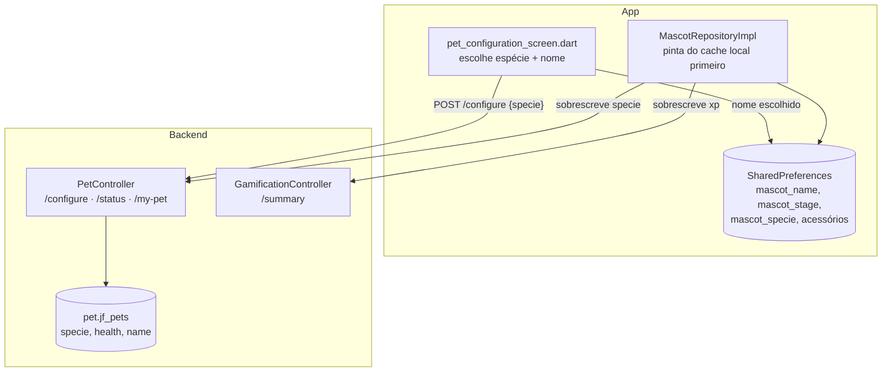

# Fatia 03 — Pet / companheiro

> Verificado em 2026-09-02 lendo o código. Toda linha aqui é rastreável a um arquivo.

O Pet é a única entidade **deliberadamente compartilhada** entre os dois
produtos: é o mesmo companheiro, para a mesma pessoa, no Wallet e no Academy.
Também é a fatia com a maior distância entre o que o servidor guarda e o que o
usuário vê.

---

## 1. O que o usuário vê

No onboarding ele escolhe uma espécie e dá um nome ao companheiro. Dali em
diante o bicho aparece na home, reage, evolui de estágio, ganha acessórios, e
mostra um nível que sobe conforme ele estuda.

O que o servidor realmente guarda disso tudo: **espécie e vida**. Mais nada.

| O que o usuário vê | Onde realmente vive |
|---|---|
| Espécie | `jf_pets.specie` — servidor |
| Nível / XP | Derivado de `xp_events` + conquistas + missões (fatia 04) |
| **Nome** | **`SharedPreferences` do aparelho** |
| Estágio de evolução | `SharedPreferences` do aparelho |
| Acessórios equipados/desbloqueados | `SharedPreferences` do aparelho |
| "Vida" (health) | `jf_pets.health` — sempre 100, nunca muda |

---

## 2. Caminho do dado



O `MascotRepositoryImpl` pinta instantaneamente do cache local, depois
sobrescreve **apenas `xp` e `specie`** com os valores reais do backend, em
best-effort. Offline, fica com o último valor real conhecido — o comentário do
arquivo chama isso de "staleness legítima, nunca um número fabricado", e a
distinção é boa: o app nunca inventa XP.

---

## 3. Arquivos que importam

| Arquivo | Papel |
|---|---|
| `infrastructure/controller/pet/PetController.java` | 3 endpoints, todos compartilhados |
| `application/pet/usecase/ConfigurePetUseCaseImpl.java` | Cria ou troca a espécie; **gera o nome** |
| `core/domain/Pet.java` | `id`, `name`, `specie`, `health`, `user` |
| `core/domain/enums/PetSpecieEnum.java` | **7 espécies** — ver regra 4.5 |
| `features/pet/data/repositories/mascot_repository_impl.dart` | Cache local + sobrescrita parcial pelo backend |
| `features/pet/data/repositories/pet_preferences_repository.dart` | Meta / horizonte / experiência — **local-only** |
| `features/onboarding/presentation/screens/pet_configuration_screen.dart` | Espécie + nome numa tela só |
| `features/pet/presentation/widgets/pet_species_selector.dart` | Renderiza `PetSpecieEnum.values` |

---

## 4. Regras de negócio (e o porquê de cada uma)

### 4.1 Um pet por usuário, compartilhado entre os apps — por design

`jf_pets.user_id` tem constraint `unique`. Não existe "pet do Wallet" e "pet do
Academy": é um só.

`/api/pets/**` cai em `anyRequest().authenticated()` justamente por isso
(fatia 01). A auditoria da Etapa 6 confirmou que isso é intencional, não um
vazamento — o companheiro atravessa os dois produtos de propósito.

O que torna isso seguro é a fatia 04: o XP que alimenta o nível dele só pode
ser ganho no Academy. Um usuário Wallet ver nível 7 é ver o próprio estudo
refletido, não a própria riqueza.

### 4.2 O nome do pet não é o nome que o Mentor usa

Este é o achado mais visível desta fatia.

`ConfigurePetUseCaseImpl` gera o nome no servidor:

```java
pet.setName(specie.name() + " Companion");   // "DOG Companion"
```

Não existe endpoint para renomear. O nome que o usuário escolhe no onboarding
— e edita depois em Configurações — é salvo em `SharedPreferences`
(`mascot_name`), nunca enviado ao backend.

Mas o Mentor monta o prompt com o nome **do servidor**:

```java
private static String resolvePetName(Pet pet) {
    return (pet != null && pet.getName() != null && !pet.getName().isBlank())
            ? pet.getName()
            : "your pet";
}
```

<!-- Consequência real e verificável: o usuário batiza o bicho de "Nina", a
     interface inteira diz "Nina", e o Mentor se apresenta como "DOG Companion".
     Não corrigido; documentado. A correção seria persistir o nome (coluna já
     existe em jf_pets, hoje só recebe o valor gerado) e expor um endpoint de
     rename. -->

Dois efeitos colaterais do nome ser local:

- Reinstalar o app ou trocar de aparelho **perde o nome**.
- O "mesmo companheiro" pode ter **nomes diferentes** no Wallet e no Academy,
  porque cada app tem seu próprio `SharedPreferences`.

### 4.3 `health` existe, vale 100 e nunca muda

`DEFAULT_PET_HEALTH = 100` é gravado na criação. Nenhum outro ponto do backend
chama `setHealth` — verificado com grep em toda a base, fora testes. O campo é
devolvido por `/my-pet` e não é usado para nada.

<!-- Campo vestigial do app original (Invest-Game-V2), onde a saúde do pet
     provavelmente reagia a comportamento. Mantido no schema, morto na prática.
     Não remover sem checar se algum app lê — a resposta de /my-pet o inclui. -->

### 4.4 `configure` é upsert, e trocar de espécie preserva o pet

Se o usuário já tem pet, `ConfigurePetUseCaseImpl` só troca a espécie: o mesmo
registro, o mesmo id, a mesma vida. Não há criação de um segundo pet nem perda
de histórico — o que faz sentido, já que o XP não mora no pet, mora nas tabelas
de gamificação (fatia 04).

Mas o **nome não é regenerado** ao trocar de espécie: quem era `"DOG Companion"`
e vira gato continua `"DOG Companion"` no banco. Só o `setName` da criação
existe.

### 4.5 O enum tem 7 espécies; o banco aceita 6

<!-- BUG ATIVO, alcançável pelo usuário. Documentado aqui em vez de corrigido
     porque a correção é uma migration, não uma mudança de documentação. -->

`PetSpecieEnum` (backend e app) lista: `DOG`, `CAT`, `WOLF`, `FOX`, `BEAR`,
`LION`, **`OWL`**.

O CHECK da migration `V1` permite: `('DOG', 'CAT', 'WOLF', 'FOX', 'BEAR', 'LION')`.
Nenhuma migration posterior adiciona `OWL` — verificado com grep em
`db/migration`, `db/migration-dev` e `db/migration-postgres`.

`PetJpaEntity` mapeia a espécie com `@Enumerated(EnumType.STRING)`, então o
literal `"OWL"` é o que vai para a coluna — e é rejeitado pelo CHECK.

E o `PetSpeciesSelector` do Academy renderiza `PetSpecieEnum.values`, ou seja,
**oferece a coruja na tela**. Um usuário que escolher a coruja no onboarding
recebe erro na chamada de `/api/pets/configure`.

Por que passou despercebido: `spring.jpa.hibernate.ddl-auto=validate` valida
colunas e tipos, **não valores de CHECK constraint** — a aplicação sobe
normalmente. E o Wallet não tem seletor de espécie desde a Etapa 5, então o
bug é exclusivo do Academy.

### 4.6 Meta, horizonte e experiência do onboarding são local-only

`PetPreferencesRepository` guarda `pet_goal`, `pet_investment_horizon` e
`pet_experience_level` em `SharedPreferences`. O comentário do arquivo é
honesto sobre o motivo: não existe campo no backend para isso, e criar um
schema para um valor que nada mais consome não se justificava.

Consequência: esses valores **chegam ao Mentor** apenas porque o app os envia a
cada requisição de chat, dentro do `MentorClientContextDTO` (fatia 05, regra
4.8 — as chaves `client_goal` e `client_horizon`). Eles não existem no servidor
entre uma conversa e outra.

---

## 5. Dados persistidos

### `pet.jf_pets` — V1, movida de schema pela V20

| Coluna | Observação |
|---|---|
| `id` | PK |
| `name` | Sempre `"<ESPÉCIE> Companion"`, gerado no servidor. Ver regra 4.2 |
| `health` | `not null`, sempre 100. Ver regra 4.3 |
| `specie` | CHECK com **6** valores; o enum tem **7**. Ver regra 4.5 |
| `user_id` | FK para `identity.jf_users`, **`unique`** — um pet por usuário |

Nada de nível, XP, estágio ou acessório é persistido aqui. Nível e XP são
derivados (fatia 04); estágio e acessórios são locais do aparelho.

---

## 6. Modos de falha

| Situação | O que acontece | Onde |
|---|---|---|
| Usuário escolhe a coruja | **Erro na configuração do pet** — violação de CHECK | regra 4.5 |
| Espécie inválida no corpo | `400 Bad Request`, `"Invalid specie"` | `PetController.configurePet` |
| `/my-pet` sem pet configurado | `404` — o app trata como "ainda não configurou" | `PetController.getMyPet` |
| Usuário reinstala o app | Nome, estágio e acessórios **voltam ao padrão**; espécie e XP são recuperados do backend | `MascotRepositoryImpl` |
| Mesmo usuário nos dois apps | Pode ver **nomes diferentes** para o mesmo companheiro | regra 4.2 |
| Sem conexão | Pinta do cache local, sem sobrescrever — staleness legítima | `MascotRepositoryImpl.loadProfile` |
| Usuário conversa com o Mentor | Mentor o chama de `"<ESPÉCIE> Companion"`, não do nome escolhido | regra 4.2 |

---

## 7. Drills

<details>
<summary><b>Drill 1 —</b> O usuário batizou o pet de "Nina". Ele abre o chat e o Mentor se apresenta como outra coisa. Onde está o problema?</summary>

Não é um bug do Mentor — é a fatia 03 vazando para a 05.

"Nina" está em `SharedPreferences` (`mascot_name`), no aparelho. O backend
nunca soube desse nome: `ConfigurePetUseCaseImpl` gravou `"<ESPÉCIE> Companion"`
e não existe endpoint de rename. O `MentorSystemPromptBuilder.resolvePetName`
lê o pet do servidor.

**A correção mínima:** a coluna `name` já existe em `jf_pets`. Bastaria aceitar
o nome no `/configure` (ou adicionar um `PATCH /api/pets`) e fazer o app enviá-lo.
Nada no schema precisa mudar.
</details>

<details>
<summary><b>Drill 2 —</b> Por que <code>/api/pets/**</code> não é gated por <code>app_context</code>, se <code>/api/v1/achievements</code> é?</summary>

Porque são coisas de natureza diferente.

O Pet é **um companheiro único e intencionalmente compartilhado** — a auditoria
da Etapa 6 confirmou isso como design, não como falha. O que o torna seguro é
que o número que ele exibe (nível) só pode subir com estudo: o XP vem de rotas
Academy-only (fatia 04).

Conquistas avaliam **patrimônio real** (`portfolio_10k`, `portfolio_50k`). Uma
sessão Academy não tem carteira real e nunca deveria disparar essa avaliação —
daí o `APP_CONTEXT_WALLET`.

A regra por trás das duas decisões é a mesma: *o Wallet nunca celebra riqueza,
e o Academy nunca toca dinheiro real.*
</details>

<details>
<summary><b>Drill 3 —</b> Um usuário troca a espécie do pet de cachorro para leão. O que acontece com o nível dele?</summary>

**Nada.** O nível não mora no pet.

`ConfigurePetUseCaseImpl` só faz `pet.setSpecie(specie)` num registro que já
existe — mesmo id, mesma vida. E o nível é derivado de `xp_events`,
`achievement_unlocks` e `mission_completions` (fatia 04), que são indexadas por
`user_id`, não por pet.

*Pegadinha:* o **nome** no banco continua `"DOG Companion"`, porque `setName` só
é chamado na criação. Como esse nome só aparece no prompt do Mentor (regra
4.2), o efeito prático é o Mentor de um leão se apresentar como cachorro.
</details>

<details>
<summary><b>Drill 4 —</b> Você quer remover a coluna <code>health</code>, que está morta. Qual é o risco?</summary>

Menor do que parece, mas não zero.

Nada no backend escreve nela além do valor inicial — verificado. Mas
`/api/pets/my-pet` **devolve** `health` no `PetDetailResponseDTO`. Antes de
remover, você precisa saber se algum dos dois apps lê esse campo; se ler e a
resposta mudar de forma, o parse quebra.

E a coluna é `not null` sem default, então a migration precisa removê-la, não
apenas ignorá-la — com `ddl-auto=validate`, uma coluna presente no banco e
ausente na entidade não derruba o boot, mas o inverso sim.
</details>

<details>
<summary><b>Drill 5 —</b> Como a coruja passou pelos testes e pelo boot da aplicação?</summary>

Porque nenhuma das duas coisas checa isso.

`spring.jpa.hibernate.ddl-auto=validate` compara **colunas e tipos** entre as
entidades e o schema. Uma CHECK constraint cujos valores divergem de um enum
Java não é comparada — para o Hibernate, `specie` é um `varchar` e o enum
serializa para `varchar`. Bate.

E os testes rodam contra H2 com as mesmas migrations, então só falhariam se
algum teste efetivamente tentasse **persistir** um pet com `OWL`. Nenhum tenta.

É o formato clássico de bug que só aparece com um usuário real fazendo uma
escolha legítima na tela.
</details>

---

## 8. Se você fosse mudar algo aqui

- **Corrigir a coruja** → migration alterando o CHECK de `jf_pets.specie` para
  incluir `OWL`. Em Postgres é `drop constraint` + `add constraint`; o nome da
  constraint é gerado pelo banco na V1, então descubra-o antes de escrever a
  migration.
- **Persistir o nome do pet** → a coluna já existe. É aceitar o nome no
  `/configure` e fazer o app enviar. Resolve o drill 1 e a divergência entre
  os dois apps.
- **Mover estágio e acessórios para o servidor** → é o que faria o companheiro
  ser de verdade "o mesmo" nos dois apps. Precisa de schema novo, e a fatia 04
  é onde o nível já vive.
- **Remover `health`** → ver drill 4.
