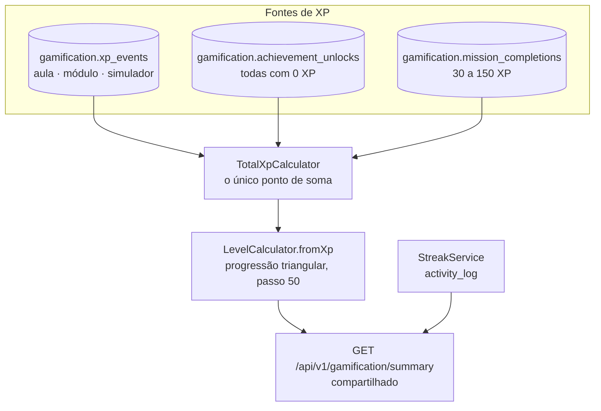
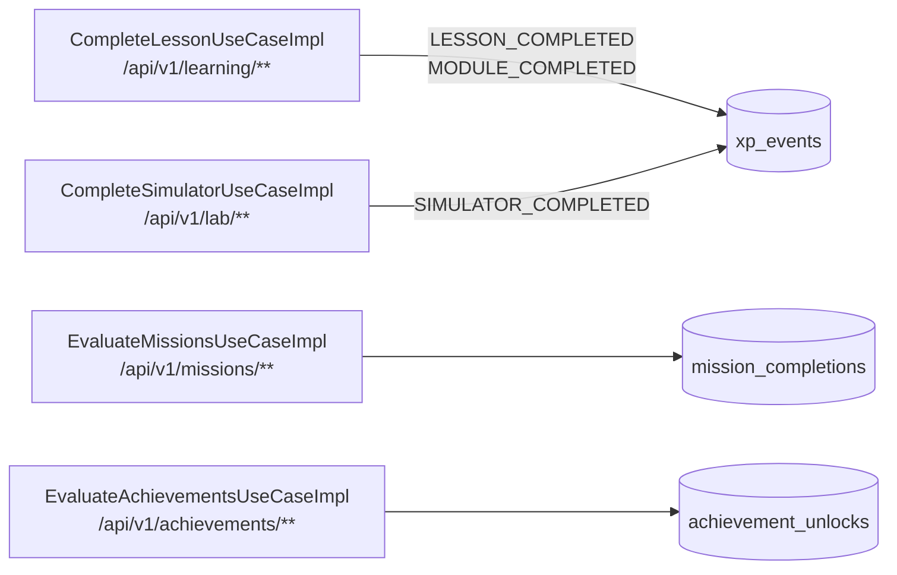

# Fatia 04 — Gamificação: XP, nível e streak

> Verificado em 2026-09-02 lendo o código. Toda linha aqui é rastreável a um arquivo.

Esta fatia sustenta a promessa que torna o Pet compartilhado seguro (fatia 03):
**o número que os dois apps exibem só pode subir com estudo.** Vale entender
onde essa garantia é estrutural e onde ela é apenas um valor literal que
alguém pode mudar numa linha.

---

## 1. O que o usuário vê

Um nível, uma barra de progresso até o próximo, e uma sequência de dias
("streak"). No Academy ele também vê missões diárias/semanais; no Wallet, um
mural de conquistas.

O nível é o mesmo nos dois apps, porque `/api/v1/gamification/summary` é uma
rota compartilhada.

---

## 2. Caminho do dado



Quem **escreve** em cada fonte:



As três primeiras rotas são **Academy-only**. A quarta é **Wallet-only** — e é
a única que poderia furar a regra, se as conquistas não fossem todas de 0 XP.

---

## 3. Arquivos que importam

| Arquivo | Papel |
|---|---|
| `application/gamification/service/TotalXpCalculator.java` | Soma as **três** fontes. O ponto único |
| `application/gamification/service/XpLedgerService.java` | O único lugar que concede XP; idempotente |
| `application/gamification/service/LevelCalculator.java` | XP → nível. Espelha o Dart |
| `application/gamification/service/StreakService.java` | Registra atividade e deriva o streak |
| `core/domain/gamification/XpEventType.java` | **3 valores.** O allow-list |
| `application/gamification/achievement/AchievementCatalog.java` | 10 conquistas, todas 0 XP |
| `application/gamification/mission/MissionCatalog.java` | 4 missões, 30–150 XP |
| `application/gamification/usecase/GetGamificationSummaryUseCaseImpl.java` | Monta o resumo compartilhado |

---

## 4. Regras de negócio (e o porquê de cada uma)

### 4.1 XP vive em três tabelas, não em uma

`TotalXpCalculator` existe exatamente por isso:

```java
return xpLedgerService.totalXpFor(userId)
        + achievementRepository.totalXpFor(userId)
        + missionRepository.totalXpFor(userId);
```

O comentário da classe explica o valor: antes, cada chamador somava as fontes à
mão, e uma fonte nova precisava ser lembrada em todo lugar. Agora é um lugar só.

**Consequência para quem lê o `SecurityConfig`:** o comentário lá diz que o XP é
restrito por allow-list de `XpEventType`. Isso é verdade sobre `xp_events`, mas
`xp_events` é **um terço** da história. As outras duas fontes não passam pelo
enum.

### 4.2 O allow-list é real, e mais forte do que o comentário sugere

`XpEventType` tem exatamente três valores: `LESSON_COMPLETED`,
`MODULE_COMPLETED`, `SIMULATOR_COMPLETED`. Nenhum ligado a dinheiro.

Mais importante: um grep na base inteira mostra que **só dois use cases**
chamam `XpLedgerService.grantXp`:

| Use case | Rota | Gate |
|---|---|---|
| `CompleteLessonUseCaseImpl` | `/api/v1/learning/**` | `APP_CONTEXT_ACADEMY` |
| `CompleteSimulatorUseCaseImpl` | `/api/v1/lab/**` | `APP_CONTEXT_ACADEMY` |

Ou seja: **uma sessão Wallet não consegue escrever XP em `xp_events` nem em
tese** — não é uma questão de o evento não existir, é que a rota que o
produziria devolve 403 para ela.

### 4.3 As conquistas dão 0 XP — mas por valor, não por estrutura

Esta é a parte que merece atenção numa revisão de PR.

As dez conquistas do `AchievementCatalog` têm `xpReward` literal **0**,
incluindo as baseadas em patrimônio (`portfolio_10k`, `portfolio_50k`,
`positive_return`, `dividend_hunter`). O comentário da classe registra as
decisões por trás disso:

> DECISION-014 (XP nunca deve premiar lucro/riqueza/tamanho de carteira) e
> DECISION-027 (XP também não deve premiar *atividade* de investimento — só
> comportamento de aprendizado/prática).

Só que `AchievementDefinition` é um record com um `int xpReward` livre, e
`TotalXpCalculator` soma `achievementRepository.totalXpFor(userId)` sem
filtrar nada.

<!-- A garantia é: "todo literal na lista é 0". Não é: "conquistas não podem dar
     XP". Trocar um único 0 por 50 em AchievementCatalog faria patrimônio real
     alimentar o nível que um usuário Academy também vê — sem tocar em nenhuma
     regra de rota, sem quebrar nenhum teste de fronteira. É uma linha.

     Se essa invariante importar de verdade, o lugar de garanti-la é um teste
     que afirme que todo xpReward do catálogo é 0, ou o próprio tipo. Não existe
     hoje. -->

### 4.4 As missões dão XP de verdade — e tudo bem

Quatro missões, 30 a 150 XP:

| Código | Período | Condição |
|---|---|---|
| `daily_complete_lesson` | Diária | 1 aula concluída |
| `daily_complete_two_lessons` | Diária | 2 aulas concluídas |
| `weekly_complete_three_lessons` | Semanal | 3 aulas concluídas |
| `weekly_complete_module` | Semanal | 1 módulo concluído |

Todas medem **aula ou módulo**, e `EvaluateMissionsUseCaseImpl` conta os
próprios `xp_events` de `LESSON_COMPLETED`/`MODULE_COMPLETED` na janela do
período. A rota é `/api/v1/missions/**`, Academy-only.

Conclusão verificada: **hoje, 100% do XP acumulável vem de comportamento de
estudo.** A promessa da fatia 03 se sustenta.

### 4.5 Toda concessão de XP é idempotente

`grantXp` é idempotente em `(userId, eventType, sourceId)` e devolve `boolean`
dizendo se realmente concedeu. Concluir a mesma aula duas vezes, ou um retry de
rede, nunca dá XP em dobro.

O mesmo vale para conquistas (`unlock` é idempotente pelo `code`) e para o
registro de atividade do streak (idempotente por `(user, dia)`).

<!-- É por isso que EvaluateAchievements pode ser chamado a cada carregamento da
     carteira sem efeito colateral. Ver regra 4.8. -->

### 4.6 O `LevelCalculator` existe duas vezes, de propósito — e isso é um risco

Progressão triangular com passo de 50 XP:

```java
totalXpForLevel(level) = (50 * (level - 1) * level) / 2
```

Nível 2 em 50 XP, nível 3 em 150, nível 4 em 300, nível 5 em 500.

O javadoc diz que ele espelha `level_calculator.dart` "exatamente … para que
servidor e cliente nunca discordem sobre o que um total de XP significa".

<!-- Duplicação deliberada com um custo: nada verifica que as duas
     implementações continuam iguais. Se alguém mudar XP_STEP num lado, o app
     mostra um nível e o backend calcula outro, e o sintoma aparece na barra de
     progresso, não num erro. Um teste de contrato com valores conhecidos
     (0→1, 50→2, 150→3) nos dois repositórios fecharia isso. -->

### 4.7 O streak é de **engajamento**, não de estudo

`StreakService.recordActivity` é chamado de quatro lugares:

| Chamador | Significa |
|---|---|
| `LoginUseCaseImpl` | **Fazer login** |
| `GoogleLoginUseCaseImpl` | **Fazer login com Google** |
| `CompleteLessonUseCaseImpl` | Concluir uma aula |
| `CompleteSimulatorUseCaseImpl` | Concluir um simulador |

Os dois primeiros são o ponto: **abrir o app conta**. E o login não é gated por
contexto — logar no Wallet registra atividade do mesmo jeito que logar no
Academy.

Como o streak aparece no `/summary` compartilhado, ao lado do nível, ele é
facilmente lido como "sequência de dias estudando". Não é: é sequência de dias
com alguma atividade, inclusive só abrir a carteira.

<!-- Não é um vazamento (nenhum dado real cruza), mas é uma inconsistência de
     produto: o número mede uma coisa e comunica outra. Se a intenção for streak
     de aprendizado, remover as duas chamadas de login resolve — ao custo de
     zerar streaks de quem só abre o app. Decisão de produto, não técnica. -->

### 4.8 `GET /api/v1/achievements` grava no banco

O endpoint é um `@GetMapping`, mas `EvaluateAchievementsUseCaseImpl` chama
`achievementRepository.unlock(...)` para cada conquista recém-qualificada. Um
GET que muta estado.

É seguro na prática — o unlock é idempotente, e o próprio javadoc diz que é
"barato de chamar quantas vezes o cliente quiser". Mas é bom saber ao depurar:
carregar a tela de conquistas **desbloqueia** conquistas, e o campo
`newlyUnlockedCodes` da resposta é o que o app usa para animar a comemoração.

---

## 5. Dados persistidos

Schema `gamification`.

| Tabela | Migration | Guarda |
|---|---|---|
| `xp_events` | V4 | Uma linha por evento concedido. Idempotência por `(user, tipo, sourceId)` |
| `achievement_unlocks` | V6 | Código da conquista + XP concedido (sempre 0) + timestamp |
| `activity_log` | V6 | Uma linha por `(usuário, dia)` com atividade |
| `mission_completions` | V12 | Missão + chave do período + XP |

O nível **não é persistido** — é derivado a cada chamada por
`LevelCalculator.fromXp(totalXp)`. Trocar a fórmula recalcula o nível de todo
mundo retroativamente, sem migration.

---

## 6. Modos de falha

| Situação | O que acontece | Onde |
|---|---|---|
| Concluir a mesma aula duas vezes | Segunda vez não concede XP; `grantXp` devolve `false` | `XpLedgerService` |
| Sessão Wallet chama `/api/v1/missions` | **403** | `SecurityConfig` |
| Sessão Academy chama `/api/v1/achievements` | **403** | `SecurityConfig` |
| Qualquer sessão chama `/summary` | **200** — rota compartilhada | `SecurityConfig` |
| Usuário só faz login todo dia | Streak sobe sem nenhum estudo | regra 4.7 |
| Fórmula de nível diverge entre app e backend | Barra de progresso erra, **sem erro visível** | regra 4.6 |
| Conquista ganha `xpReward` > 0 | Patrimônio real passa a alimentar o nível compartilhado | regra 4.3 |
| Reabrir a tela de conquistas | Reavalia e grava; sem efeito duplicado | regra 4.8 |

---

## 7. Drills

<details>
<summary><b>Drill 1 —</b> O comentário do <code>SecurityConfig</code> diz que o XP nunca inclui sinal de riqueza porque <code>XpEventType</code> é restrito. Essa justificativa está completa?</summary>

**Não.** Está certa na conclusão e incompleta no raciocínio.

`XpEventType` só governa `xp_events`, que é uma das **três** fontes somadas por
`TotalXpCalculator`. As outras duas — `achievement_unlocks` e
`mission_completions` — não passam pelo enum.

A conclusão se sustenta hoje por dois motivos que o comentário não menciona:
as missões só medem aula/módulo, e **todas as conquistas dão 0 XP**.

Por que a distinção importa: se alguém confiar no comentário e mudar um
`xpReward` de conquista, vai achar que o enum ainda protege. Não protege.
</details>

<details>
<summary><b>Drill 2 —</b> Quantas linhas seria preciso mudar para fazer o patrimônio real alimentar o nível que um usuário Academy vê?</summary>

**Uma.** Trocar um `0` por qualquer número em `AchievementCatalog`, por exemplo
na definição de `portfolio_10k`.

Não quebraria nenhuma regra de rota — conquistas continuam Wallet-only. Não
quebraria os testes de fronteira entre contextos, porque nenhum dado cruzaria de
um app para o outro. O XP entraria por um caminho legítimo, seria somado por
`TotalXpCalculator`, viraria nível, e apareceria no `/summary` compartilhado que
o Academy também lê.

É exatamente o tipo de mudança que passa numa revisão desatenta: uma linha, num
catálogo, sem tocar em segurança.

**Como se protegeria:** um teste que afirme que todo `xpReward` do
`AchievementCatalog` é 0. Não existe hoje.
</details>

<details>
<summary><b>Drill 3 —</b> Um usuário do Wallet que nunca abriu o Academy vê "sequência de 12 dias". Ele estudou 12 dias?</summary>

Não necessariamente — pode não ter estudado **nenhum**.

`recordActivity` é chamado no login, inclusive no login do Wallet, e não é
gated por contexto. Doze dias abrindo a carteira produzem o mesmo número que
doze dias de aula.

O streak mede engajamento; a interface o exibe ao lado do nível, que mede
estudo. Os dois números têm significados diferentes e são apresentados como se
fossem da mesma família.
</details>

<details>
<summary><b>Drill 4 —</b> Você muda <code>XP_STEP</code> de 50 para 40 no backend. O que o usuário vê?</summary>

Todo mundo sobe de nível na hora — o nível é derivado, não persistido, então a
mudança é retroativa sem migration.

E o app **discorda do servidor**, porque `level_calculator.dart` continua com
50. Dependendo de qual das duas implementações pinta cada elemento da tela, o
usuário vê o nível de um lado e a barra de progresso do outro, sem nenhum erro.

É a falha silenciosa da regra 4.6: a duplicação é deliberada, mas nada verifica
que as cópias continuam iguais.
</details>

<details>
<summary><b>Drill 5 —</b> Por que <code>grantXp</code> devolve <code>boolean</code> em vez de <code>void</code>?</summary>

Porque o chamador precisa saber se **aquela** chamada concedeu ou se foi
repetição.

`CompleteLessonUseCaseImpl` usa o retorno para decidir se concede também o
bônus de módulo e se registra atividade de streak. Sem isso, um retry de rede
concluindo a mesma aula manteria o streak vivo num dia em que o usuário não
fez nada de novo.

A idempotência sozinha protege o total de XP; o retorno é o que protege os
efeitos colaterais em volta dele.
</details>

---

## 8. Se você fosse mudar algo aqui

- **Blindar a invariante do 0 XP** → um teste sobre o `AchievementCatalog`. É a
  proteção mais barata e mais valiosa desta fatia. Ver drill 2.
- **Blindar as duas fórmulas de nível** → teste de contrato com os mesmos
  valores conhecidos nos dois repositórios.
- **Transformar o streak em streak de aprendizado** → remover as duas chamadas
  de `recordActivity` nos use cases de login. Decisão de produto: zera o streak
  de quem só abre o app.
- **Adicionar uma fonte de XP** → só `TotalXpCalculator` precisa saber. Mas
  pergunte antes se a fonte nova respeita DECISION-014 e DECISION-027.
