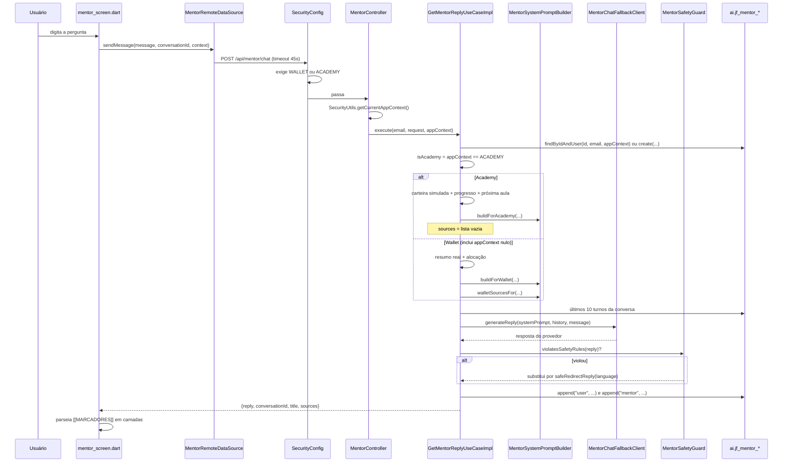

# Fatia 05 — Mentor: chat, prompt por contexto e conversas

> Verificado em 2026-09-02 lendo o código. Toda linha aqui é rastreável a um arquivo.

O Mentor é a única funcionalidade **compartilhada e sensível ao contexto** do
sistema. Os dois apps mostram a mesma tela de chat; o backend monta dois
cérebros diferentes por trás dela. É por isso que esta é a fatia onde a
fronteira entre os produtos é mais frágil — e onde já houve um vazamento real.

---

## 1. O que o usuário vê

Um chat com o companheiro dele. Ele pergunta algo sobre investimentos, recebe
uma resposta que cita a própria carteira (ou o próprio progresso de estudo),
e pode voltar a conversas anteriores, renomeá-las e apagá-las.

O que muda entre os apps, sem que ele perceba:

| | Wallet | Academy |
|---|---|---|
| O Mentor enxerga | Carteira **real** + alocação + pet | Carteira **simulada** + progresso de aulas + pet |
| A resposta vem em camadas | dado / cálculo / interpretação | conteúdo / interpretação |
| Cita fontes ("por que estou vendo isso?") | Sim | Não |
| Conversas visíveis | Só as criadas no Wallet | Só as criadas no Academy |

---

## 2. Caminho do dado



O ponto de bifurcação é uma linha só:

```java
boolean isAcademy = appContext == AppContextEnum.ACADEMY;
```

Tudo o que vem depois é disjunto. Não existe caminho em que os dois lados se
encontrem.

---

## 3. Arquivos que importam

### Backend

| Arquivo | Papel |
|---|---|
| `infrastructure/controller/mentor/MentorController.java` | 6 endpoints; lê o contexto e repassa a **todos** eles |
| `application/mentor/usecase/GetMentorReplyUseCaseImpl.java` | A bifurcação. O coração da fatia |
| `application/mentor/prompt/MentorSystemPromptBuilder.java` | Os dois construtores de prompt + o template comum |
| `application/mentor/safety/MentorSafetyGuard.java` | Checagem determinística da resposta que sai |
| `infrastructure/external/MentorChatFallbackClient.java` | Anthropic → Gemini |
| `infrastructure/repository/mentor/MentorConversationRepositoryAdapter.java` | Escopo por `app_context` nas buscas |
| `application/mentor/usecase/{List,Get,Rename,Delete}ConversationUseCaseImpl.java` | CRUD de conversas, todos gated |

### Flutter

| Arquivo | Papel |
|---|---|
| `features/mentor/data/datasources/mentor_remote_datasource.dart:46` | Timeout de **45s**, não os 15s padrão |
| `features/mentor/domain/services/wallet_mentor_reply_layers.dart` | **Só Wallet** — parseia 3 marcadores |
| `features/mentor/domain/services/mentor_reply_layers.dart` | **Só Academy** — parseia 2 marcadores |
| `features/mentor/presentation/widgets/chat_bubble.dart` | Renderiza as camadas |

<!-- Os dois apps têm 14 arquivos em features/mentor/ e a única diferença de
     nome de arquivo é o parser de camadas. Isso NÃO significa que os outros 13
     sejam idênticos — ver o aviso de clones em 00-visao-geral.md §4. -->

---

## 4. Regras de negócio (e o porquê de cada uma)

### 4.1 Allow-list `ACADEMY`, nunca deny-list `WALLET`

A linha `appContext == AppContextEnum.ACADEMY` está escrita nessa direção de
propósito, e o javadoc da classe diz por quê: qualquer contexto ambíguo —
`null`, sessão legada, token sem a claim — cai no caminho **Wallet**.

Se fosse escrito como `appContext != WALLET`, um contexto desconhecido cairia
no Academy e passaria a montar prompts com conteúdo pedagógico para alguém que
pode ser um usuário de dinheiro real. A direção do teste é a regra de
segurança.

Hoje esse caminho é inalcançável, porque o `SecurityConfig` exige um dos dois
contextos antes de chegar ao controller (fatia 01). A defesa é redundante de
propósito: ela sobrevive a alguém afrouxar a regra de rota sem perceber.

### 4.2 Dois construtores de prompt sem nenhum parâmetro em comum

`buildForWallet(pet, portfolioSummary, allocation, clientContext, language)` e
`buildForAcademy(pet, simulatedPortfolio, clientContext, language, learningProgress, nextLessonTitle, nextModuleTitle)`.

Não é estilo — é a correção de um vazamento real. Antes da separação existia um
único `build(...)` que recebia **ambos** os conjuntos de dados e montava os dois
blocos independentemente do app. Um usuário Wallet recebia conteúdo de aulas
Academy no prompt; um usuário Academy recebia os números da carteira real.

A garantia agora é estrutural, não comportamental: **não existe parâmetro pelo
qual o dado do outro contexto possa chegar**. Um `if` esquecido não recria o
bug; seria preciso mudar a assinatura de um método.

<!-- Corolário para revisão de PR: adicionar um parâmetro a qualquer um dos dois
     construtores é a mudança mais perigosa deste arquivo. Se o parâmetro novo
     puder carregar dado do outro contexto, a garantia acabou. -->

### 4.3 Conversas são escopadas por `app_context` ponta a ponta

Os seis endpoints leem o contexto e o repassam. As buscas filtram por ele:
`findByIdAndUser(id, email, appContext)` e
`findByUser_EmailAndAppContextOrderByUpdatedAtDesc(...)`.

Não basta escopar o prompt: sem isso, uma sessão Wallet listaria — ou abriria,
adivinhando o id — uma conversa Academy inteira, com todo o conteúdo que o
prompt separado tinha acabado de proteger.

**Consequência que você precisa saber:** conversas criadas antes da migration
V27 têm `app_context` nulo. Como toda busca filtra por contexto, elas **deixam
de ser alcançáveis** por qualquer sessão — não aparecem na lista, não abrem,
não são renomeáveis nem deletáveis. Isso é deliberado e está escrito no
comentário da V27: essas conversas foram montadas pelo prompt antigo e
misturado, então não são atribuíveis a nenhum dos lados. Elas continuam no
banco, órfãs.

### 4.4 A checagem de posse vive no use case, não no repositório

Verificado: os quatro use cases de conversa (`List`, `Get`, `Rename`, `Delete`)
chamam `findByIdAndUser(id, email, appContext)` e lançam `ResourceNotFoundException`
antes de agir. Não há IDOR.

Mas o adapter expõe `updateTitle(id, title)`, `touch(id)` e `delete(id)` que
buscam por `findById` puro — **sem filtrar usuário nem contexto**. Eles são
seguros hoje só porque todo chamador faz a checagem antes.

<!-- Débito latente, não bug: um chamador futuro que pule a checagem não recebe
     nenhuma proteção do repositório. Se esta fatia ganhar um endpoint novo que
     mexa em conversa, a checagem tem que ser repetida à mão. -->

### 4.5 `MentorSafetyGuard`: o prompt pede, o código garante

O prompt do sistema tem uma seção `SAFETY RULES (never break these)` — nunca
recomendar compra/venda de um ativo específico, nunca prometer retorno, nunca
se apresentar como consultor licenciado. Mas **instrução em prompt não tem
força de execução**: uma injeção de prompt ou um desvio comum do modelo passa
por cima dela.

O `MentorSafetyGuard` é a checagem determinística que roda **depois** da
resposta, antes de ela chegar ao usuário ou ser persistida. Três regex:

| Regra | O que casa |
|---|---|
| `DIRECTIVE_WITH_TICKER` | verbo imperativo (`buy`/`sell`/`compre`/`venda`…) **imediatamente** seguido de algo com forma de ticker (`[A-Z]{3,6}\d{0,2}`) |
| `GUARANTEED_RETURN` | "garantido" perto de "retorno/lucro/rentabilidade", nas duas ordens e nos dois idiomas |
| `LICENSED_ADVISER_CLAIM` | "licenciado/certificado/registrado" perto de "consultor/advisor" |

Duas sutilezas que valem entender antes de mexer:

- A **case-insensitivity é escopada só ao verbo**. Um `(?i)` global faria
  `[A-Z]` casar minúsculas, e "buy and hold" viraria "compre o ticker AND".
- O filtro é **deliberadamente estreito**. Ele não sinaliza qualquer menção a
  ativo, porque isso daria falso positivo em linguagem educativa legítima
  ("muitos investidores compram e mantêm ETFs a longo prazo"). Só a violação
  clara e juridicamente relevante.

Quando dispara, a resposta é substituída por `safeRedirectReply(language)` — um
redirecionamento em personagem, não um erro — e o fato é logado **sem o texto
da resposta**.

### 4.6 Três níveis de fallback, não um

```
AnthropicChatClient  →  (exceção)  →  GeminiChatClient  →  (exceção)  →  FALLBACK_REPLY
```

O `MentorChatFallbackClient` é o bean `@Primary` que todo mundo injeta; ele
tenta Anthropic e cai para Gemini se der qualquer exceção — sem chave, rate
limit, indisponibilidade. O `try/catch` dentro do `GetMentorReplyUseCaseImpl` é
o último recurso: só é alcançado se **os dois provedores** falharem, e devolve
uma frase enlatada em vez de estourar um erro na cara do usuário.

Os dois níveis logam `e.getMessage()`, e os comentários registram por que isso
é seguro: nenhum dos clients deixa a API key chegar à mensagem de exceção.

### 4.7 As camadas da resposta são diferentes nos dois apps

O backend pede ao modelo que marque a resposta com marcadores literais, sempre
em inglês independentemente do idioma da resposta — assim o cliente parseia sem
precisar de uma tabela por idioma.

| App | Marcadores | Vem de |
|---|---|---|
| Wallet | `[[DATA]]` · `[[CALCULATION]]` · `[[INTERPRETATION]]` | `WALLET_STRUCTURED_RESPONSE_INSTRUCTION` |
| Academy | `[[CONTENT]]` · `[[INTERPRETATION]]` | `STRUCTURED_RESPONSE_INSTRUCTION` |

Nos dois casos os marcadores são **opcionais e independentes**. Uma saudação
não tem camada de interpretação para separar, e forçar uma significaria
inventar uma distinção que não existe. Por isso os dois parsers retornam `null`
quando nenhum marcador aparece, e o cliente renderiza o texto cru.

O Wallet aceita qualquer subconjunto: só dado, dado+cálculo, ou os três.

### 4.8 `sources` só existe no Wallet

`walletSourcesFor(...)` devolve chaves estáveis em inglês (`portfolio_summary`,
`portfolio_allocation`, `pet`, `client_goal`, `client_horizon`,
`client_screen`) que alimentam o "por que estou vendo isso?" da interface. No
caminho Academy, `sources` é sempre `List.of()`.

A razão é a regra do design system do Wallet: toda interpretação do Mentor
sobre dinheiro real precisa citar de onde veio. Conteúdo educativo não tem essa
exigência.

<!-- A função usa exatamente os mesmos condicionais dos métodos que montam os
     blocos do prompt. Se um bloco passar a ser incluído sob outra condição e a
     lista de sources não acompanhar, a citação passa a mentir. -->

### 4.9 Timeout de 45s no cliente, não 15s

O `ApiClient` usa 15s por padrão, dimensionado para endpoints de banco. A
resposta do Mentor espera uma chamada de LLM, que passa de 10s com folga. Um
timeout curto aqui derrubaria, do lado do cliente, uma requisição que estava
funcionando no servidor — e o usuário veria "algo deu errado" numa conversa que
foi salva normalmente.

### 4.10 Detalhes menores

- O histórico enviado ao modelo são os **últimos 10 turnos** (`MAX_HISTORY_TURNS * 2` mensagens).
- O título da conversa é gerado da primeira mensagem, truncado em 60 caracteres com reticências.
- `/api/mentor/suggestions` limita `limit` ao intervalo 1–8, independentemente do que o cliente pedir.

---

## 5. Dados persistidos

Schema `ai` em produção; sem prefixo em dev.

### `jf_mentor_conversations` — V11, mais V27

| Coluna | Observação |
|---|---|
| `id`, `user_id` | FK para `identity.jf_users` (cruza schema) |
| `title` | Nulo até a primeira mensagem gerar um |
| `created_at`, `updated_at` | Índice `(user_id, updated_at desc)` — a listagem ordena por isso |
| `app_context` | **V27**. Nulo = conversa órfã, ver regra 4.3 |

### `jf_mentor_messages` — V11

| Coluna | Observação |
|---|---|
| `conversation_id` | FK **com `on delete cascade`** — apagar a conversa apaga as mensagens |
| `role` | `"user"` ou `"mentor"` |
| `content` | `text`, sem limite de tamanho |
| `created_at` | Índice `(conversation_id, created_at)` |

O prompt do sistema **não é persistido**. Só as mensagens do usuário e as
respostas finais (já passadas pelo `MentorSafetyGuard`) vão para o banco.

---

## 6. Modos de falha

| Situação | O que acontece | Onde |
|---|---|---|
| Sessão sem `app_context` resolvível | **403** antes do controller | `SecurityConfig` |
| `conversationId` de outro contexto | `ResourceNotFoundException` — não 403 | `GetMentorReplyUseCaseImpl` |
| `conversationId` de outro usuário | `ResourceNotFoundException` | mesmo lugar |
| Conversa anterior à V27 | Invisível para sempre, em qualquer sessão | regra 4.3 |
| Anthropic fora do ar | Cai para Gemini, silenciosamente para o usuário | `MentorChatFallbackClient` |
| Anthropic **e** Gemini fora do ar | Frase enlatada: *"Hmm, I'm having a little trouble thinking right now 🐾…"* | `GetMentorReplyUseCaseImpl` |
| Modelo recomenda um ticker | Resposta substituída pelo redirecionamento seguro; warning sem o texto | `MentorSafetyGuard` |
| Resposta demora mais de 45s | `TimeoutException` no cliente — **mas a conversa já foi salva no servidor** | `MentorRemoteDataSource` |
| Modelo não emite marcadores | Parser devolve `null`, bolha renderiza texto cru | `*ReplyLayers.tryParse` |
| Usuário sem pet | `getMyPetUseCase` devolve `null`; o prompt usa nome padrão | `MentorSystemPromptBuilder.resolvePetName` |

<!-- A linha do timeout de 45s é uma inconsistência real de UX, não teórica: o
     append das mensagens acontece depois da chamada ao LLM, então uma resposta
     que chega em 46s é persistida mas o usuário vê erro. Ao reabrir a conversa
     ela está lá. Não corrigido; documentado. -->

---

## 7. Drills

<details>
<summary><b>Drill 1 —</b> Por que a bifurcação testa <code>== ACADEMY</code> em vez de <code>!= WALLET</code>? Os dois não dariam no mesmo?</summary>

Não. Dão no mesmo **só quando o contexto é um dos dois valores conhecidos.**

Com `== ACADEMY`, qualquer coisa ambígua — `null`, sessão legada — cai no
Wallet, que é o caminho seguro: mostra dado real para quem já tinha dado real.
Com `!= WALLET`, o ambíguo cairia no Academy e passaria a montar prompts
pedagógicos para uma sessão de origem desconhecida.

A direção do teste **é** a regra de segurança. O javadoc da classe diz isso com
todas as letras: *"Whitelisting ACADEMY explicitly rather than blacklisting
WALLET means an ambiguous context can never accidentally surface Academy
content."*
</details>

<details>
<summary><b>Drill 2 —</b> Um usuário tinha conversas com o Mentor antes da migration V27. Ele abre o app hoje. O que ele vê?</summary>

**Nada.** A lista vem vazia.

Toda busca filtra por `app_context`, e essas linhas têm `app_context` nulo, que
não casa com `'wallet'` nem com `'academy'`. Elas não aparecem, não abrem, não
podem ser renomeadas nem deletadas. Continuam no banco, inalcançáveis.

Isso é deliberado, e a V27 explica: essas conversas foram construídas pelo
prompt antigo, que misturava carteira real e conteúdo Academy no mesmo fio.
Atribuí-las a um dos lados seria adivinhar — e adivinhar errado significaria
mostrar conteúdo do outro produto.

*Se você quisesse recuperá-las,* teria que decidir um critério de atribuição e
escrever uma migration. Não existe hoje.
</details>

<details>
<summary><b>Drill 3 —</b> O modelo responde "Compre PETR4 agora, o retorno é garantido". Quantas das três regex disparam, e o que o usuário vê?</summary>

**Duas.** `DIRECTIVE_WITH_TICKER` casa `Compre PETR4` (verbo imperativo em
português imediatamente seguido de token no formato de ticker) e
`GUARANTEED_RETURN` casa "retorno … garantido".

Basta uma para o `violatesSafetyRules` devolver `true` — é um `||`.

O usuário vê o `safeRedirectReply` em português: *"Prefiro não apontar uma
compra ou venda específica…"*. A resposta original **não é persistida** — o
`append` acontece depois da substituição. E o log registra que houve violação,
com o e-mail do usuário, **sem o texto flagrado**.
</details>

<details>
<summary><b>Drill 4 —</b> Você precisa adicionar "o saldo em conta do usuário" ao prompt do Academy. Qual é o risco real?</summary>

Depende de qual saldo. Se for o saldo da carteira **simulada**, é só mais um
campo no DTO que `buildForAcademy` já recebe.

O risco é adicionar um parâmetro que carregue dado **real**. A garantia da
regra 4.2 é estrutural: hoje `buildForAcademy` não tem por onde receber
`PortfolioSummaryDTO`. No instante em que alguém adiciona um parâmetro que
possa carregá-lo, a garantia deixa de existir e volta a depender de um `if`
correto — que foi exatamente o que falhou antes.

**Como revisar isso num PR:** olhe a assinatura, não o corpo. Se um dos dois
construtores ganhou um parâmetro que o outro contexto também usaria, pare.
</details>

<details>
<summary><b>Drill 5 —</b> Um usuário diz que enviou uma pergunta, viu "algo deu errado", mas ao reabrir o app a conversa estava lá com a resposta. Bug ou comportamento esperado?</summary>

Comportamento conhecido, não corrigido — e vale entender a ordem das operações.

O cliente tem timeout de 45s. No servidor, `messageRepositoryPort.append(...)`
das duas mensagens acontece **depois** do retorno do LLM. Uma resposta que
chega em 46s é persistida normalmente; o cliente já desistiu e mostrou erro.

Não há perda de dado, só divergência de percepção. A correção passaria por
persistir a mensagem do usuário antes da chamada ao modelo, ou por reconciliar
no cliente ao reabrir a conversa. Nenhuma das duas existe.
</details>

<details>
<summary><b>Drill 6 —</b> O adapter tem <code>delete(id)</code> sem filtro de usuário. Isso é uma vulnerabilidade?</summary>

**Hoje, não.** `DeleteConversationUseCaseImpl` chama
`findByIdAndUser(id, email, appContext)` e lança `ResourceNotFoundException`
antes de chamar `delete`. Verificado nos quatro use cases de conversa.

Mas a proteção vive no **chamador**, não no repositório. Um endpoint novo que
chame `delete(id)` direto apaga a conversa de qualquer usuário, sem checagem.

É débito latente, e a distinção importa quando você revisa um PR: a pergunta
certa não é "esse método é seguro?", é "todo chamador desse método faz a
checagem?".
</details>

---

## 8. Se você fosse mudar algo aqui

- **Trocar de provedor de LLM** → implementar `MentorChatPort` e ajustar o
  `MentorChatFallbackClient`. Nada acima da porta muda.
- **Adicionar uma regra de segurança** → `MentorSafetyGuard` é puro e sem
  dependência de framework, testável isoladamente. Mas cuidado com a
  case-insensitivity: escope o `(?i)` ao grupo, nunca ao padrão inteiro.
- **Abrir o Mentor para sessões sem contexto** → ver o drill 3 da fatia 01. São
  dois lugares e um terceiro efeito não óbvio.
- **Adicionar parâmetro a `buildForWallet` ou `buildForAcademy`** → a mudança
  mais perigosa deste arquivo. Ver regra 4.2.
