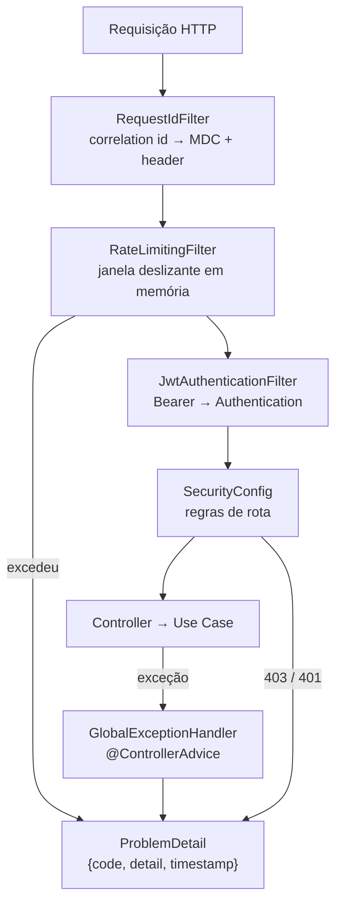

# Fatia 07 — Infra transversal: filtros, rate limit, erros e config

> Verificado em 2026-09-02 lendo o código. Toda linha aqui é rastreável a um arquivo.

Nenhuma tela depende desta fatia. Mas quando algo dá errado em produção, **o que
o usuário vê e o que você consegue investigar são decididos aqui.**

---

## 1. O que o usuário vê

No caminho feliz, nada. Quando falha, ele vê uma de duas coisas:

- Uma mensagem específica e acionável — *"appContext must be 'academy' or 'wallet'"*, *"Too many requests"* — quando o erro é atribuível ao pedido dele.
- Uma mensagem genérica — *"An unexpected error occurred. Please try again later."* — quando o erro é um bug nosso.

A fronteira entre as duas é o `GlobalExceptionHandler`, e ela existe para que
nenhum stack trace, nome de classe, SQL ou caminho de arquivo chegue ao
cliente.

---

## 2. Caminho do dado

A ordem dos três filtros é declarada explicitamente no `SecurityConfig`, e cada
posição tem uma razão:

| Ordem | Filtro | Por que aqui |
|---|---|---|
| 1º | `RequestIdFilter` | **Toda** requisição, inclusive as barradas, precisa de id nos logs |
| 2º | `RateLimitingFilter` | Uma requisição barrada não deve gastar CPU parseando JWT |
| 3º | `JwtAuthenticationFilter` | Só quem passou pelos dois anteriores |

<!-- O comentário no SecurityConfig registra que os dois primeiros foram
     ordenados um em relação ao outro de propósito: declarar ambos como
     "antes do UsernamePasswordAuthenticationFilter" não fixaria a ordem
     relativa entre eles. -->

---

## 3. Arquivos que importam

| Arquivo | Papel |
|---|---|
| `infrastructure/security/RequestIdFilter.java` | Correlation id em MDC + header de resposta |
| `infrastructure/security/ratelimit/RateLimitingFilter.java` | Janela deslizante, em memória |
| `infrastructure/security/ratelimit/TrustedProxyMatcher.java` | Decide quando confiar em `X-Forwarded-For` |
| `infrastructure/controller/GlobalExceptionHandler.java` | Exceção → `ProblemDetail` |
| `infrastructure/config/ActiveProfileGuard.java` | Recusa subir sem perfil explícito |
| `infrastructure/config/DotenvLoader.java` | Segredos locais fora do git |
| `infrastructure/config/HttpClientConfig.java` | Dois `RestTemplate` com timeouts diferentes |
| `infrastructure/config/CacheConfig.java` | Cache do catálogo Academy |

---

## 4. Regras de negócio (e o porquê de cada uma)

### 4.1 O correlation id aceita um valor de fora

`RequestIdFilter` usa o `X-Request-Id` da requisição se houver, e só gera um
UUID quando não houver. Isso é para que um proxy reverso ou load balancer que
já emita o seu próprio id mantenha a trilha contínua entre as camadas.

O id vai para o **MDC** (então toda linha de log daquela requisição o carrega) e
volta no header de resposta (então o usuário que reporta um problema pode
informá-lo). O `MDC.remove` está num `finally` — sem isso, o id vazaria para a
próxima requisição atendida pela mesma thread do pool.

### 4.2 O rate limit cobre apenas oito caminhos

São dois grupos de regras, com limites diferentes porque protegem coisas
diferentes:

| Grupo | Caminhos | Limite |
|---|---|---|
| Autenticação | `/auth/login`, `/auth/register`, `/auth/forgot-password` | **5 / 60s** |
| Progressão | `/api/v1/learning/progress`, `/api/v1/achievements`, `/api/v1/missions`, `/api/v1/gamification/summary`, `/api/v1/learning/lessons/{id}/complete` | **60 / 60s** |

O primeiro é um deterrente a credential stuffing e enumeração — apertado de
propósito. O segundo é um backstop contra abuso em endpoints que o uso legítimo
já chama repetidamente (toda tela de gamificação reavalia XP ao vivo), então
precisa ser frouxo o bastante para não dar falso positivo.

**Todo o resto passa direto.** Em particular, não estão cobertos:
`/auth/refresh`, `/auth/logout` e `/auth/reset-password` — os três públicos
(`permitAll()`), e o último recebendo um token que, sem limite, pode ser
tentado à exaustão.

<!-- Mitigação existente: o token de reset é gerado com SecureRandom e
     armazenado como hash, então a força bruta é inviável na prática. Ainda
     assim, é uma exceção que vale ser deliberada e não acidental. -->

### 4.3 O mapa do rate limiter nunca é limpo

`requestLog` é um `ConcurrentHashMap<String, Deque<Instant>>` com chave
`IP:caminho`. Os timestamps **dentro** de cada deque são podados a cada
verificação, mas **a chave nunca é removida do mapa**.

Verificado: não há `remove`, `@Scheduled`, evicção ou TTL em lugar nenhum do
arquivo.

<!-- Consequência: uma entrada permanente por par (IP, caminho) já visto, para
     sempre, enquanto o processo viver. Numa instância única com poucos usuários
     é irrelevante; com tráfego real e IPs diversos vira crescimento de memória
     sem teto. O deque de uma chave inativa fica vazio, mas o par chave+deque
     continua alocado.

     A correção mais barata é remover a chave quando o deque esvazia dentro do
     bloco synchronized que já existe. -->

### 4.4 `X-Forwarded-For` só é honrado se o peer for confiável

`clientIp` só lê o header se o endereço TCP imediato estiver dentro de um range
configurado em `app.security.trusted-proxies`. O padrão é **vazio**, então o
endereço bruto da conexão é sempre usado e ninguém consegue forjar o header
para escapar do limite.

O outro lado dessa moeda: **se a aplicação estiver atrás de um proxy e a
propriedade não for configurada**, todos os clientes chegam com o IP do proxy.
O rate limit deixa de ser por usuário e passa a ser global — cinco logins por
minuto para o mundo inteiro.

<!-- Nenhuma das duas falhas é silenciosa do ponto de vista de segurança, mas a
     segunda é silenciosa do ponto de vista de disponibilidade: ela se manifesta
     como usuários legítimos tomando 429 sem motivo aparente.

     TrustedProxyMatcher é IPv4-only por decisão explícita; um range IPv6 é
     tratado como não-confiável em vez de casar por engano. -->

### 4.5 O handler de erros separa culpa do cliente de bug nosso

Toda resposta de erro é um `ProblemDetail` com `code` estável e `timestamp`.

| Exceção | Status | `code` |
|---|---|---|
| `MethodArgumentNotValidException`, `ConstraintViolationException` | 400 | `VALIDATION_ERROR` |
| `HttpMessageNotReadableException` | 400 | `MALFORMED_REQUEST` |
| `IllegalArgumentException` | 400 | `INVALID_REQUEST` |
| `UserAlreadyExistsException` | 409 | `USER_ALREADY_EXISTS` |
| `AuthenticationException` | 401 | `INVALID_CREDENTIALS` |
| `ResourceNotFoundException` | 404 | `RESOURCE_NOT_FOUND` |
| `PasswordResetTokenInvalidException` | 400 | `PASSWORD_RESET_TOKEN_INVALID` |
| Qualquer outra | 500 | `INTERNAL_ERROR` + mensagem genérica |

A regra é: erro atribuível ao pedido mantém a mensagem específica; qualquer
outra coisa é logada com stack trace completo **no servidor** e vira uma frase
genérica para o cliente.

<!-- O `code` é o contrato real com o app: a mensagem pode mudar de redação sem
     aviso, o code não. Se o Flutter passar a ramificar em cima de texto, ele
     quebra na primeira revisão de copy. -->

### 4.6 A aplicação recusa subir sem perfil explícito

`ActiveProfileGuard` lança exceção se nenhum de `dev`, `prod` ou `test` estiver
ativo. O motivo é específico e vale conhecer: `application.properties` não traz
datasource; `dev` e `prod` trazem o seu. Sem perfil e com H2 no classpath, o
Spring Boot **cria silenciosamente um H2 embarcado e vazio** — a aplicação sobe
parecendo saudável, mas os seeds nunca rodaram e todo login falha com
"credenciais inválidas", sem nada nos logs apontando o motivo.

O guard troca essa falha confusa por uma explícita no boot.

### 4.7 Em `.env`, valor em branco não é o mesmo que ausente

`DotenvLoader` carrega um `.env` git-ignorado para system properties antes do
Spring subir. E trata `KEY=` (em branco) **como se a chave não existisse**.

O motivo é sutil e está documentado no próprio arquivo: algumas
auto-configurações do Boot usam `@ConditionalOnProperty` testando só a
**presença** da chave. `spring.mail.host=` em branco ativaria um
`JavaMailSender` apontando para host vazio, em vez de deixar o caminho de
fallback "não configurado" alcançável.

### 4.8 Dois `RestTemplate`, e o segundo existe por causa do Claude

| Bean | Connect | Read | Para quem |
|---|---|---|---|
| `restTemplate` | 5s | **10s** | Brapi, Gemini, LibreTranslate |
| `anthropicRestTemplate` | 5s | **45s** | Anthropic |

O comentário registra o diagnóstico: o Claude Opus 5 roda *adaptive thinking*
por padrão e passa de 10s com folga, então o teto genérico estava cortando toda
chamada no meio e lançando `ResourceAccessException` — que **parecia falha de
rede e era timeout nosso**.

<!-- Coincidência que não é coincidência e vale notar: o timeout do cliente
     Flutter para /api/mentor/chat também é 45s (fatia 05, regra 4.9). Os dois
     números são iguais, o que deixa margem ZERO: se a Anthropic levar 44s, o
     backend ainda precisa rodar o MentorSafetyGuard e dois INSERTs antes de
     responder — e o cliente já desistiu.

     É a causa mecânica do bug "erro no cliente, conversa salva no servidor"
     documentado na fatia 05. O timeout do cliente deveria ser estritamente
     maior que o do servidor, não igual. -->

### 4.9 O cache do catálogo não tem evicção, e isso é seguro

`CacheConfig` registra um `ConcurrentMapCacheManager` para `academyCatalog`, sem
TTL nem tamanho máximo. É seguro porque o catálogo é semeado uma vez no boot
(`AcademyContentSeedRunner`) e nunca mais escrito — a chave é o idioma, então o
mapa tem no máximo tantas entradas quantos idiomas.

<!-- A premissa é "o catálogo é imutável em runtime". Se algum dia existir um
     endpoint que edite conteúdo Academy, este cache passa a servir dado velho
     silenciosamente. -->

---

## 5. Dados persistidos

Nenhum. Esta fatia inteira vive em memória e em logs.

O que ela **produz** e que você vai querer em produção:

- `X-Request-Id` em toda linha de log (via MDC) e em toda resposta.
- Stack traces completos no log do servidor para tudo que virou 500.
- Warnings estruturados para validação, autenticação falha e recurso não encontrado.

---

## 6. Modos de falha

| Situação | O que acontece | Onde |
|---|---|---|
| Cliente excede o limite | 429 com `{"code":"RATE_LIMIT_EXCEEDED"}` | `RateLimitingFilter` |
| App atrás de proxy sem `trusted-proxies` | Rate limit vira **global**, usuários legítimos tomam 429 | regra 4.4 |
| Processo vivo por muito tempo | Memória do rate limiter cresce sem teto | regra 4.3 |
| Bug não tratado num use case | 500 genérico ao cliente, stack trace completo no log | `GlobalExceptionHandler` |
| Boot sem perfil ativo | **Recusa subir**, com mensagem explícita | `ActiveProfileGuard` |
| Chave em branco no `.env` | Tratada como ausente, não como string vazia | `DotenvLoader` |
| Provedor externo lento | 10s (ou 45s para Anthropic) e `ResourceAccessException` | `HttpClientConfig` |
| Anthropic perto de 45s | Cliente Flutter desiste **antes** de o backend terminar | regra 4.8 |
| Requisição sem `X-Request-Id` | Um UUID é gerado | `RequestIdFilter` |

---

## 7. Drills

<b>Drill 1 —</b> Usuários legítimos começam a tomar 429 no login em produção, sem pico de tráfego. Primeira hipótese?

A aplicação foi para trás de um proxy reverso e `app.security.trusted-proxies`
continuou vazio.

Com a propriedade vazia, `clientIp` sempre usa `request.getRemoteAddr()` — que
passa a ser o IP do proxy para **todo mundo**. A chave do rate limiter vira
`IP_DO_PROXY:/auth/login`, e o limite de 5 por minuto passa a valer para a base
inteira de usuários.

*Como confirmar:* os logs de 429 vindo de um único IP repetido. *Como corrigir:*
configurar o range CIDR do proxy — e lembrar que o matcher é IPv4-only.

<b>Drill 2 —</b> O rate limiter é um mapa em memória. Qual o problema de longo prazo?

Ele **nunca remove chaves**. Os timestamps dentro de cada deque são podados,
mas o par `(IP:caminho) → deque` permanece para sempre.

Não há `remove`, `@Scheduled` nem TTL no arquivo — verificado.

Numa instância única com poucos usuários, irrelevante. Com tráfego real e IPs
diversos, é crescimento de memória sem teto. A correção mais barata é remover a
chave quando o deque esvazia, dentro do bloco `synchronized` que já existe.

<b>Drill 3 —</b> Um usuário reporta erro numa tela. O que você pede a ele?

O `X-Request-Id` da resposta.

`RequestIdFilter` devolve esse header em toda resposta e o coloca no MDC, então
com ele você recupera **todas** as linhas de log daquela requisição específica —
inclusive o stack trace, se virou 500.

Sem isso, correlacionar logs de uma requisição num deploy real é adivinhação —
que é exatamente o que o javadoc da classe diz.

<b>Drill 4 —</b> Por que o timeout de 45s aparece em dois lugares, e por que isso é um problema?

`anthropicRestTemplate` tem read timeout de 45s no backend; o
`MentorRemoteDataSource` tem 45s no Flutter. **São iguais, e deveriam não ser.**

O backend só termina depois de: receber a resposta do LLM, rodar o
`MentorSafetyGuard`, e gravar duas mensagens. Se a Anthropic levar 44s, tudo
isso acontece **depois** do relógio do cliente estourar.

É a causa mecânica do sintoma documentado na fatia 05: erro na tela, conversa
salva no servidor. O timeout do cliente precisa ser estritamente maior que o do
servidor mais a margem de processamento.

<b>Drill 5 —</b> Alguém sobe a aplicação sem <code>SPRING_PROFILES_ACTIVE</code>. O que acontece — e o que aconteceria sem o <code>ActiveProfileGuard</code>?

**Com o guard:** falha no boot, com mensagem explícita.

**Sem ele:** `application.properties` não define datasource, e com H2 no
classpath o Boot cria um banco embarcado e vazio. A aplicação sobe, o health
check passa, e **todo login falha com "credenciais inválidas"** porque os seeds
de `db/migration-dev` nunca rodaram — sem nada nos logs explicando por quê.

É o padrão que se repete neste projeto: preferir falhar alto a funcionar de
forma enganosa. Ver também `ApiConstants.assertConfiguredForRelease` na fatia 01.

<b>Drill 6 —</b> O app Flutter deveria ramificar em cima da mensagem de erro ou do <code>code</code>?

Do `code`. A mensagem é texto para humano e pode ser reescrita a qualquer
momento; o `code` é o contrato.

E há uma segunda razão: para tudo que vira 500, a mensagem é **sempre a mesma**
frase genérica, por design — não há informação nela para ramificar.

---

## 8. Se você fosse mudar algo aqui

- **Limpar as chaves do rate limiter** → uma linha dentro do `synchronized` que
  já existe. Ver drill 2.
- **Ajustar o timeout do Mentor** → o do cliente precisa ser maior que o do
  servidor. Ver drill 4.
- **Cobrir `/auth/reset-password` no rate limit** → adicionar ao primeiro grupo
  de regras. Ver regra 4.2.
- **Rate limit distribuído** → só faz sentido quando houver mais de uma
  instância; hoje o `ConcurrentHashMap` é adequado e o comentário justifica não
  trazer Redis/Bucket4j.
