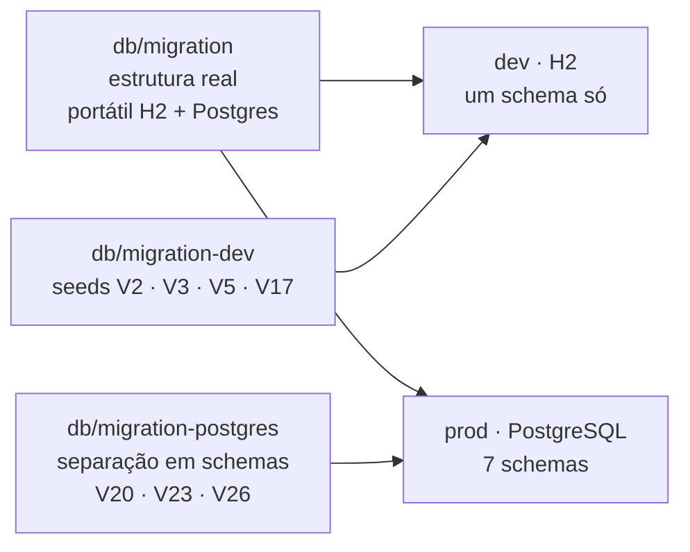
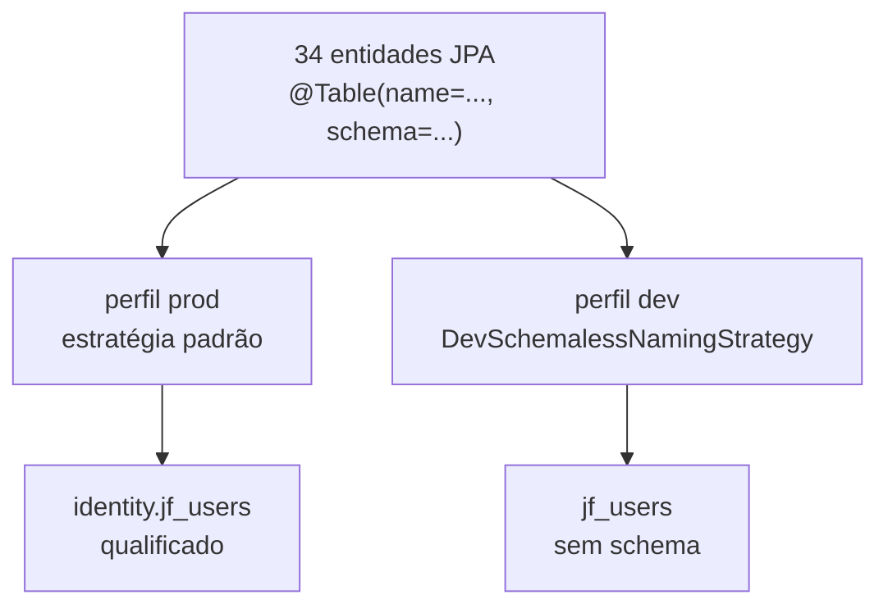

# Fatia 08 — Flyway: migrations, schemas e os dois ambientes

> Verificado em 2026-09-02 lendo o código. Toda linha aqui é rastreável a um arquivo.

Esta fatia não tem tela. Mas ela decide **o que você consegue ver na sua
máquina** — e portanto que classe de bug é, por construção, invisível para você
até chegar em produção. Vale ler cedo.

---

## 1. O que o usuário vê

Nada. O que o **desenvolvedor** vê é o assunto:

| | dev (sua máquina) | prod |
|---|---|---|
| Banco | H2 | PostgreSQL |
| Schemas | **nenhum** — tudo junto | **sete** |
| Seeds (usuários de teste) | sim | não |
| Conjuntos de migration | `migration` + `migration-dev` | `migration` + `migration-postgres` |

---

## 2. Caminho do dado



E, do lado do Hibernate, a conciliação entre os dois mundos:



`DevSchemalessNamingStrategy` devolve `null` em `toPhysicalSchemaName`,
apagando a declaração de schema — e só é registrada em
`application-dev.properties`.

---

## 3. Arquivos que importam

| Arquivo | Papel |
|---|---|
| `application.properties` | Base: `ddl-auto=validate`, `flyway.locations=db/migration` |
| `application-dev.properties` | Acrescenta `migration-dev`, registra a naming strategy |
| `application-prod.properties` | Acrescenta `migration-postgres`, declara `flyway.schemas` |
| `infrastructure/config/DevSchemalessNamingStrategy.java` | Apaga o schema em dev |
| `infrastructure/config/ActiveProfileGuard.java` | Impede subir sem escolher um dos dois mundos |
| `db/migration-postgres/V20__schema_separation.sql` | A separação em si |

---

## 4. Regras de negócio (e o porquê de cada uma)

### 4.1 O Flyway é dono do schema; o Hibernate nunca cria nada

`spring.jpa.hibernate.ddl-auto=validate` em todo lugar. O Hibernate só confere
se o mapeamento bate com o que existe. Uma coluna nova numa entidade sem
migration correspondente **derruba a aplicação no boot** — que é o comportamento
desejado.

O cabeçalho da V1 registra como a baseline foi construída: exportando o DDL que
o próprio Hibernate geraria para H2 e para PostgreSQL, e reconciliando os dois
num script portátil (`VARCHAR` + `CHECK` em vez do `ENUM` nativo do H2, já que
o PostgreSQL não tem equivalente).

### 4.2 O que `validate` **não** valida

Colunas e tipos, sim. **Valores de `CHECK` constraint, não.**

<!-- É a brecha exata pela qual passou a coruja: PetSpecieEnum tem sete valores,
     o CHECK de jf_pets.specie aceita seis, e o boot não reclama porque para o
     Hibernate `specie` é um varchar e o enum serializa para varchar. Ver fatia
     03, regra 4.5.

     Corolário geral: toda vez que um enum Java tiver um CHECK correspondente no
     banco, a sincronia entre os dois é responsabilidade de um teste, não do
     framework. -->

### 4.3 A separação em schemas é exclusiva de Postgres — por necessidade, não preferência

O H2 **não consegue** mover uma tabela entre schemas via `ALTER TABLE`.
Verificado empiricamente pelo autor e registrado no javadoc da
`DevSchemalessNamingStrategy`: *"Schema name must match"* num RENAME
cross-schema.

Por isso a V20 vive em `db/migration-postgres`, fora das locations de dev.

No Postgres, `ALTER TABLE ... SET SCHEMA` é operação **só de catálogo**: nenhuma
linha é reescrita, nenhum dado é copiado, índices/constraints/sequences se
movem junto, e as FKs que cruzam schema continuam válidas sem serem
redefinidas. É por isso que a separação foi segura de rodar contra um banco com
dados reais.

### 4.4 As entidades declaram o schema; o dev apaga

Todas as **34** entidades trazem `@Table(name = "...", schema = "...")`.

Em produção isso significa que o Hibernate qualifica toda referência. Em dev, a
naming strategy apaga a qualificação, de modo que `validate` concorde com o que
as migrations realmente criaram lá — um schema só.

Consequência que importa: **o acesso a dados em runtime não depende de
`search_path`**. E não há nenhuma consulta nativa no projeto — verificado,
`nativeQuery = true` não aparece em lugar nenhum.

### 4.5 O `search_path` governa apenas o SQL das migrations

O DDL das migrations usa nomes **não qualificados**:

```sql
alter table jf_mentor_conversations add column app_context varchar(20);
```

Isso roda na conexão do Flyway, cuja resolução vem de `spring.flyway.schemas`,
que em prod lista os sete schemas e em dev nem existe.

<!-- Duas consequências reais, ambas de baixa probabilidade mas fáceis de
     evitar:

     - A ORDEM dos schemas na lista decide o desempate se duas tabelas homônimas
       existirem em schemas diferentes.
     - Uma migration que CRIE uma tabela nova sem qualificar cai no primeiro
       schema da lista (identity), que quase nunca é onde ela deveria ficar — e
       o erro só apareceria em prod, já que em dev não há schemas.

     Convenção sugerida: qualificar explicitamente todo `create table` novo. -->

### 4.6 A numeração é global entre os três diretórios — e tem buracos

O Flyway trata os três `locations` como um único histórico de versões. Por isso
a numeração não se repete entre eles:

| Diretório | Versões |
|---|---|
| `db/migration` | 1, 4, 6–13, 15, 16, 18, 21, 22, 24, 25, 27 |
| `db/migration-dev` | 2, 3, 5, 17 |
| `db/migration-postgres` | 20, 23, 26 |

**V14 e V19 não existem em lugar nenhum.**

<!-- Provavelmente números pulados durante o desenvolvimento. Mas se alguma
     delas chegou a ser APLICADA em produção, a linha correspondente continua em
     flyway_schema_history e o `validate` do Flyway falha no boot com "missing
     migration" — não há `ignoreMissingMigrations` configurado.

     Antes de assumir que foram só números pulados: conferir o conteúdo de
     flyway_schema_history no banco de produção. -->

### 4.7 Seeds nunca vão para produção — e é por isso que o guard existe

`db/migration-dev` contém `V2__seed_default_data`, `V3__seed_admin_portfolio`,
`V5__seed_admin2_user` e `V17__seed_admin3_user` — usuários administrativos com
credenciais conhecidas.

Eles só entram nas locations do perfil `dev`. O `ActiveProfileGuard` (fatia 07,
regra 4.6) fecha o outro lado do risco: sem perfil, o Boot criaria um H2 vazio e
o desenvolvedor veria "credenciais inválidas" sem entender por quê.

### 4.8 Sete schemas, todas as FKs apontando para `identity`

```
identity            jf_users · jf_refresh_tokens · jf_password_reset_tokens
education           catálogo Academy (17 tabelas) · lesson_progress
real_portfolio      jf_investments · jf_finances · real_portfolio_sync_log
simulated_portfolio simulated_portfolios · _positions · _orders
gamification        xp_events · achievement_unlocks · activity_log · mission_completions
pet                 jf_pets
ai                  jf_mentor_conversations · jf_mentor_messages
```

Toda tabela aponta para `identity.jf_users`, cruzando schema. É válido e
intencional: a identidade é compartilhada, os contextos não.

<!-- jf_investments/jf_finances foram para real_portfolio, e não para um par
     real/simulado, porque na época da V20 não existia nenhum dado de dinheiro
     simulado — o Laboratório Financeiro só gravava XP, nunca uma posição. O
     schema simulated_portfolio veio depois, na V22/V23. -->

---

## 5. Dados persistidos

A tabela `flyway_schema_history`, criada pelo próprio Flyway no schema padrão
(o primeiro de `spring.flyway.schemas`, ou seja `identity` em prod).

É a única fonte da verdade sobre o que já rodou. Consultá-la é o primeiro passo
de qualquer investigação de migration.

---

## 6. Modos de falha

| Situação | O que acontece | Onde |
|---|---|---|
| Entidade com coluna sem migration | **Boot falha** com erro de validação | `ddl-auto=validate` |
| Enum Java diverge de um `CHECK` | Boot **passa**; falha só ao persistir o valor novo | regra 4.2 |
| Migration nova sem qualificar `create table` | Tabela criada em `identity`, só em prod | regra 4.5 |
| Migration aplicada e depois deletada do repo | Boot falha com *missing migration* | regra 4.6 |
| Boot sem perfil ativo | Recusa subir | `ActiveProfileGuard` |
| Tentar rodar a V20 em H2 | Falharia — por isso ela não está nas locations de dev | regra 4.3 |
| Bug que dependa de schema | **Invisível localmente**, aparece só em prod | regra 4.4 |

---

## 7. Drills

<details>
<summary><b>Drill 1 —</b> Você escreve uma migration criando <code>create table user_notes (...)</code> em <code>db/migration</code>. Roda local, passa. O que acontece em produção?</summary>

A tabela é criada em **`identity`** — o primeiro schema de
`spring.flyway.schemas` — porque o `create table` não foi qualificado.

Se a entidade correspondente declarar `@Table(schema = "education")`, como as
outras 34 declaram um schema, o `ddl-auto=validate` **falha no boot de
produção**: ele procura `education.user_notes` e encontra `identity.user_notes`.

Localmente nada disso aparece, porque em dev não existe schema e a naming
strategy apaga a qualificação dos dois lados.

**Convenção que evita:** qualificar explicitamente todo `create table` novo.
</details>

<details>
<summary><b>Drill 2 —</b> Por que a separação em schemas não roda em desenvolvimento? É preguiça?</summary>

Não — é impossibilidade. O H2 **não consegue** mover uma tabela entre schemas
via `ALTER TABLE`; o autor verificou empiricamente e registrou o erro
("Schema name must match") no javadoc da `DevSchemalessNamingStrategy`.

Como a V20 é inteiramente feita de `ALTER TABLE ... SET SCHEMA`, ela só pode
existir num diretório exclusivo de Postgres. E como as entidades declaram
schema, foi preciso a naming strategy para o `validate` concordar com a
realidade de cada ambiente.
</details>

<details>
<summary><b>Drill 3 —</b> Existe V13 e existe V15. Onde está a V14?</summary>

Em lugar nenhum — nem em `migration`, nem em `migration-dev`, nem em
`migration-postgres`. O mesmo vale para a V19.

Provavelmente números pulados no desenvolvimento. **Mas isso precisa ser
confirmado**, porque se alguma delas chegou a ser aplicada em produção, a linha
continua em `flyway_schema_history` e o `validate` do Flyway falha no boot com
*missing migration* — não há `ignoreMissingMigrations` configurado.

Consultar `flyway_schema_history` em produção resolve a dúvida em uma query.
</details>

<details>
<summary><b>Drill 4 —</b> Você acrescenta <code>OWL</code> a um enum Java que tem um <code>CHECK</code> correspondente no banco. Os testes passam e o boot passa. Por quê?</summary>

Porque `ddl-auto=validate` compara **colunas e tipos**, não valores de `CHECK`
constraint. Para o Hibernate, a coluna é `varchar` e o enum serializa para
`varchar` — bate.

E os testes só falhariam se algum efetivamente tentasse **persistir** o valor
novo. Nenhum tenta.

É exatamente o que aconteceu com a espécie coruja (fatia 03, regra 4.5). A lição
generalizável: sempre que um enum Java tiver um `CHECK` espelhando-o, a sincronia
é responsabilidade de um teste — o framework não cobre isso.
</details>

<details>
<summary><b>Drill 5 —</b> Por que <code>jf_investments</code> ficou em <code>real_portfolio</code> e não num par real/simulado desde o início?</summary>

Porque na época da V20 **não existia nenhum dado de dinheiro simulado**. O
Laboratório Financeiro só gravava eventos de XP, nunca uma posição ou saldo.

O schema `simulated_portfolio` é posterior (V22, e V23 para movê-lo) e foi
trabalho novo, não migração de algo que já existia — o que também explica por
que construir a carteira simulada da Academy foi uma etapa inteira do split e
não uma adaptação.
</details>

---

## 8. Se você fosse mudar algo aqui

- **Confirmar V14 e V19** → uma query em `flyway_schema_history`. É a primeira
  coisa a fazer antes de qualquer trabalho de migration.
- **Convencionar qualificação explícita** → todo `create table` novo com schema
  no nome. Ver drill 1.
- **Testar a sincronia enum ↔ CHECK** → um teste que persista cada valor de cada
  enum que tenha CHECK correspondente. Ver drill 4.
- **Rodar Postgres em dev** → resolveria a classe inteira de bug invisível, ao
  custo de perder a simplicidade do H2 embarcado. Trade-off real, não decidido.
