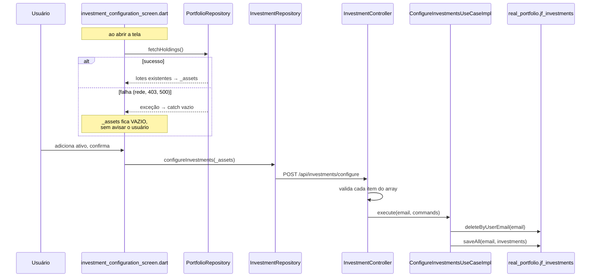

# Fatia 09 — Carteira real: cadastro, posições e cálculo

> Verificado em 2026-09-02 lendo o código. Toda linha aqui é rastreável a um arquivo.

Esta é a primeira fatia que lida com **dinheiro real do usuário**. Ela também
contém o achado mais grave do Atlas até aqui — leia as regras 4.1 e 4.2 antes de
mexer em qualquer coisa aqui.

> **Atualizada em 2026-09-02:** o bug de perda de carteira descrito na regra 4.2
> foi corrigido, em duas camadas. O texto abaixo descreve o estado atual e
> mantém o histórico do problema, porque entender por que ele existiu é o que
> impede recriá-lo.

---

## 1. O que o usuário vê

Uma tela onde ele cadastra os ativos que possui: ticker, quantidade, preço de
compra, data e tipo. Depois disso, a aba Carteira mostra posições consolidadas,
valor investido, valor atual, ganho e alocação.

A tela é alcançada de dois lugares diferentes, e essa diferença importa:

- No **onboarding**, como "conectar minha carteira" — começando vazia.
- Na **aba Carteira**, pela ação "Investir" — para quem **já tem** ativos.

---

## 2. Caminho do dado



O par `delete` + `saveAll` está sob `@Transactional`, então é atômico. O
problema não é atomicidade — é **o que** está sendo substituído.

---

## 3. Arquivos que importam

| Arquivo | Papel |
|---|---|
| `application/investment/usecase/ConfigureInvestmentsUseCaseImpl.java` | **Substitui a carteira inteira** |
| `infrastructure/controller/investment/InvestmentController.java` | Valida cada elemento do array à mão |
| `infrastructure/controller/investment/dto/AssetRegistrationDto.java` | As constraints financeiras |
| `application/investment/service/UserPositionCalculator.java` | Média, ganho, peso — tudo `BigDecimal` |
| `application/investment/usecase/GetPortfolioSummaryUseCaseImpl.java` | Agrega os lotes |
| `features/investment/presentation/screens/investment_configuration_screen.dart` | **O ponto de falha.** Ver regra 4.2 |

---

## 4. Regras de negócio (e o porquê de cada uma)

### 4.1 `/configure` substitui a carteira inteira, não adiciona

```java
investmentRepositoryPort.deleteByUserEmail(email);
investmentRepositoryPort.saveAll(email, investments);
```

Não existe endpoint de "adicionar um ativo" nem de "remover um ativo". A única
operação de escrita é **"esta lista passa a ser a sua carteira"**.

O cliente é obrigado a mandar sempre o conjunto completo. Isso é uma decisão
defensável para um fluxo de onboarding — mas transferia ao cliente toda a
responsabilidade de não perder nada, e ele não a cumpria (regra 4.2).

**Desde 2026-09-02 há uma guarda no servidor.** Se o usuário já tem lotes e a
submissão traria *menos* lotes do que ele tem hoje, a requisição é recusada com
`409 PORTFOLIO_REPLACE_NOT_CONFIRMED` — a menos que traga
`?confirmReplace=true`.

| Situação | Sem `confirmReplace` |
|---|---|
| Usuário sem lotes | Passa |
| Submissão **maior** que a carteira atual | Passa |
| Submissão do **mesmo tamanho** (edição no lugar) | Passa |
| Submissão **menor** | **409** |

<!-- O parâmetro é de query, não de corpo, porque o corpo é um array JSON puro:
     acrescentar um campo mudaria a forma dele e quebraria todo cliente de uma
     vez. E o default `false` é o que faz a guarda proteger versões do app já
     instaladas, que não sabem enviá-lo. Só a redução é guardada — adicionar é
     o caminho comum e nunca é destrutivo, então um cliente antigo continua
     funcionando para ele. -->

### 4.2 A tela não protege essa responsabilidade

<!-- ACHADO GRAVE — perda silenciosa e irreversível de dado financeiro real.
     Catalogado como demanda P0. -->

`investment_configuration_screen.dart` sabe do risco. O comentário é explícito:

> *"sem essa semeadura, adicionar um ativo novo ali submeteria só aquele ativo e
> apagaria todo investimento existente."*

A proteção é `_seedExistingHoldings()`, que carrega os lotes atuais e os insere
em `_assets` antes de o usuário editar. Mas ela é **best-effort**:

```dart
} catch (_) {
  // Best-effort — see doc comment above.
}
```

E `fetchHoldings()` **lança** em qualquer não-200 ou erro de rede — verificado
em `portfolio_remote_datasource.dart:16`.

Logo, a sequência de falha é:

1. Usuário com carteira existente abre a tela pela ação "Investir".
2. `_seedExistingHoldings()` falha — oscilação de rede, 401 cujo refresh não
   funcionou, 500 momentâneo. Qualquer coisa.
3. O `catch` engole. `_assets` fica vazio. **Nada é mostrado ao usuário.**
4. Ele adiciona um ativo e confirma. `_assets.isEmpty` é falso, então o guarda
   existente não impede.
5. `POST /configure` chega com um elemento. O backend apaga tudo e grava um.

O comentário dizia que uma falha "apenas deixa isto como um formulário de
onboarding normal, começando vazio". Para quem veio do onboarding, verdade.
**Para quem já tinha carteira, isso não era um formulário vazio — era uma
armadilha armada.**

A premissa errada era tratar a falha como recuperável: um `_assets` vazio depois
de uma carga que falhou é indistinguível de "este usuário não tem ativos".

**Corrigido em 2026-09-02**, em duas camadas:

| Camada | O que faz | Protege |
|---|---|---|
| App (`_HoldingsSeedState`) | Só o estado `loaded` permite confirmar; falha mostra aviso bloqueante com "Tentar novamente" | Quem atualizar o app |
| Backend (regra 4.1) | Recusa reduções não confirmadas com 409 | **Todos**, inclusive versões já instaladas |

A segunda camada existe porque a primeira só protege clientes atualizados.
Pular a etapa continua liberado — só o caminho destrutivo é bloqueado.

### 4.3 Lotes são preservados individualmente; a consolidação é derivada

Cada linha de `jf_investments` é um **lote**: uma compra, com sua quantidade,
seu preço e sua data. Comprar o mesmo ticker duas vezes gera duas linhas.

A consolidação por ticker acontece só na leitura, em `UserPositionCalculator` e
`GetPortfolioSummaryUseCase`. Isso é o desenho certo — preço médio é derivável
dos lotes, mas os lotes não são deriváveis do preço médio.

<!-- Consequência prática: `totalAssets` do resumo conta tickers DISTINTOS, não
     linhas. Um usuário com cinco compras de PETR4 tem totalAssets = 1. -->

### 4.4 Toda a aritmética é `BigDecimal`, escala 2, HALF_UP

O javadoc do `UserPositionCalculator` é direto: *"isto é dinheiro real, nunca
`double`"*.

A migration V24 migrou `quantity` e `purchase_price` de `double` para
`BigDecimal` em toda a cadeia. A escala 2 com `RoundingMode.HALF_UP` é a
convenção compartilhada com `simulated_portfolio`.

<!-- Débito registrado no BACKEND_MODULE_PLAN §12: Dividend Radar
     (DividendDTO/DividendRadarEntryDTO) e os ~40 campos de fundamentos do
     AssetDetailsResponseDTO continuam `Double`, deliberadamente — cadeias
     separadas e de menor risco. Se você tocar nelas, é a hora de fechar isso. -->

### 4.5 A validação do array é feita à mão, e há um motivo

O corpo de `/configure` é uma `List<AssetRegistrationDto>` crua, não um objeto
envelope. O comentário explica: `@Valid` **não cascateia de forma confiável**
para elementos de uma lista no topo do corpo, então o controller itera e valida
cada elemento explicitamente.

As regras em si continuam como anotações no DTO (fonte única): nome não vazio,
quantidade e preço estritamente positivos, data e tipo obrigatórios.

<!-- É um caso em que confiar na anotação daria um no-op silencioso: nada
     falharia, e valores inválidos entrariam no banco. -->

### 4.6 O peso da carteira usa uma aproximação, e o código admite

Em `UserPositionCalculator.compute`, o denominador do peso usa **preço de
compra** como proxy do preço atual para os *outros* tickers — só o ticker sendo
calculado usa cotação viva.

O comentário aponta onde está o cálculo correto: o endpoint dedicado de
holdings, que busca cotação para cada ticker.

<!-- Consequência: o "peso na carteira" mostrado na tela de detalhes do ativo e
     o mostrado na aba Carteira podem divergir para o mesmo ativo, sem que
     nenhum dos dois esteja errado do ponto de vista do seu próprio cálculo. -->

### 4.7 Falha de cotação é indistinguível de "sem cotação"

`InvestmentRemoteDataSource.fetchQuote` captura qualquer exceção e devolve
`null` com o comentário *"Return null on failure"*. No backend,
`UserPositionCalculator` trata `currentPrice == null` caindo para o preço médio
de compra.

O efeito combinado: quando a brapi falha, a posição é exibida com **ganho zero**
— valor atual igual ao investido — em vez de sinalizar que o preço não pôde ser
obtido.

<!-- Isso viola o guardrail que o próprio projeto declara em outros lugares
     ("dados desatualizados devem ser identificados na interface" — página de
     Correção de Bugs, §4.3). Ver fatia 10 para o lado da brapi. -->

---

## 5. Dados persistidos

`real_portfolio.jf_investments` (V1, movida pela V20, precisão pela V24):

| Coluna | Observação |
|---|---|
| `id` | PK |
| `name` | O ticker. **Sem constraint de formato** |
| `quantity` | `BigDecimal` desde a V24 |
| `purchase_price` | `BigDecimal` desde a V24 |
| `purchase_date` | `date` |
| `type` | CHECK com os 6 valores de `InvestmentType` |
| `user_id` | FK para `identity.jf_users`. **Sem `unique`** — vários lotes por usuário |

Nada de saldo, caixa ou histórico de operação. `jf_finances` existe no mesmo
schema, mas é outra coisa (saldo), não movimentada por esta fatia.

---

## 6. Modos de falha

| Situação | O que acontece | Onde |
|---|---|---|
| `fetchHoldings` falha ao abrir a tela | Aviso bloqueante; confirmar desabilitado até nova tentativa | regra 4.2 |
| Cliente antigo submete lista parcial | **409** `PORTFOLIO_REPLACE_NOT_CONFIRMED` | regra 4.1 |
| Lista vazia enviada | 400, `"At least one investment is required"` | `InvestmentController` |
| Quantidade ou preço ≤ 0 | 400 com a mensagem da constraint | `AssetRegistrationDto` |
| Tipo inválido | 400 na desserialização | `InvestmentType` |
| Sessão Academy chamando qualquer rota daqui | **403** | `SecurityConfig` |
| Cotação da brapi indisponível | Posição exibida com **ganho zero**, sem aviso | regra 4.7 |
| Mesmo ticker em vários lotes | Consolidado na leitura; `totalAssets` conta 1 | regra 4.3 |
| Usuário sem nenhum lote | Resumo com zeros, `totalAssets = 0` | `GetPortfolioSummaryUseCaseImpl` |

---

## 7. Drills

<details>
<summary><b>Drill 1 —</b> Um usuário com 12 ativos abre "Investir", adiciona um, e confirma. Em que circunstância ele fica com 1 ativo?</summary>

Sempre que `_seedExistingHoldings()` tiver falhado — e ele **não é avisado**
quando isso acontece.

`fetchHoldings()` lança em qualquer não-200 ou erro de rede; a tela captura com
`catch (_)` e segue com `_assets` vazio. O usuário adiciona um ativo, o guarda
`_assets.isEmpty` não dispara, e o `POST /configure` chega com um elemento.

O backend então faz `deleteByUserEmail` + `saveAll` numa transação. Os 12
ativos foram apagados.

**Hoje ele não fica** — as correções 1 e 2 abaixo foram aplicadas em
2026-09-02. A pergunta continua valendo como exercício porque o desenho que a
tornava possível (substituição total) segue de pé.

1. ✅ Não engolir a falha: a tela bloqueia a confirmação e oferece nova
   tentativa.
2. ✅ Guarda no backend: reduções não confirmadas tomam 409.
3. ⬜ Trocar a semântica de substituição por adicionar/remover — eliminaria a
   classe inteira de problema, e não foi feito.
</details>

<details>
<summary><b>Drill 2 —</b> Por que o controller valida o array item a item em vez de usar <code>@Valid</code>?</summary>

Porque o corpo é uma `List` no topo, e o Bean Validation **não cascateia de
forma confiável** para os elementos nesse caso. Confiar na anotação daria um
no-op silencioso: nada falharia, e valores inválidos entrariam no banco.

As regras continuam declaradas no DTO — fonte única. O laço no controller só
garante que elas sejam de fato executadas.
</details>

<details>
<summary><b>Drill 3 —</b> O "peso na carteira" de PETR4 aparece como 22% numa tela e 19% em outra. Qual está errado?</summary>

Nenhum dos dois, dentro do próprio cálculo — e é por isso que o caso é
confuso.

`UserPositionCalculator` usa **preço de compra** como proxy do preço atual para
os *outros* tickers no denominador; só o ticker em foco usa cotação viva. O
endpoint de holdings busca cotação para todos.

Se as cotações subiram desde a compra, o denominador aproximado é menor, e o
peso calculado sai maior.

O comentário no código aponta exatamente para isso. Unificar exigiria buscar
cotação de todos os tickers também no caminho de detalhes.
</details>

<details>
<summary><b>Drill 4 —</b> A brapi está fora do ar. O que o usuário vê na carteira?</summary>

Valor atual **igual** ao investido, e ganho **zero** — em todas as posições.

O caminho: a busca de cotação devolve `null` em qualquer falha (o `catch` do
datasource diz *"Return null on failure"*), e o cálculo trata `null` caindo para
o preço médio de compra.

O resultado é indistinguível de uma carteira que realmente não valorizou. Não há
marcação de "preço indisponível" em lugar nenhum do caminho.

Isso contradiz o guardrail que o próprio projeto declara: *"dados incompletos ou
desatualizados são identificados na interface"*.
</details>

<details>
<summary><b>Drill 5 —</b> Um usuário comprou PETR4 três vezes. Quantas linhas no banco, e quanto vale <code>totalAssets</code>?</summary>

**Três linhas** e `totalAssets = 1`.

Cada compra é um lote independente, com sua quantidade, preço e data. A
consolidação por ticker acontece só na leitura, e `totalAssets` conta tickers
**distintos**.

Preservar os lotes é o desenho certo: preço médio é derivável dos lotes, mas os
lotes não são recuperáveis a partir do preço médio.
</details>

---

## 8. Se você fosse mudar algo aqui

- ✅ **Fechar a perda de carteira** → feito em 2026-09-02, nas duas camadas.
  Ver regras 4.1 e 4.2.
- **Trocar a semântica para adicionar/remover** → a única correção que elimina
  a classe de problema em vez de guardá-la. Não feita.
- **Sinalizar cotação indisponível** → precisa atravessar backend e app: hoje o
  `null` é convertido em "preço = média de compra" cedo demais para o app saber
  que houve falha.
- **Unificar o cálculo de peso** → ver drill 3.
- **Fechar o débito de `Double`** → Dividend Radar e os fundamentos do
  asset-details ainda não são `BigDecimal`. Ver regra 4.4.
