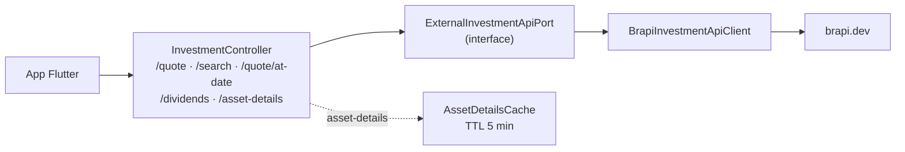

# Fatia 10 — Cotações e busca de ativos (brapi.dev)

> Verificado em 2026-09-02 lendo o código. Toda linha aqui é rastreável a um arquivo.

Esta é a única fonte de preço do produto inteiro. Ela alimenta a carteira real
(fatia 09), a carteira simulada da Academy (fatia 21) e os detalhes de ativo —
e é o ponto onde um dado inventado se torna indistinguível de um dado real.

---

## 1. O que o usuário vê

Ao digitar um ticker, sugestões. Ao escolher uma data de compra, o preço
daquele dia preenchido sozinho. Na carteira, o valor atual das posições. Na
tela de detalhes, fundamentos e histórico de proventos.

Tudo isso vem de **um** provedor externo: `brapi.dev`.

---

## 2. Caminho do dado



`ExternalInvestmentApiPort` é a fronteira: nenhum use case conhece a brapi. A
carteira simulada da Academy consome esse mesmo port — a exceção documentada
que permite ordens fictícias executarem no preço real de referência.

---

## 3. Arquivos que importam

| Arquivo | Papel |
|---|---|
| `application/investment/port/ExternalInvestmentApiPort.java` | A fronteira. 5 operações |
| `infrastructure/external/BrapiInvestmentApiClient.java` | A única implementação |
| `application/investment/cache/AssetDetailsCache.java` | TTL de 5 min por ticker |
| `infrastructure/config/HttpClientConfig.java` | `RestTemplate` genérico: 5s connect, 10s read |
| `features/investment/data/datasources/investment_remote_datasource.dart` | **Engole erros de cotação** — ver regra 4.6 |

---

## 4. Regras de negócio (e o porquê de cada uma)

### 4.1 O token ausente é tratado de forma diferente em cada operação

Isto era a maior inconsistência da fatia, e vale entender o mapa completo:

| Operação | Sem token |
|---|---|
| `searchQuotes` | **Funciona** — o endpoint de busca da brapi é público |
| `getDividends` | **Funciona** — o token é anexado só se existir |
| `getEnrichedQuote` | Devolve `Optional.empty()` — recusa-se a inventar |
| `getQuote` | Devolvia **preço fabricado de R$ 50,00** |
| `getQuoteAtDate` | Devolvia **preço fabricado de R$ 50,00** |

O `.env.example` deixa a intenção clara — *"deixe em branco para cair em dados
mock de cotação **localmente**"*. O problema era que nada garantia o
"localmente": `application.properties` define `api.brapi.token=` em branco como
padrão base, e `application-prod.properties` **não o sobrescreve**. Num deploy
onde a variável de ambiente não fosse definida, toda a carteira de todo usuário
seria avaliada a R$ 50,00 por ativo, apresentada como fato.

**Corrigido em 2026-09-02:** as duas operações que fabricavam agora só o fazem
fora do perfil `prod`. Em prod devolvem `Optional.empty()` e logam em `error` —
o mesmo comportamento que `getEnrichedQuote` já tinha.

<!-- Por que devolver vazio em vez de falhar a requisição: os chamadores já
     tratam "sem cotação" (UserPositionCalculator cai para o preço médio de
     compra), e nenhum número inventado chega ao usuário de qualquer forma. A
     degradação fica honesta em vez de silenciosa.

     Isso não resolve a regra 4.6 — "sem cotação" ainda é exibido como ganho
     zero. São dois problemas distintos: este era "inventar um preço", aquele é
     "não sinalizar a ausência". -->

### 4.2 A URL nunca é logada, e o motivo é o token

Todo `catch` genérico do client loga apenas `e.getClass().getSimpleName()`,
nunca `e.getMessage()` nem o stack trace. O comentário explica:

> *"exceções de conectividade do `RestTemplate` comumente embutem a URL completa
> da requisição, que inclui o token."*

<!-- É uma armadilha fácil de reintroduzir: acrescentar e.getMessage() a um log
     "para facilitar o debug" vaza a credencial da brapi para o log de produção.
     Vale conferir isso em toda revisão que toque este arquivo. -->

### 4.3 O histórico escolhe o menor balde que alcança a data

`rangeFor(daysAgo)` mapeia a distância até a data pedida no menor bucket da
brapi que a contém: 5d, 1mo, 3mo, 6mo, 1y, 2y, 5y, 10y, max.

É uma otimização de payload — pedir `max` para uma data de ontem traria anos de
candles para achar um preço.

### 4.4 `getQuoteAtDate` com data futura ou hoje delega para `getQuote`

```java
if (date == null || !date.isBefore(today)) {
    return getQuote(ticker);
}
```

Faz sentido: "o preço de fechamento em ou antes de hoje" é o preço atual. E o
javadoc do port avisa que datas anteriores à existência do ticker devolvem
vazio.

### 4.5 O contrato do port proíbe fabricar — em três lugares

Os javadocs de `getDividends` e `getEnrichedQuote` são explícitos:
*"implementações nunca devem fabricar uma entrada"*, *"valores que o provedor
não retornou devem simplesmente estar ausentes do mapa, nunca fabricados"*.

<!-- Era exatamente esse contrato que getQuote violava — e o violava em silêncio,
     porque o port não tem como impedir. A regra escrita num javadoc só vale
     enquanto alguém a lê. -->

### 4.6 Falha de cotação vira ganho zero, não "indisponível"

No app, `fetchQuote` captura qualquer exceção e devolve `null` — o comentário é
literalmente *"Return null on failure"*. No backend, `UserPositionCalculator`
trata `currentPrice == null` caindo para o preço médio de compra.

Combinados: quando a brapi falha, a carteira aparece com **valor atual igual ao
investido e ganho zero**, indistinguível de uma carteira que não valorizou.

<!-- Catalogado como demanda P1. Contradiz o guardrail do próprio projeto:
     "dados incompletos ou desatualizados são identificados na interface".
     A correção atravessa backend e cliente — o null é convertido cedo demais
     para o app saber que houve falha. -->

### 4.7 O cache de detalhes tem um TTL só para tudo

`AssetDetailsCache` guarda a resposta inteira por ticker com TTL de **5
minutos**. O javadoc reconhece o trade-off: preço e variação são sensíveis ao
mercado e mereceriam TTL curto; setor, descrição e logo mereceriam TTL longo —
mas por simplicidade tudo compartilha um só.

Diferente do cache do catálogo Academy (fatia 07, regra 4.9), este **tem**
expiração, porque o dado de fato muda.

---

## 5. Dados persistidos

Nenhum. Cotação não é armazenada em lugar nenhum — nem em tabela, nem em coluna
de `jf_investments`.

Consequência: **o valor histórico da carteira é sempre recalculado**, nunca
recuperado. Se a brapi mudar um preço histórico, o passado do usuário muda
junto.

O único estado é o `AssetDetailsCache`, em memória, por instância.

---

## 6. Modos de falha

| Situação | O que acontece | Onde |
|---|---|---|
| Sem token, fora de prod | Preço mock R$ 50,00, log em `warn` | regra 4.1 |
| **Sem token, em prod** | `Optional.empty()` + log em `error` | regra 4.1 |
| brapi fora do ar | `Optional.empty()`, log só com a classe da exceção | regra 4.2 |
| brapi devolve 4xx | `Optional.empty()`, log com o status | `getQuote` |
| Ticker inexistente | `results` vazio → `Optional.empty()` | `extractResults` |
| Data anterior à existência do ticker | `Optional.empty()` | regra 4.4 |
| Qualquer uma das acima, vista pelo usuário | **Ganho zero**, sem aviso | regra 4.6 |
| brapi lenta | `read timeout` de 10s → exceção → vazio | `HttpClientConfig` |
| Mesmo ticker pedido em sequência | Servido do cache por até 5 min | regra 4.7 |

---

## 7. Drills

<details>
<summary><b>Drill 1 —</b> O deploy de produção sobe sem <code>api.brapi.token</code>. O que o usuário via antes de 2026-09-02, e o que vê agora?</summary>

**Antes:** toda posição avaliada a **R$ 50,00 por ativo**, com o nome
`"Simulated PETR4"`. O número entrava no cálculo de valor atual, ganho,
alocação e nos limiares das conquistas (`portfolio_10k`) — tudo apresentado
como fato. Nada falhava.

**Agora:** `getQuote` devolve vazio e loga em `error`. Nenhum número inventado
chega ao usuário.

O que **não** melhorou: pela regra 4.6, "sem cotação" ainda é exibido como ganho
zero. Continua errado, mas é um erro menor e de outra natureza — não é dinheiro
inventado.

*Como isso passou:* `application.properties` define o token em branco como
padrão base, e `application-prod.properties` não o sobrescreve. Nada no boot
reclamava — ao contrário do `ActiveProfileGuard`, que existe justamente para
esse tipo de configuração ausente.
</details>

<details>
<summary><b>Drill 2 —</b> Você acrescenta <code>e.getMessage()</code> a um log deste arquivo para facilitar o debug. Qual o risco?</summary>

Vazar o token da brapi para o log de produção.

Exceções de conectividade do `RestTemplate` comumente embutem a **URL completa**
da requisição — e o token vai na query string
(`?token=...`). Por isso todo `catch` genérico do client loga apenas
`e.getClass().getSimpleName()`.

É uma armadilha fácil de reintroduzir com a melhor das intenções. Vale conferir
em toda revisão que toque este arquivo.
</details>

<details>
<summary><b>Drill 3 —</b> A busca de tickers funciona sem token, mas a cotação não. Por quê?</summary>

Porque são endpoints diferentes da brapi com políticas diferentes:
`/api/quote/list?search=` é público, `/api/quote/{ticker}` exige token. O
comentário no código registra isso — *"we can use search without a token"*.

Consequência prática ao depurar: num ambiente sem token, a busca de ativos
funciona normalmente e só o preço falha. É fácil concluir que "a integração
está funcionando" olhando só a busca.
</details>

<details>
<summary><b>Drill 4 —</b> A brapi corrige retroativamente o preço de fechamento de uma data. O que acontece com a carteira do usuário?</summary>

O passado dele muda.

Nenhuma cotação é persistida — nem a atual, nem a histórica. Valor atual, ganho
e histórico da carteira são **sempre recalculados** a partir do que o provedor
responde agora.

É uma decisão razoável para o valor atual e discutível para o histórico: um
gráfico de evolução pode mudar de forma entre duas visitas sem que o usuário
tenha feito nada.
</details>

<details>
<summary><b>Drill 5 —</b> Por que a carteira simulada da Academy consome este mesmo port, se ela é de dinheiro fictício?</summary>

Porque o dinheiro é fictício, mas o **preço de referência** precisa ser real —
senão a prática não ensina nada sobre o mercado.

É uma exceção documentada à separação entre contextos (fatia 08, §2.8): o
`simulated_portfolio` não toca `real_portfolio`, mas ambos leem o mesmo
`ExternalInvestmentApiPort`.

Por isso a Academy ganhou endpoints próprios de cotação
(`/api/v1/simulated-portfolios/quotes/*`): os do Wallet são gated por
`APP_CONTEXT_WALLET` e devolveriam 403 para ela.
</details>

---

## 8. Se você fosse mudar algo aqui

- **Sinalizar cotação indisponível** → a correção que falta. Ver regra 4.6. O
  `null` é convertido em "preço = média de compra" cedo demais para o app saber
  que houve falha.
- **Exigir o token no boot em prod** → seria mais forte que a guarda atual, no
  mesmo espírito do `ActiveProfileGuard`. Não feito: a guarda por requisição já
  impede o dano, e falhar o boot inteiro por uma integração degradada é uma
  decisão de produto.
- **Persistir cotações históricas** → resolveria o drill 4 e reduziria chamadas
  ao provedor. Custa uma tabela e uma política de invalidação.
- **Segundo provedor** → o port já permite; hoje há uma implementação só.
