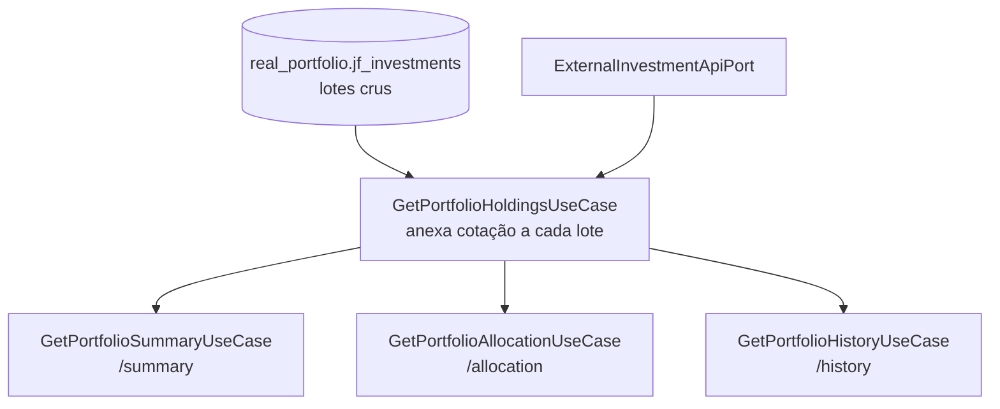

# Fatia 11 — Resumo, alocação e histórico da carteira

> Verificado em 2026-09-02 lendo o código. Toda linha aqui é rastreável a um arquivo.

Três endpoints de leitura sobre os mesmos dados. Um deles mostra ao usuário um
gráfico que **não é histórico** — e não avisa isso em lugar nenhum da interface.

---

## 1. O que o usuário vê

Na aba Carteira: valor investido, valor atual, ganho e percentual; um donut de
alocação por classe de ativo; e um gráfico "Evolução Patrimonial" com seletor de
período (7D, 30D, 3M, 6M, 1A, 3A, 5A, Tudo).

---

## 2. Caminho do dado



**Tudo deriva de um lugar.** `GetPortfolioHoldingsUseCase` é o único que lê o
banco e chama o provedor de cotação; os outros três consomem o resultado dele.

<!-- Consequência boa: uma correção no cálculo de valor atual se propaga aos
     três endpoints sozinha. Consequência a lembrar: uma chamada a /summary
     custa o mesmo que /allocation e /history — todas buscam cotação. Uma tela
     que chame os três faz o trabalho três vezes. -->

---

## 3. Arquivos que importam

| Arquivo | Papel |
|---|---|
| `application/investment/usecase/GetPortfolioHoldingsUseCaseImpl.java` | **A base.** Anexa cotação, com cache por requisição |
| `application/investment/usecase/GetPortfolioSummaryUseCaseImpl.java` | Agrega |
| `application/investment/usecase/GetPortfolioAllocationUseCaseImpl.java` | Agrupa por tipo |
| `application/investment/usecase/GetPortfolioHistoryUseCaseImpl.java` | **Interpola.** Ver regra 4.4 |
| `features/portfolio/domain/services/wealth_history_calculator.dart` | Cópia da mesma matemática, em Dart |
| `features/portfolio/presentation/widgets/wealth_evolution_card.dart` | O gráfico, sem aviso |

---

## 4. Regras de negócio (e o porquê de cada uma)

### 4.1 Uma cotação por ticker distinto, não por lote

```java
Map<String, BigDecimal> priceCache = new HashMap<>();
for (Investment lot : lots) {
    priceCache.computeIfAbsent(lot.name(), ticker -> fetchCurrentPrice(...));
}
```

Um usuário com cinco compras de PETR4 gera **uma** chamada ao provedor, não
cinco. O cache vive só durante a requisição.

### 4.2 Renda fixa nunca é cotada — e por isso nunca valoriza

```java
if (type == InvestmentType.FIXED_INCOME) {
    return fallbackPrice;
}
```

O comentário explica: títulos de renda fixa não são ações, não têm ticker no
feed da brapi, e consultá-lo sempre daria 404. Não existe modelo de
precificação por acúmulo (*accrual*) no sistema.

<!-- Consequência para o usuário: um Tesouro Selic comprado há dois anos aparece
     valendo exatamente o que ele pagou, com ganho zero, para sempre. Não é bug
     de cotação — é ausência de um modelo. Vale saber antes de alguém reportar
     "meu Tesouro não rende". -->

### 4.3 Qualquer falha de cotação vira o preço de compra

`fetchCurrentPrice` cai para `fallbackPrice` em três situações: renda fixa,
`Optional.empty()` do provedor, ou exceção. As três produzem o mesmo resultado
visível: **ganho zero**.

<!-- É o lado backend do problema catalogado na fatia 10 regra 2.5. As três
     causas são indistinguíveis entre si e indistinguíveis de "não valorizou".
     E note o log: `e.getMessage()` aqui — o client da brapi já captura tudo e
     devolve empty, então nada deveria escapar, mas se algum dia escapar, essa
     linha pode logar a URL com o token (fatia 10, regra 2.2). -->

### 4.4 O "histórico" é uma interpolação linear, não histórico

O comentário no topo do arquivo é honesto e vale citar inteiro:

> *"This is a deterministic cost-basis → current-value interpolation
> approximation, not true historical mark-to-market data, since no daily price
> history is persisted anywhere in this system."*

O que ele faz: para cada lote, traça uma **reta** do preço de compra até o preço
atual, e amostra essa reta em até 60 pontos.

```java
double progress = elapsedDays / totalDays;              // 0..1
BigDecimal interpolatedPrice =
        purchasePrice.add(priceDelta.multiply(valueOf(progress)));
```

Consequências que o usuário não tem como saber:

- O gráfico **nunca mostra uma queda** que tenha existido de verdade.
- Se o mercado caiu 15% na semana passada e recuperou, a linha segue reta.
- Selecionar "7D" não mostra os últimos 7 dias: mostra 7 dias **daquela reta**.
- Dois usuários que compraram o mesmo ativo em datas diferentes veem
  inclinações diferentes para o mesmo período de mercado.

O card se chama **"Evolução Patrimonial"**, tem seletor de período e legenda de
gráfico — e **não há nenhum aviso na interface** de que aquilo não é histórico
de mercado. A honestidade existe só em comentários de código.

<!-- Catalogado como demanda P1 (Guardrail/Compliance). A defesa no comentário
     ("aproximação razoável, não fabricada; sem aleatoriedade; sempre resolve
     no valor real de hoje") é justa sobre o MÉTODO e não responde à
     APRESENTAÇÃO: o problema não é a matemática, é o gráfico parecer o que não
     é. Marcar como estimativa custa uma linha de texto. -->

### 4.5 A mesma matemática existe duas vezes, em duas linguagens

`WealthHistoryCalculator` (Dart) é uma cópia declarada do use case Java. O
comentário justifica: o endpoint do backend não tem quebra por classe de ativo,
e adicionar uma não se justificava "só para evitar ~30 linhas de matemática
compartilhada e bem entendida".

<!-- É o terceiro caso do mesmo padrão neste projeto — LevelCalculator (fatia
     04, regra 4.6) é o outro. Em nenhum deles existe teste de contrato que
     verifique que as duas implementações continuam concordando. Aqui o sintoma
     seria pior que no nível: o gráfico mudaria de forma ao trocar o filtro de
     classe, porque uma metade viria do backend e a outra do cliente. -->

### 4.6 Amostragem: no máximo 60 pontos, e hoje sempre entra

`generateSampleDates` devolve todos os dias quando a janela tem menos de 60,
e 60 pontos igualmente espaçados quando tem mais. `today` é adicionado sempre ao
final — é o que garante que o gráfico termine no valor real.

`range` desconhecido ou nulo cai em `ALL`, cuja janela começa na **data de
compra mais antiga** do usuário.

### 4.7 Alocação agrupa por tipo sobre o valor **atual**

`AllocationSliceDTO` divide por `InvestmentType` (6 valores) e calcula o
percentual sobre a soma do valor atual — não do investido. Faz sentido: alocação
é sobre o que você tem hoje.

E como renda fixa nunca valoriza (regra 4.2), a fatia dela no donut **encolhe
sozinha** conforme os outros ativos sobem, mesmo que o usuário não venda nada.

---

## 5. Dados persistidos

Nenhum, além dos lotes da fatia 09. Resumo, alocação e histórico são **sempre
calculados na hora** — nada é materializado.

Por isso não existe "valor da carteira em 3 de janeiro": existe apenas uma
reconstrução, feita agora, a partir dos preços de agora.

---

## 6. Modos de falha

| Situação | O que acontece | Onde |
|---|---|---|
| Cotação indisponível | Preço de compra, **ganho zero** | regra 4.3 |
| Ativo de renda fixa | Preço de compra, **ganho zero, sempre** | regra 4.2 |
| Carteira vazia | Resumo com zeros; histórico com um ponto (hoje) | `generateSampleDates` |
| Menos de 2 pontos no gráfico | *"Sem dados suficientes para este período."* | `wealth_evolution_card.dart` |
| Lote comprado hoje | `progress = 1.0`, contribui já com o valor atual | `GetPortfolioHistoryUseCaseImpl` |
| `range` inválido | Cai em `ALL` sem erro | regra 4.6 |
| Usuário interpreta o gráfico como histórico | **Sem aviso de que não é** | regra 4.4 |

---

## 7. Drills

<details>
<summary><b>Drill 1 —</b> A bolsa caiu 12% na semana passada e recuperou. O usuário abre "Evolução Patrimonial" em 30D. O que ele vê?</summary>

**Uma linha reta**, subindo (ou descendo) suavemente do preço de compra até o
valor de hoje. A queda de 12% não aparece — nunca apareceu, para ninguém.

O backend não guarda preço diário; o gráfico é uma interpolação linear entre
duas âncoras: o que ele pagou e o que vale agora.

*O detalhe que torna isso difícil de perceber:* o valor de **hoje** está sempre
certo, e o valor **inicial** também. Só o caminho entre os dois é inventado — e
é justamente o caminho que um gráfico se propõe a mostrar.
</details>

<details>
<summary><b>Drill 2 —</b> Um usuário reclama que o Tesouro Selic dele aparece com rendimento zero há dois anos. Bug de cotação?</summary>

Não. É ausência de modelo, e é deliberado.

`fetchCurrentPrice` devolve o preço de compra direto para `FIXED_INCOME`, sem
sequer consultar o provedor — o comentário explica que renda fixa não tem ticker
no feed da brapi e a consulta sempre daria 404.

Precificar renda fixa exigiria um modelo de acúmulo (taxa, indexador, data de
vencimento) que não existe no sistema. O campo `type` guarda a classe, mas
nenhum dado necessário para o cálculo.

*Efeito colateral no donut:* a fatia de renda fixa encolhe sozinha conforme os
outros ativos valorizam, sem o usuário vender nada.
</details>

<details>
<summary><b>Drill 3 —</b> A tela da carteira chama <code>/summary</code>, <code>/allocation</code> e <code>/history</code>. Quantas vezes o provedor de cotação é consultado?</summary>

**Três vezes o número de tickers distintos** — uma vez por endpoint.

Os três derivam de `GetPortfolioHoldingsUseCase`, que tem cache de preço **por
requisição** (`computeIfAbsent`), não entre requisições. Cada chamada HTTP
refaz o trabalho inteiro.

Dentro de uma requisição a economia é real: cinco lotes de PETR4 geram uma
consulta, não cinco.
</details>

<details>
<summary><b>Drill 4 —</b> Você muda a fórmula de interpolação no backend. O gráfico da carteira muda?</summary>

**Depende do filtro que o usuário selecionou** — e essa é a pegadinha.

Existe uma segunda implementação da mesma matemática em Dart
(`WealthHistoryCalculator`), usada para redesenhar instantaneamente quando o
filtro por classe de ativo muda. Se você mudar só o Java, o gráfico passa a
mudar de forma ao alternar o filtro.

É o mesmo padrão do `LevelCalculator` (fatia 04): duplicação deliberada,
justificada no comentário, **sem teste de contrato** que garanta que as cópias
continuem concordando.
</details>

<details>
<summary><b>Drill 5 —</b> Existe "o valor da minha carteira em 3 de janeiro"?</summary>

Não. Existe apenas uma **reconstrução feita agora**, a partir dos preços de
agora.

Nada é materializado: resumo, alocação e histórico são sempre calculados na
hora. Some-se a isso que nenhuma cotação é persistida (fatia 10) — então a
mesma pergunta feita amanhã pode dar outra resposta, sem que nada tenha
acontecido com a carteira.
</details>

---

## 8. Se você fosse mudar algo aqui

- **Marcar o gráfico como estimativa** → a correção mais barata desta fatia, e a
  que fecha a lacuna de honestidade. Ver regra 4.4.
- **Persistir preço diário** → transformaria a interpolação em histórico de
  verdade e resolveria o drill 1 e o drill 5. Custa uma tabela, um job e uma
  política de retenção.
- **Modelo de renda fixa** → precisa de dados que hoje não são nem coletados
  (taxa, indexador, vencimento). É escopo de produto, não ajuste.
- **Teste de contrato entre as duas implementações do histórico** → mesmo caso
  do `LevelCalculator`.
