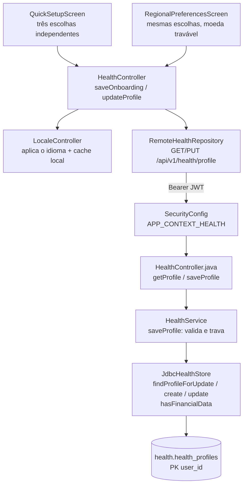

# Fatia 26 — Perfil Health: país, moeda, idioma e a trava da moeda

> Verificado em 2026-09-04 lendo o código. Toda linha aqui é rastreável a um
> arquivo.

Esta é a primeira fatia do Petrimonium Health, e é a certa para começar por um
motivo: **o perfil não é uma tela de preferências, é a chave de todo o resto do
produto.** Sem ele, nenhuma outra rota do Health responde. E a moeda que ele
grava não é um rótulo — é uma coluna que o banco usa para recusar dado
inconsistente.

---

## 1. O que o usuário vê

Duas telas, na primeira vez que a pessoa entra no Health:

```
login → [petSetup, se ainda não tem pet] → quickSetup → home
```

A **`QuickSetupScreen`** pede três coisas, apresentadas como três escolhas
independentes:

| Escolha | Valores |
|---|---|
| País | Brasil ou Portugal |
| Moeda principal | real (`BRL`) ou euro (`EUR`) |
| Idioma da interface | português do Brasil (`pt-BR`) ou de Portugal (`pt-PT`) |

Tocar em um país **sugere** os outros dois (Brasil → BRL + pt-BR; Portugal →
EUR + pt-PT), e a pessoa pode sobrescrever qualquer um antes de salvar. Nada
vem do dispositivo: nem locale do sistema, nem região da loja, nem IP.

Depois do onboarding, as mesmas três escolhas reaparecem em **Perfil →
Preferências regionais** (`AppSubScreen.regionalPreferences`) — com uma
diferença: assim que existe qualquer dado financeiro, os chips de moeda ficam
**desabilitados**, com uma explicação abaixo deles. País e idioma continuam
editáveis para sempre.

### A tela do pet aparece ou não?

`onboardingStep` é derivado, não é um flag persistido:

```dart
OnboardingStep get onboardingStep =>
    pet == null ? OnboardingStep.petSetup : OnboardingStep.quickSetup;
```

Quem já criou o companheiro no Wallet ou na Academy **não vê a tela de pet** —
o Pet é um só, compartilhado (fatia 03). Quem chega ao ecossistema pelo Health
cria o pet aqui, pela rota compartilhada `/api/pets/configure`.

---

## 2. Caminho do dado



O detalhe que muda como você depura este fluxo: **o `LocaleController` é
atualizado a partir da resposta do backend, não da escolha do usuário.**
`saveOnboarding` e `updateProfile` chamam `setLocale(saved.interfaceLocale)` —
`saved`, o que voltou do PUT. Se o backend normalizasse ou recusasse um valor,
a interface seguiria o backend, não o toque.

---

## 3. Arquivos que importam

| Arquivo | Papel |
|---|---|
| `Health/lib/core/profile/health_profile.dart` | Os três enums, `suggestionFor()` e o modelo. **A sugestão por país vive aqui, não na tela** |
| `Health/lib/features/onboarding/presentation/quick_setup_screen.dart` | Onboarding: `_selectCountry` aplica a sugestão |
| `Health/lib/features/profile/presentation/regional_preferences_screen.dart` | Pós-onboarding: mesma escolha, respeitando a trava |
| `Health/lib/features/health/presentation/health_controller.dart` | `saveOnboarding`, `updateProfile`, `onboardingStep`, `CurrencyLockedException` |
| `Health/lib/core/i18n/locale_controller.dart` | Aplica o idioma e guarda em `SharedPreferences` (`health_last_locale`) |
| `application/health/HealthService.java` | `saveProfile` — validação e a trava de moeda |
| `infrastructure/repository/health/JdbcHealthStore.java` | `findProfileForUpdate` (`for update`), `hasFinancialData` |
| `db/migration/V29__health_schema.sql` | A tabela, os `check` e a unique que sustenta as FKs de moeda |

---

## 4. Regras de negócio (e o porquê de cada uma)

### 4.1 O 404 do `GET /profile` é a definição de "precisa de onboarding"

Não existe flag `hasCompletedOnboarding` em lugar nenhum. O app decide pela
ausência do recurso:

```dart
if (response.statusCode == 404) return null;   // RemoteHealthRepository
...
if (loadedProfile == null) { stage = AppStage.onboarding; return; }
```

E o backend recusa deliberadamente inventar um padrão:

> *"404 before onboarding: a Petrimonium account exists (the token proves it),
> but this user has no Health profile yet, and the app reads that as 'show
> onboarding' rather than inventing a default country/currency for them."*
> — `HealthController.java`

**Por quê:** um padrão inventado (`BR`/`BRL`) seria invisível e irreversível.
A pessoa criaria a primeira conta em reais sem nunca ter escolhido reais — e a
partir daí a moeda estaria travada (4.3) numa escolha que ela não fez.

### 4.2 Sem perfil, o Health inteiro devolve 404

Todo método do `HealthService` que toca dinheiro começa por `requireProfile`:

```java
private Profile requireProfile(long userId) {
    return store.findProfile(userId).orElseThrow(() ->
        new ResourceNotFoundException("Health profile not found. Complete Health onboarding first."));
}
```

O perfil não é configuração opcional: é pré-requisito de contas, lançamentos,
transferências, recorrências, cartões e resumo. É por isso que esta fatia vem
antes das outras três do Health.

### 4.3 A moeda trava quando existe qualquer dado financeiro — e a trava é dupla

**Camada 1, aplicação** (`HealthService.saveProfile`):

```java
boolean hasData = store.hasFinancialData(userId);
if (hasData && current.get().primaryCurrency() != currency) {
    throw new HealthConflictException("CURRENCY_CHANGE_LOCKED", CURRENCY_LOCKED_MESSAGE);
}
```

`hasFinancialData` é um único `select` com cinco `exists`: contas, cartões,
recorrências, lançamentos, compras de cartão. **Uma linha em qualquer uma
delas fecha a moeda.**

**Camada 2, banco.** Esta é a parte que ninguém espera encontrar, e é a mais
interessante do schema do Health:

```sql
constraint uq_health_profiles_user_currency unique (user_id, primary_currency)
```

Uma unique sobre `(user_id, primary_currency)` numa tabela cuja PK já é
`user_id` sozinha é redundante como restrição — e não está lá para restringir.
Está lá para ser **alvo de chave estrangeira composta**:

```sql
-- health_accounts e health_cards
constraint fk_health_..._profile_currency foreign key (user_id, currency)
    references health_profiles (user_id, primary_currency)
```

E os demais encadeiam a partir daí: recorrências, transferências e lançamentos
referenciam `health_accounts (id, user_id, currency)`; faturas, compras e
prestações referenciam `health_cards`/`health_card_invoices` pelo mesmo trio.

**A consequência:** mesmo que a camada 1 fosse contornada, o `UPDATE` do
`primary_currency` seria **recusado pelo próprio Postgres** enquanto existisse
uma conta ou cartão apontando para o valor antigo. A moeda não é uma
convenção respeitada pelo código — é uma restrição referencial.

Coberto por `HealthSchemaConstraintsTest.anAccountCannotUseACurrencyOtherThanTheProfilesPrimaryOne`
e `anEntryCannotCarryADifferentCurrencyFromItsAccount`.

### 4.4 País, moeda e idioma são independentes — sugestão não é dedução

`suggestionFor(country)` devolve um par, e as telas o aplicam **uma vez**, no
toque do país. Depois disso os três campos vivem separados: trocar a moeda não
mexe no idioma, trocar o idioma não mexe no país.

**Por quê:** o caso real que motiva o Health suportar BR e PT no primeiro
release é justamente a combinação cruzada — quem mora em Portugal e prefere
`pt-BR`, quem mora no Brasil e recebe em euro. Deduzir uma escolha da outra
transformaria esses casos em erro do usuário.

Nas Preferências regionais há uma assimetria deliberada:

```dart
void _selectCountry(CountryCode country, bool currencyChangeAllowed) {
  final suggestion = suggestionFor(country);
  setState(() {
    _country = country;
    if (currencyChangeAllowed) _currency = suggestion.currency;   // só a moeda é condicional
    _locale = suggestion.locale;
  });
}
```

Trocar o país de quem já tem dados muda o idioma sugerido, mas **não** mexe na
moeda travada — em vez de propor uma mudança que o backend recusaria.

### 4.5 O backend valida os três campos por caminhos diferentes

| Campo | Validação | Onde |
|---|---|---|
| `countryCode` | `enumValue(CountryCode.class, ...)` → `BR`/`PT` | `HealthService` |
| `primaryCurrency` | `enumValue(CurrencyCode.class, ...)` → `BRL`/`EUR` | `HealthService` |
| `localeTag` | comparação literal com `"pt-BR"`/`"pt-PT"` | `requireLocale` |

O idioma é o único que não é enum no backend — é `String` comparada a dois
literais, gravada numa coluna `varchar(5)` com `check`. Funciona, e é uma
assimetria a lembrar quando um terceiro idioma entrar: são **três** lugares a
mudar (o literal, o `check` da V29 e o enum `InterfaceLocale` do Flutter), não
um.

### 4.6 O `PUT` é create-or-update, com `for update`

`saveProfile` não distingue POST de PUT: chama `findProfileForUpdate`, e cria
se estiver vazio ou atualiza se existir. O `select ... for update` dentro de
uma transação `@Transactional` fecha a janela em que duas requisições
simultâneas leriam "não existe" e ambas tentariam inserir.

---

## 5. Dados persistidos

`health.health_profiles` (Postgres; sem qualificação de schema em H2/dev —
fatia 08 e `../../INTEGRATION.md` §7):

| Coluna | Tipo | Regra |
|---|---|---|
| `user_id` | `bigint` | **PK** e FK para `identity.jf_users`. Um perfil por pessoa |
| `country_code` | `varchar(2)` | `check in ('BR','PT')` |
| `primary_currency` | `varchar(3)` | `check in ('BRL','EUR')`. Alvo da FK composta (4.3) |
| `locale_tag` | `varchar(5)` | `check in ('pt-BR','pt-PT')` |
| `created_at` / `updated_at` | `timestamp` | Gravados pelo store, não pelo banco |

Migrations: **V29** cria a tabela (comum a H2 e Postgres); **V30** a move para
o schema `health`, só em Postgres.

> **Nada aqui é JPA.** O contexto `health` é o único do backend que persiste
> por `JdbcTemplate` (`JdbcHealthStore`), resolvendo o schema por um prefixo
> calculado em runtime — `"health."` sob o perfil `prod`, string vazia fora
> dele. Isso significa que **`ddl-auto=validate` não protege esta tabela**: uma
> coluna divergente não derruba o boot, falha na primeira chamada que a tocar.

---

## 6. Modos de falha

| O que acontece | O que o usuário vê | Onde está a decisão |
|---|---|---|
| Sessão Wallet ou Academy chama `/api/v1/health/**` | 403 | `SecurityConfig`, gate `APP_CONTEXT_HEALTH` |
| Perfil não existe | Onboarding, não erro | `getProfile` → `null` → `AppStage.onboarding` |
| Rota de dinheiro sem perfil | 404 com "Complete Health onboarding first" | `requireProfile` |
| `localeTag` inválido | 400 | `requireLocale` |
| País ou moeda fora do enum | 400 | `enumValue` |
| Moeda alterada com dados existentes, **flag do app atualizada** | Diálogo "moeda travada", sem ida ao servidor | `updateProfile` → `CurrencyLockedException` |
| Moeda alterada com dados existentes, **flag do app desatualizada** | ⚠️ Erro genérico, não o diálogo | ver abaixo |
| Falha de rede no PUT do onboarding | `onboardingSaveFailed`, permanece na tela | `QuickSetupScreen._submit` |
| `SharedPreferences` indisponível no boot | Segue em `pt-BR` | `main.dart`, `loadCached` em try/catch |

### A lacuna do 409

O guarda do cliente usa `profile.currencyChangeAllowed`, que veio da **última**
resposta do backend. Se o valor envelheceu — outra sessão criou a primeira
conta, ou o app está aberto desde antes disso — o guarda deixa passar, o
backend responde **409 `CURRENCY_CHANGE_LOCKED`**, e `RegionalPreferencesScreen._save`
só captura `CurrencyLockedException`:

```dart
} on CurrencyLockedException {   // não captura ApiException(409)
```

O 409 vira `ApiException` e cai no tratamento genérico: a pessoa vê uma
mensagem de erro comum em vez do diálogo que explica *por que* a moeda está
travada. O dado permanece correto — a trava funcionou nas duas camadas — mas a
explicação se perde exatamente no caso em que ela é mais necessária.

Mapear `code == 'CURRENCY_CHANGE_LOCKED'` para `CurrencyLockedException` no
repositório fecharia isso, e faria o guarda do cliente virar otimização em vez
de caminho principal.

---

## 7. Drills

<details>
<summary><b>Drill 1 —</b> Você remove a linha <code>uq_health_profiles_user_currency</code> da V29, achando que é redundante com a PK. O que quebra, e quando?</summary>

A migration falha **imediatamente**, ao criar `health_accounts`. Uma FK
composta exige que as colunas referenciadas tenham unique ou PK; sem ela,
`foreign key (user_id, currency) references health_profiles (user_id, primary_currency)`
não pode ser criada.

Se você removesse também as FKs, aí sim o schema subiria — e a camada 2 da
trava de moeda desapareceria em silêncio. O código continuaria passando nos
testes de serviço e o banco aceitaria uma conta em euro sob um perfil em real.
</details>

<details>
<summary><b>Drill 2 —</b> Um usuário cria a conta pelo Wallet, usa por meses, e depois instala o Health. Quantas telas de onboarding ele vê, e por quê?</summary>

Uma: a `QuickSetupScreen`. `onboardingStep` é derivado de `pet == null`, e ele
já tem pet (criado no onboarding do Wallet — provisionado silenciosamente como
`Nino`, fatia 02). A tela de pet é pulada.

O `GET /api/v1/health/profile` responde 404 porque perfil Health é por produto,
então o quick setup aparece. Identidade e Pet atravessam; o perfil Health não.
</details>

<details>
<summary><b>Drill 3 —</b> Uma pessoa em Portugal cria o perfil com país PT, moeda EUR, idioma pt-PT. Um mês depois, com 40 lançamentos registrados, muda-se para o Brasil e troca o país para BR. O que acontece com cada um dos três campos?</summary>

- **País**: muda para `BR`. Nunca trava.
- **Idioma**: a tela aplica a sugestão do país e propõe `pt-BR`; ela pode
  desfazer antes de salvar. Nunca trava.
- **Moeda**: continua `EUR`. `_selectCountry` só aplica a moeda sugerida se
  `currencyChangeAllowed` for `true`, e não é — existem lançamentos.

Ou seja, o perfil fica `BR` + `EUR` + `pt-BR`, e isso é **estado válido e
esperado**: os 40 lançamentos estão em euro, e não há câmbio nesta versão.
Converter a moeda exigiria uma migração de valores que ainda não existe — é o
que a mensagem `CURRENCY_LOCKED_MESSAGE` diz ao usuário.
</details>

<details>
<summary><b>Drill 4 —</b> O <code>LocaleController</code> guarda o idioma em <code>SharedPreferences</code>. Se esse cache discordar do <code>localeTag</code> do backend, qual vence, e em que momento?</summary>

O cache vence **durante o boot**, e o backend vence **logo em seguida**.

`main.dart` chama `loadCached()` antes de qualquer rede, para o primeiro frame
sair no idioma certo em vez de piscar em `pt-BR`. Depois, `_loadAuthenticatedState`
recebe o perfil e chama `setLocale(loadedProfile.interfaceLocale)`, que
sobrescreve e regrava o cache.

Consequência prática: uma divergência é visível por alguns frames num cold
start, e se autocorrige. Se a chamada do perfil falhar, o cache permanece — o
que é o comportamento desejado offline.
</details>

<details>
<summary><b>Drill 5 —</b> Você quer adicionar espanhol (<code>es-ES</code>). Liste todos os pontos que precisam mudar antes de a primeira tela renderizar em espanhol.</summary>

1. `requireLocale` no `HealthService` — hoje compara com dois literais.
2. O `check constraint` `chk_health_profiles_locale` na V29 — via **nova
   migration**, `V31`, nunca editando a V29.
3. O enum `InterfaceLocale` (`health_profile.dart`) — tag + `Locale`.
4. `suggestionFor()` — e antes disso, decidir qual país sugere `es-ES`, o que
   implica um valor novo em `CountryCode` e no `check` de país.
5. Os ARB (`lib/l10n/`) e um `flutter gen-l10n`.

O ponto do drill: o idioma parece um campo de texto e são cinco lugares, dois
deles no banco. Compare com a moeda, que é enum nos dois lados — e ainda assim
exigiria a migração de valores da regra 4.3.
</details>

---

## Achados registrados

Escrever esta fatia confirmou dois itens já no board **Demandas — Petrimonium**
(a trava de `ddl-auto` não cobrir as tabelas do Health; idioma com duas fontes
de verdade, entre `/api/settings/language` e o `localeTag` daqui) e revelou um
novo: a lacuna do 409 descrita na §6.
