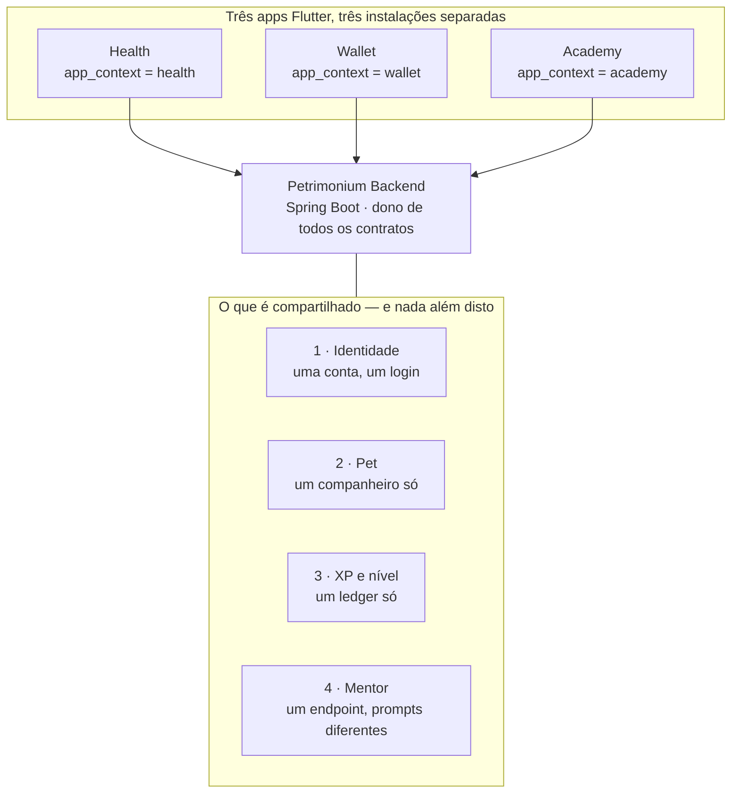
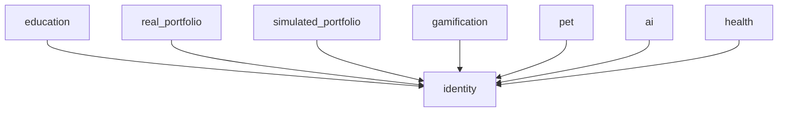

# Contrato de integração do ecossistema Petrimonium

> **Este é o documento canônico da integração entre os produtos.** Os três
> apps Flutter apontam para cá; nenhum deles define contrato de integração no
> próprio repositório. Se um app precisa saber o que pode falar com o outro,
> a resposta está aqui.
>
> Estado verificado em 2026-09-04, lendo o código do backend e dos três apps.
> Onde o documento descreve algo que **ainda não existe**, isso está marcado
> como lacuna na §8 — nada aqui é aspiracional sem etiqueta.

## 1. A ideia: três perguntas, um companheiro

O Petrimonium não é um app com três módulos. São **três produtos**, cada um
respondendo a uma pergunta que a mesma pessoa faz em momentos diferentes da
vida financeira:

| Produto | A pergunta que ele responde | Dinheiro |
|---|---|---|
| **Petrimonium Health** | *Como está o meu mês, e quanto sobra depois dos compromissos que já conheço?* | Real — fluxo de caixa |
| **Petrimonium Wallet** | *Como está o meu patrimônio, e o que ele está fazendo?* | Real — investimentos |
| **Petrimonium Academy** | *Eu entendo o que estou fazendo?* | Fictício — só simulação |

A ordem acima é a ordem natural da jornada, e é ela que justifica a
existência dos três: **fluxo de caixa vem antes de patrimônio, e educação
atravessa os dois.** Quem não fecha o mês não investe; quem investe sem
entender vira o próximo caso de arrependimento.

O que costura os três não é navegação nem tela compartilhada. São **quatro
coisas, e só essas quatro**:

Tudo o mais — dados financeiros, conteúdo, progresso, telas — é **isolado por
produto**, e o isolamento é executado pelo backend, não pelos apps.

## 2. Por que o backend é o carro principal

Os apps não conversam entre si. Não há chamada de app para app, não há
banco compartilhado no dispositivo, não há link funcionando hoje entre eles
(§6). Toda integração acontece **através do backend**, e isso é uma decisão,
não uma limitação:

1. **A separação real/fictício é uma regra de segurança, não de UI.** Se um
   app decidisse sozinho o que pode ver, a garantia valeria só até alguém
   instalar um APK modificado. O gate vive no `SecurityConfig` do backend
   (§4) e é o único que conta.
2. **A pessoa é uma só, os produtos é que são três.** Identidade, Pet e XP
   moram no backend porque pertencem à pessoa, não ao app que ela abriu.
3. **Divergência entre repos é o risco crônico deste projeto.** Wallet e
   Academy nasceram como clones do mesmo código e já divergiram em arquivos
   de mesmo caminho. Contrato duplicado em três repositórios diverge; contrato
   em um repositório, referenciado pelos outros, não.

Consequência prática, e a regra que vale para todo PR:

> **Nenhuma regra de integração é implementada primeiro num app.** Ela é
> definida aqui, executada no backend, e só então consumida pelos clientes.

## 3. `app_context`: a peça que separa os três produtos

Um único mecanismo separa os três produtos em tempo de execução: a claim
`app_context` no JWT.

- Valores: `wallet`, `academy`, `health` (`core/domain/enums/AppContextEnum.java`).
- **Fixo por app, nunca flag de build**: `ApiConstants.appContext` (Wallet,
  Academy) e `ApiConfig.appContext` (Health) são constantes.
- O app envia `appContext` em `POST /auth/login` e `POST /auth/google`. O
  access token resultante carrega a claim.
- **O refresh nunca aceita contexto do cliente**: o valor é gravado na linha
  de `refresh_tokens` no login (migration `V21`) e reaplicado a partir dali.
  Um cliente não troca de contexto renovando o token.
- Valor desconhecido na claim é tratado como *ausente*, não como erro — um
  token antigo continua válido, só não alcança rota gateada. Já um
  `appContext` inválido **no request de login** falha alto, porque um typo ali
  deve quebrar em vez de emitir silenciosamente um token sem escopo.

Para a fatia completa (ponta a ponta, com arquivos e modos de falha), ver
[`ARCHITECTURE/fatias/01-auth-e-app-context.md`](ARCHITECTURE/fatias/01-auth-e-app-context.md).

## 4. Matriz de acesso — o contrato de isolamento

Extraída de `infrastructure/config/SecurityConfig.java`. **Esta tabela é o
contrato.** Um endpoint novo entra em uma das quatro categorias
conscientemente; cair em `anyRequest().authenticated()` por omissão é o modo
como um vazamento nasce.

| Rota | Exige | Categoria |
|---|---|---|
| `/auth/**` | — pública | aberta |
| `/actuator/health`, `/actuator/health/**` | — pública | aberta |
| `/api/investments/**` | `APP_CONTEXT_WALLET` | exclusiva |
| `/api/v1/achievements/**` | `APP_CONTEXT_WALLET` | exclusiva |
| `/api/v1/academy/**`, `/api/v1/learning/**`, `/api/v1/lab/**` | `APP_CONTEXT_ACADEMY` | exclusiva |
| `/api/v1/simulated-portfolios/**` | `APP_CONTEXT_ACADEMY` | exclusiva |
| `/api/v1/missions/**` | `APP_CONTEXT_ACADEMY` | exclusiva |
| `/api/v1/health/**` | `APP_CONTEXT_HEALTH` | exclusiva |
| `/api/mentor/**` | `WALLET` **ou** `ACADEMY` | sensível ao contexto |
| `/api/pets/**` | autenticado | compartilhada por decisão |
| `/api/v1/gamification/**` | autenticado | compartilhada por decisão |
| `/api/onboarding/**` | autenticado | compartilhada por decisão |
| `/api/settings/**` | autenticado | compartilhada por decisão |
| `/api/users/**` | autenticado | compartilhada por decisão |

As quatro categorias, e o porquê de cada uma:

- **Exclusiva do Wallet** — patrimônio real. Conquistas entram aqui porque
  `AchievementCatalog` avalia patrimônio (`portfolio_10k`).
- **Exclusiva do Academy** — conteúdo pedagógico e dinheiro fictício.
- **Exclusiva do Health** — fluxo de caixa real: contas, salário, contas a
  pagar, faturas. Nem Academy (dinheiro fictício) nem Wallet (patrimônio, que
  responde outra pergunta) têm motivo para ler isto. O `HealthService` ainda
  deriva o dono a partir do subject do JWT em toda chamada — a regra de rota é
  o portão externo, não a única defesa.
- **Compartilhada por decisão explícita** — Pet e XP pertencem à pessoa.
  Um usuário Wallet ver XP ganho no Academy é intencional, **não é
  vazamento**, porque o XP só pode ser ganho em eventos de aprendizado (§5.3).

### 4.1 A regra de ouro do isolamento

> Dado real de um produto **nunca** entra num contexto que não seja o dele.
> Isso vale nos dois sentidos e não tem exceção de conveniência:
> Academy nunca lê fluxo de caixa nem patrimônio real; Wallet nunca lê o
> extrato do Health; Health nunca trata investimento como saldo de conta.

A única travessia permitida entre contextos de dinheiro é **de leitura e
sem valores**: a carteira simulada do Academy consulta a cotação real de
referência pelo `ExternalInvestmentApiPort` para não ensinar preço inventado.
Isso é exceção documentada e coberta por teste de arquitetura
(`SimulatedPortfolioBoundaryTest`), não precedente.

## 5. Os quatro pontos de costura, um a um

### 5.1 Identidade — uma conta

`identity.jf_users` é único. Cadastro (`POST /auth/register`) não tem
contexto: quem se cadastra no Health já existe para o Wallet. O que muda por
produto é apenas **qual token a pessoa está segurando naquele momento**.

Implicação de produto que costuma ser esquecida: não existe "conta do
Health". Existe uma conta Petrimonium que hoje abriu o Health. Qualquer tela
de exclusão de conta, troca de e-mail ou LGPD atinge os três produtos ao
mesmo tempo.

### 5.2 Pet — um companheiro só

Um `pet.jf_pets` por usuário, deliberadamente
([fatia 03](ARCHITECTURE/fatias/03-pet-companheiro.md)). Os três apps leem e
configuram pelo mesmo par de rotas (`GET /api/pets/my-pet`,
`POST /api/pets/configure`), e as espécies vêm do mesmo `PetSpecieEnum`.

É este o elo emocional entre os produtos: a pessoa que nomeou a raposa no
Health encontra **a mesma raposa, com o mesmo nome e nível**, ao instalar o
Wallet. Trocar de app não recomeça nada.

O que o Pet **não** pode fazer, em nenhum dos três:

> Reagir a dinheiro. Nunca comemorar aporte, valorização, dividendo, trade,
> saldo positivo no fim do mês ou fatura paga. O Pet reage a
> **comportamento** — aprender, praticar, manter constância — nunca a
> resultado financeiro.

Isso não é preferência estética. É o que impede o companheiro de virar um
mecanismo de reforço para decisão financeira de risco.

### 5.3 XP e nível — um ledger, com allow-list

O XP que alimenta o nível do Pet vem de `gamification.xp_events`, restrito
por `XpEventType` a eventos de aprendizado e prática
(`LESSON_COMPLETED`, `MODULE_COMPLETED`, `SIMULATOR_COMPLETED`). Nenhum evento
de patrimônio, lucro ou fluxo de caixa entra — por isso a rota pode ser
compartilhada sem quebrar §4.1.

Atenção ao detalhe que o comentário do `SecurityConfig` simplifica demais:
`XpEventType` governa **uma** das três fontes somadas por
`TotalXpCalculator`; conquistas e missões não passam pelo enum, e a garantia
delas é um literal `0` no catálogo. Ver
[fatia 04](ARCHITECTURE/fatias/04-gamificacao-xp-streak.md) §4.1–4.3.

Consequência hoje: **só o Academy produz XP.** Um usuário exclusivo de Health
ou de Wallet tem um Pet permanentemente no nível 1 — ver lacuna §8.3.

### 5.4 Mentor — um endpoint, prompts que não se tocam

`/api/mentor/**` é a única rota compartilhada e ao mesmo tempo *sensível ao
contexto*: `MentorSystemPromptBuilder` tem entradas separadas
(`buildForWallet`, `buildForAcademy`) sem nenhum parâmetro por onde o dado de
um contexto alcance o prompt do outro, e as conversas são escopadas por
`app_context` na própria tabela (migration `V27`) — um contexto não lista,
lê, renomeia nem apaga conversa do outro nem adivinhando o id.

Por isso a rota exige *um* contexto resolvível em vez de aceitar qualquer
sessão autenticada: sem saber de qual app a sessão veio, não há prompt seguro
a montar. É também por isso que o Health hoje não passa por ela — §8.1.

## 6. Ligação entre apps na superfície (deep links)

**Nada disto funciona hoje.** O esquema está definido para que a forma não
mude quando for implementado, e as CTAs existentes degradam para um estado
desabilitado/"em breve" em vez de um toque morto.

| Origem → destino | URI proposta | Estado |
|---|---|---|
| Academy → Wallet | `petrimonium://wallet/portfolio?highlight=<conceito>` | Construtor de URI pronto e testado (`Academy/lib/core/navigation/wallet_deep_link.dart`); nenhum lançamento real de OS |
| Wallet → Academy | `petrimonium://academy/lesson/{id}` | Só proposta, sem código |
| Health → Wallet | `petrimonium://wallet/portfolio` | Não proposto ainda |
| Health → Academy | `petrimonium://academy/lesson/{id}` | Não proposto ainda |

Regras que qualquer implementação futura tem de respeitar:

1. **Degradação obrigatória.** App não instalado é o caso comum, não a
   exceção. Todo ponto de entrada renderiza estado desabilitado explícito ou
   cai para a loja — nunca um toque que não faz nada.
2. **O parâmetro é um conceito, não um dado.** `highlight=diversificacao` é
   um id estável e agnóstico de backend. Um deep link **nunca** carrega
   valor monetário, ticker de posição real, saldo ou id de lançamento — isso
   seria §4.1 sendo contornada pela barra de endereços.
3. **O destino re-valida.** O app que recebe o link busca o dado pelo backend
   com o próprio token; ele não confia em nada que veio na URI.

O momento natural de cada ponte, quando existirem:
Academy → Wallet ao concluir um simulador ("veja isto na sua carteira real");
Wallet → Academy ao encontrar um indicador que a pessoa ainda não estudou;
Health → Wallet quando sobra dinheiro no mês ("o que fazer com o que sobrou");
Health → Academy quando um compromisso recorrente vira dúvida conceitual.

## 7. O banco: 8 schemas, um por contexto

Todas as FKs apontam para `identity.jf_users` e cruzam schema — permitido, e é
a materialização de "a pessoa é uma só".

A pegadinha do ambiente vale igual para o Health: os schemas **só existem em
Postgres/prod**. As migrations de separação (`V20`, `V23`, `V26`, `V30`) estão
em `db/migration-postgres` e não rodam no H2 de desenvolvimento. Detalhe em
[fatia 08](ARCHITECTURE/fatias/08-flyway-schemas.md).

## 8. Lacunas conhecidas da integração

Verificadas no código em 2026-09-04. Cada uma vira demanda no board
**Demandas — Petrimonium**; este documento registra o fato e o porquê, a
demanda registra o que fazer.

### 8.1 O Mentor do Health responde 403 (bug vivo, P0)

`Health/lib/features/health/data/remote_health_repository.dart:481,498` chama
`GET /api/mentor/suggestions` e `POST /api/mentor/chat`, e a aba Mentor do
Health está ligada a eles. Mas `SecurityConfig` gateia `/api/mentor/**` a
`WALLET` **ou** `ACADEMY`: toda sessão Health leva 403. A aba está morta
contra o backend atual.

E o conserto **não é abrir o gate**: `MentorSystemPromptBuilder` não tem
`buildForHealth`, e `GetMentorReplyUseCaseImpl` cai no caminho "seguro para
Wallet" quando o contexto não resolve — abrir a rota sem construir o prompt
de Health faria uma conversa Health receber dado de patrimônio real, que é
exatamente a §4.1 sendo violada. O conserto tem duas partes, nesta ordem:
prompt de Health primeiro (com quais dados de fluxo de caixa podem entrar
nele), gate depois.

### 8.2 O Atlas ainda não tem fatias do Health

A visão geral já cobre os três produtos (esta branch), mas nenhuma das
fatias 26–29 (perfil/moeda, contas e transferências, recorrências e cartões,
resumo mensal) foi escrita. Enquanto isso, `docs/API.md` no repo do Health é
a referência de contrato — é boa, mas descreve o contrato HTTP, não o
caminho do dado ponta a ponta.

### 8.3 Health e Wallet não produzem XP — Pet nível 1 para sempre

Decorre de §5.3: a allow-list de XP só contém eventos de aprendizado. Um
usuário que só usa Health tem o Pet compartilhado na tela, parado no nível 1.
Isso é uma decisão de produto em aberto, não um bug — e a saída **não pode**
ser XP por dinheiro (§5.2). Se houver XP de Health, ele tem de ser por
comportamento: confirmar lançamentos, manter o mês fechado, revisar
recorrências — nunca pelo valor envolvido.

### 8.4 Idioma tem duas fontes de verdade

`/api/settings/language` guarda o idioma da conta; o perfil Health guarda o
próprio `localeTag` (`BR`/`PT`, `pt-BR`/`pt-PT`), por uma razão legítima — no
Health, idioma, país e moeda são escolhas independentes e a moeda trava
depois que existe dado financeiro. Mas hoje nada reconcilia os dois campos, e
não está decidido qual vence quando divergem.

### 8.5 Não existe evento entre contextos

Não há outbox, fila nem barramento em lugar nenhum do backend. Toda
integração é síncrona, por requisição do cliente. Qualquer cenário do tipo
"quando o mês fechar no Health, o Wallet sugere um aporte" não tem hoje onde
existir. Registrado para que a ausência seja uma decisão, não uma surpresa.

### 8.6 Deriva de documentação já detectada

`Wallet/docs/ECOSYSTEM.md` (Stage 5) descreve um `AcademyBridgeCta` na tela
de Overview; o arquivo não existe mais no repositório. É a demonstração de
por que o contrato mora aqui e não em três changelogs paralelos.

## 9. Como usar este documento num PR

1. Mudou rota, claim, tabela compartilhada ou regra de isolamento? A §4 ou a
   §5 muda **no mesmo PR**. Documento desatualizado aqui é pior que ausente.
2. Adicionou endpoint? Ele entrou conscientemente numa das quatro categorias
   da §4 — se caiu em `authenticated()` por omissão, isso é um achado.
3. Ligou um app no outro? Passou pelas três regras da §6.
4. Fez o Pet reagir a algo? Releia §5.2 antes de abrir o PR.

## 10. Documentos relacionados

| Documento | O que responde |
|---|---|
| [`ARCHITECTURE/README.md`](ARCHITECTURE/README.md) | O método do Atlas e o índice das fatias |
| [`ARCHITECTURE/00-visao-geral.md`](ARCHITECTURE/00-visao-geral.md) | O mapa técnico: camadas, inventário, schemas |
| [`ECOSYSTEM.md`](ECOSYSTEM.md) | Histórico: como o backend chegou até aqui |
| [`BACKEND_MODULE_PLAN.md`](BACKEND_MODULE_PLAN.md) | Plano de módulos/schemas e o que já foi executado |
| `Petrimonium-Health/docs/API.md` | Contrato HTTP completo do Health |
| `Petrimonium-Academy/docs/CROSS_REPO_CONTRACTS.md` | Histórico das propostas de contrato — **superado por este documento** |
